

  

    

      <h2>Para reservar tu viaje, descarga la app:</h2>
        

        
    

    

      

        

          

            <h4 class="panel-title">Cuautitlán/Perinorte  Polanco/Reforma </h4>
          

          

            <button type="button" data-toggle="modal" data-target="#ruta1" class="btn-rutas">
              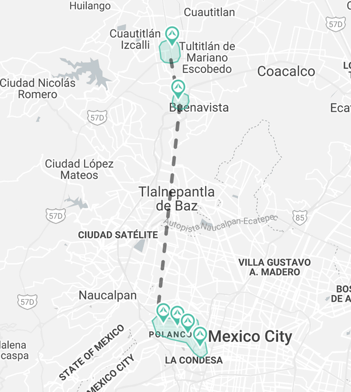
            </button>
            <!-- 

 -->
          

        

      

      

        

          

            <h4 class="panel-title">Cuautitlán/Perinorte  Santa Fe </h4>
          

          

            <button type="button" data-toggle="modal" data-target="#ruta2" class="btn-rutas">
              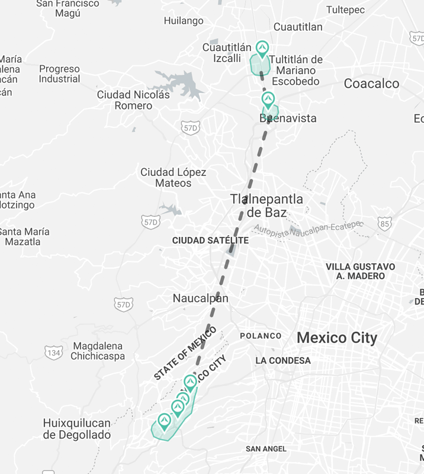
            </button>
            <!-- 

 -->
          

        

      

      

        

          

            <h4 class="panel-title">Zona Norte  Polanco</h4>
          

          

            <button type="button" data-toggle="modal" data-target="#ruta3" class="btn-rutas">
              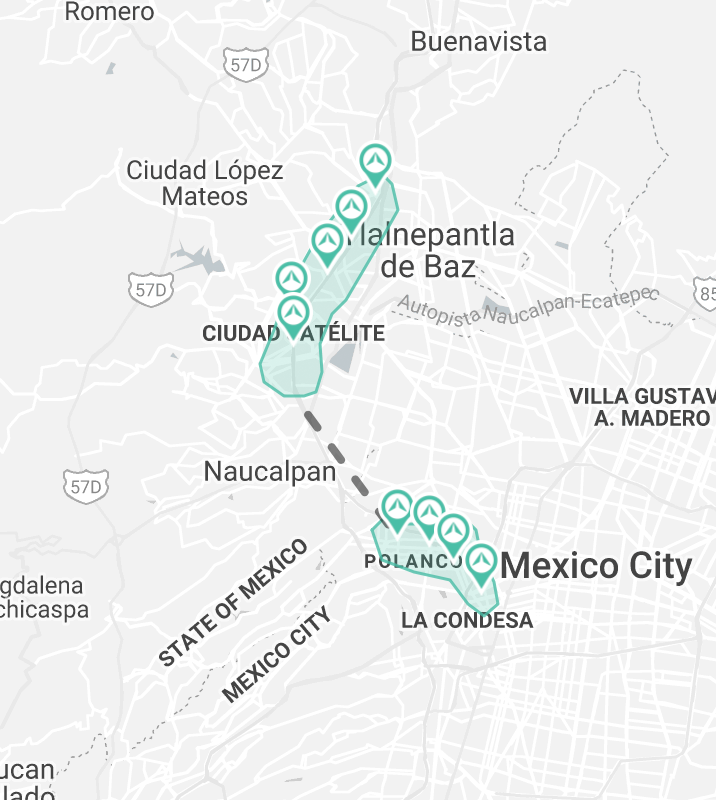
            </button>
            <!-- 

 -->
          

        

      

      

        

          

            <h4 class="panel-title">Reforma  Santa Fe</h4>
          

          

            <button type="button" data-toggle="modal" data-target="#ruta4" class="btn-rutas">
              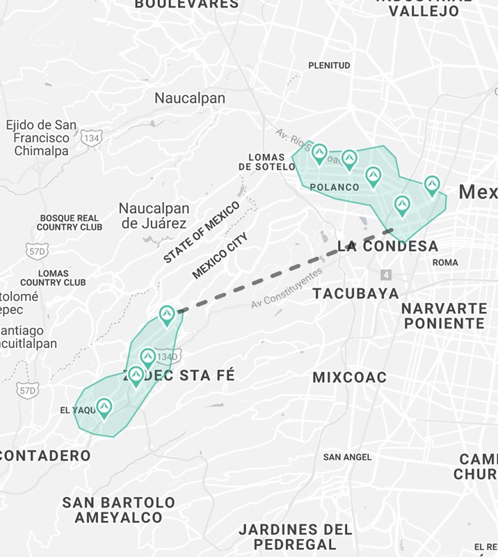
            </button>
            <!-- 

 -->
          

        

      

      

        

          

            <h4 class="panel-title">Zona Norte  Santa Fe</h4>
          

          

            <button type="button" data-toggle="modal" data-target="#ruta5" class="btn-rutas">
              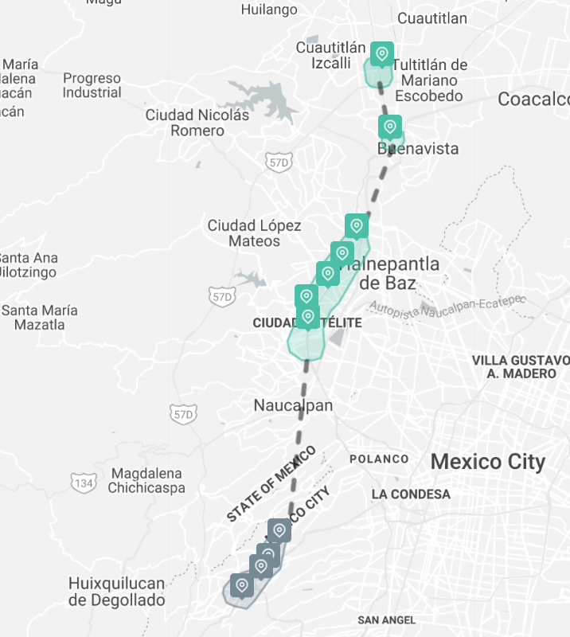
            </button>
            <!-- 

 -->
          

        

      

      

        

          

            <h4 class="panel-title">Aragón  Santa Fe</h4>
          

          

            <button type="button" data-toggle="modal" data-target="#ruta6" class="btn-rutas">
              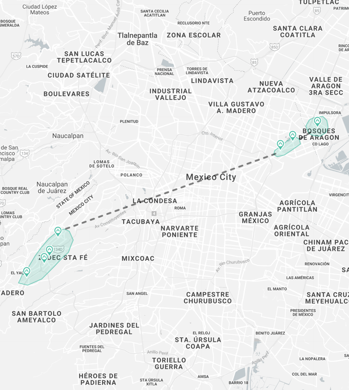
            </button>
            <!-- 

 -->
          

        

      

      

        

          

            <h4 class="panel-title">Parque de los venados/Del Valle  Santa Fe</h4>
          

          

            <button type="button" data-toggle="modal" data-target="#ruta7" class="btn-rutas">
              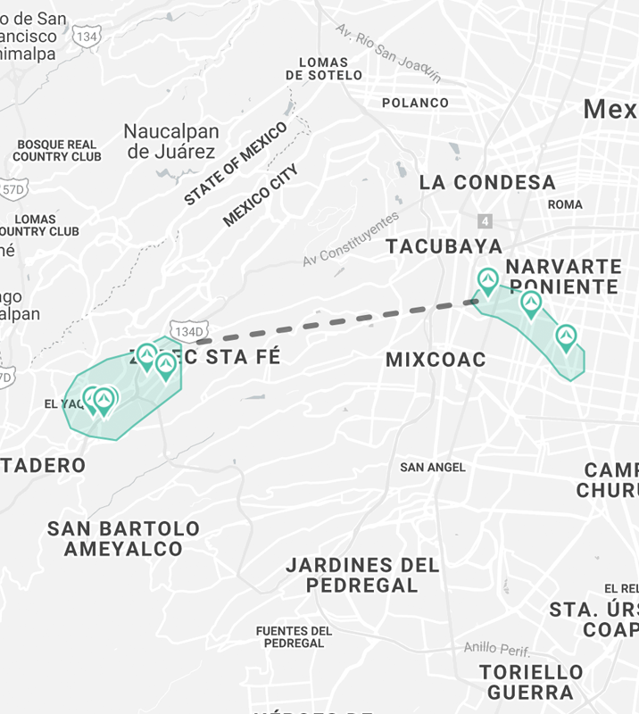
            </button>
            <!-- 

 -->
          

        

      

      

        

          

            <h4 class="panel-title">Polanco  Santa Fe</h4>
          

          

            <button type="button" data-toggle="modal" data-target="#ruta8" class="btn-rutas">
              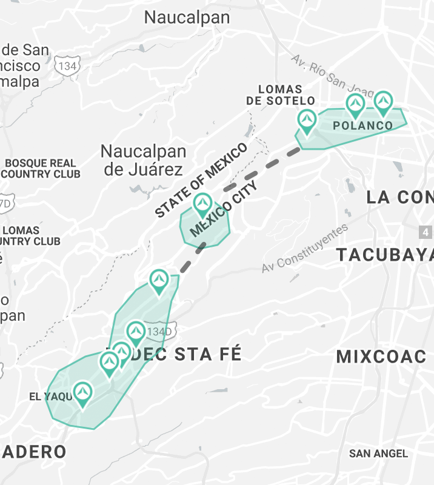
            </button>
            <!-- 

 -->
          

        

      

      

        

          

            <h4 class="panel-title">M. Chabacano/Condesa  Santa Fe</h4>
          

          

            <button type="button" data-toggle="modal" data-target="#ruta9" class="btn-rutas">
              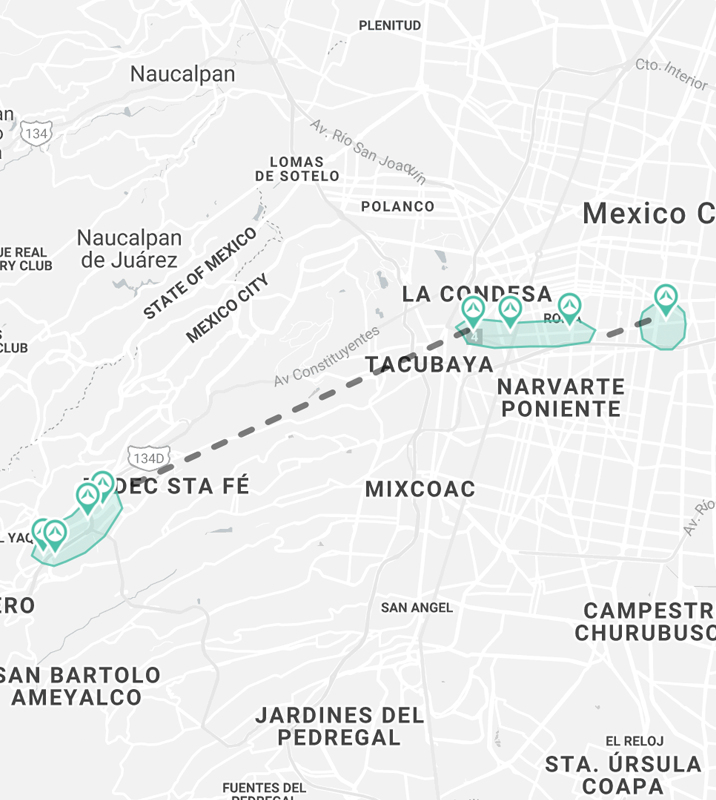
            </button>
            <!-- 

 -->
          

        

      

      

        

          

            <h4 class="panel-title">Las Alamedas/Atizapán  Santa Fe</h4>
          

          

            <button type="button" data-toggle="modal" data-target="#ruta10" class="btn-rutas">
              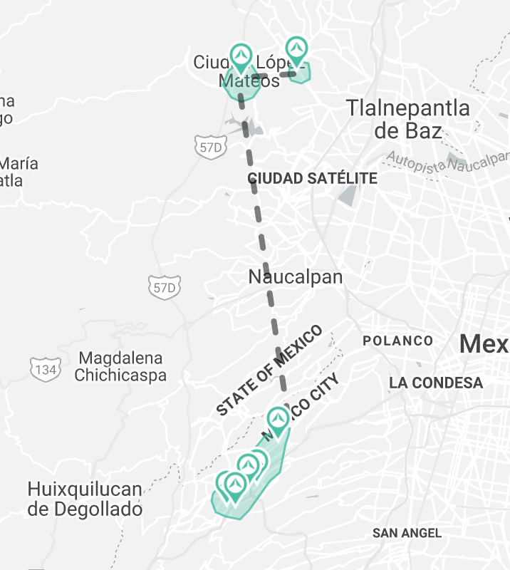
            </button>
            <!-- 

 -->
          

        

      

      

        

          

            <h4 class="panel-title">Azcapotzalco/Polanco  Santa Fe</h4>
          

          

            <button type="button" data-toggle="modal" data-target="#ruta11" class="btn-rutas">
              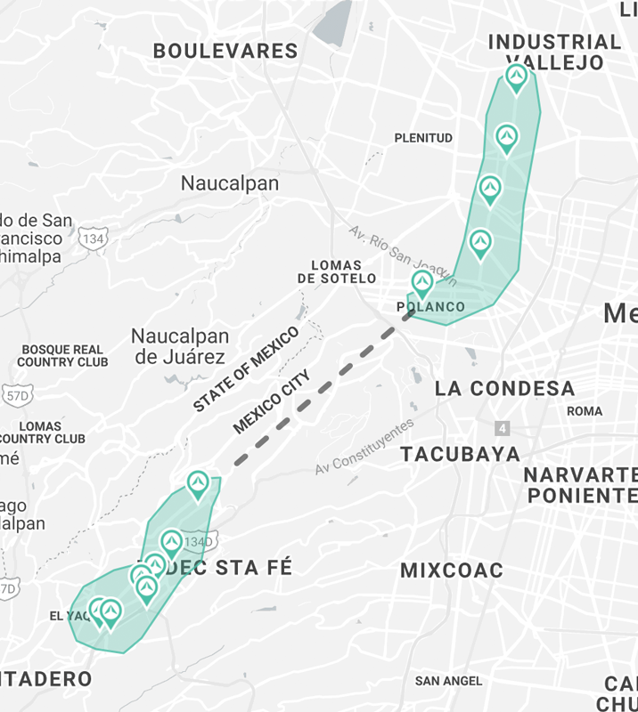
            </button>
            <!-- 

 -->
          

        

      

      

        

          

            <h4 class="panel-title">Coacalco/Satélite  Polanco/Reforma</h4>
          

          

            <button type="button" data-toggle="modal" data-target="#ruta12" class="btn-rutas">
              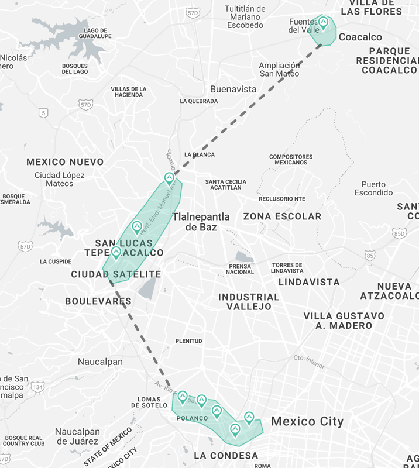
            </button>
            <!-- 

 -->
          

        

      

    

    <!-- RUTAS SVBUS -->
    

      

        

          <h2>Operado por </h2>
        

        

          <a href="http://ayuda.jetty.mx/svbus" class="conocesvbus">Conoce más aquí</a>
        

      

      <!-- SVBus 1 -->
      

        

          

            <h4 class="panel-title">Acoxpa  Santa Fe</h4>
          

          

            <button type="button" data-toggle="modal" data-target="#rutaSVBus1" class="btn-rutas">
              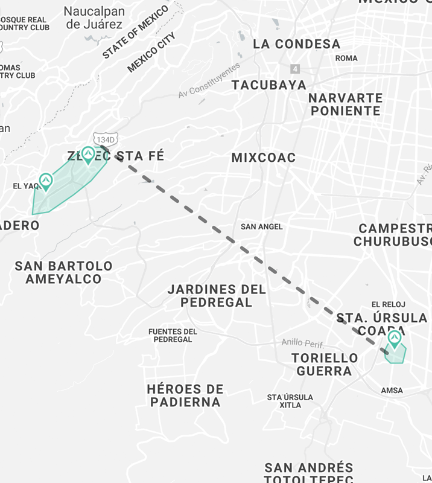
            </button>
            <!-- 

 -->
          

        

      

      <!-- SVBus 2 -->
      

        

          

            <h4 class="panel-title">Acoxpa  Auditorio</h4>
          

          

            <button type="button" data-toggle="modal" data-target="#rutaSVBus2" class="btn-rutas">
              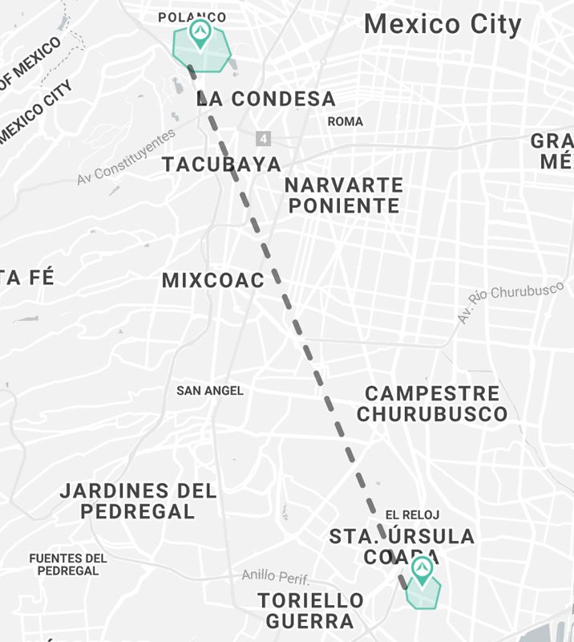
            </button>
            <!-- 

 -->
          

        

      

      <!-- SVBus 3 -->
      

        

          

            <h4 class="panel-title">Toreo  Santa Fe</h4>
          

          

            <button type="button" data-toggle="modal" data-target="#rutaSVBus3" class="btn-rutas">
              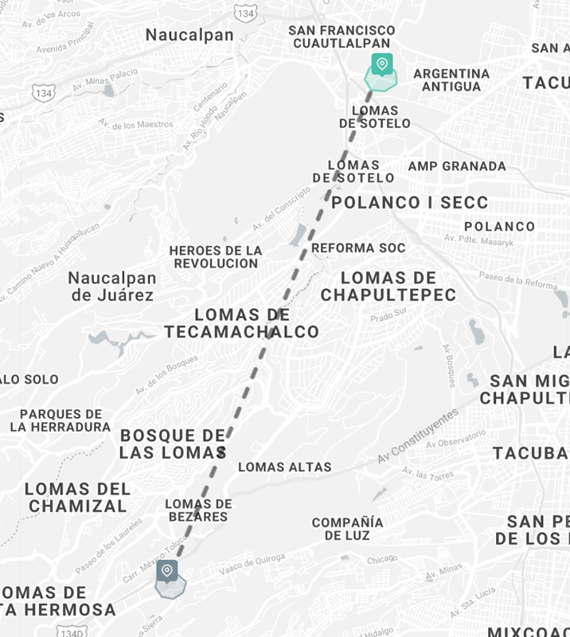
            </button>
            <!-- 

 -->
          

        

      

      <!-- SVBus 4 -->
      

        

          

            <h4 class="panel-title">Costco Coapa  Sante Fe</h4>
          

          

            <button type="button" data-toggle="modal" data-target="#rutaSVBus4" class="btn-rutas">
              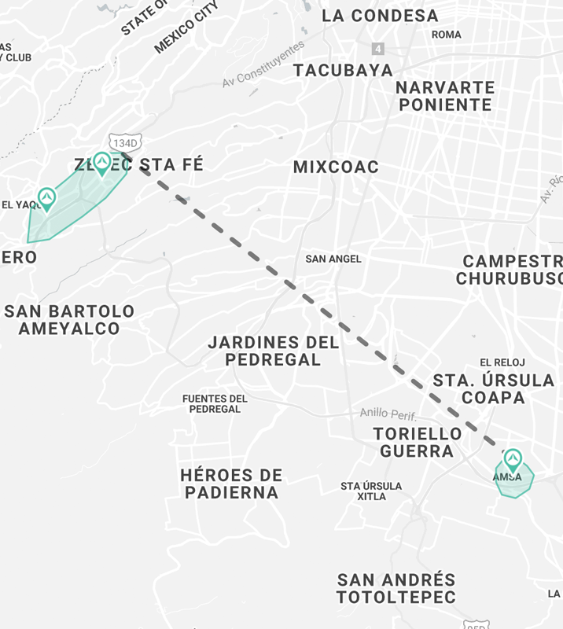
            </button>
            <!-- 

 -->
          

        

      

      <!-- SVBus 5 -->
      

        

          

            <h4 class="panel-title">Costco Coapa  Centro Comercial Santa Fe</h4>
          

          

            <button type="button" data-toggle="modal" data-target="#rutaSVBus5" class="btn-rutas">
              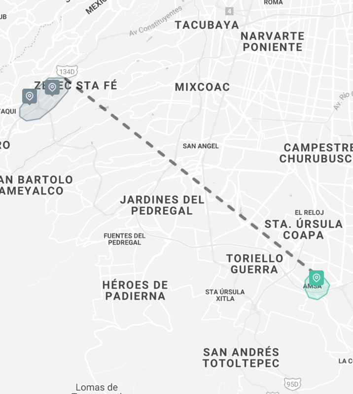
            </button>
            <!-- 

 -->
          

        

      

      <!-- SVBus 6 -->
      

        

          

            <h4 class="panel-title">Costco Coapa  Auditorio</h4>
          

          

            <button type="button" data-toggle="modal" data-target="#rutaSVBus6" class="btn-rutas">
              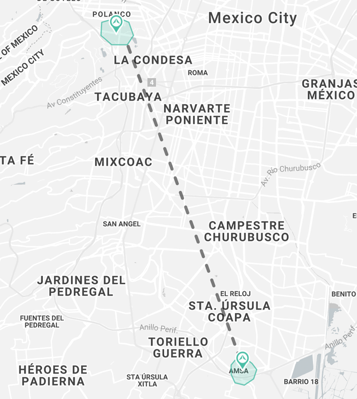
            </button>
            <!-- 

 -->
          

        

      

      <!-- SVBus 7 -->
      <!-- 

        

          

            <h4 class="panel-title">Auditorio  Santa Fe</h4>
          

          

            <button type="button" data-toggle="modal" data-target="#rutaSVBus7" class="btn-rutas">
              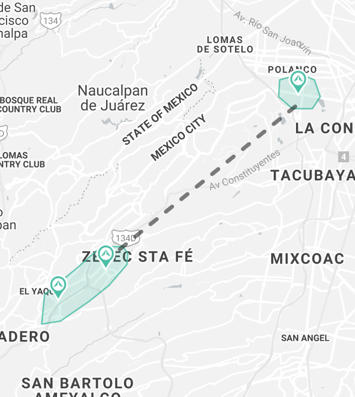
            </button>
          

        

      
 -->

    

    <!-- RUTAS UNIDAS-->
    

      

        

          <h2>Operado por </h2>
        

        

          <a href="http://ayuda.jetty.mx/rutas-unidas" class="conocesvbus">Conoce más aquí</a>
        

      

      <!-- RUTAS UNIDAS -->
      

        

          

            <h4 class="panel-title">Viveros/Miguel Ángel de Quevedo/San Jerónimo  Santa Fe</h4>
          

          

            <button type="button" data-toggle="modal" data-target="#rutaUnidas1" class="btn-rutas">
              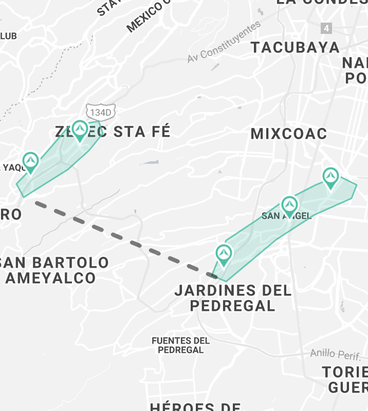
            </button>
            <!-- 

 -->
          

        

      

    

    

    

      <h3>¿Te interesa tener un Jetty cerca de ti?</h3>
      
Ingresa aquí tu origen y destino deseado y lo tomaremos en cuenta:

      <a href="solicitud" class="btn btn-default btn-lg btn-green btn-header">¿A dónde te llevamos?</a>
    

  

<!-- /// MODAL 1 /// -->

  

    

      

        <button type="button" class="close" data-dismiss="modal" aria-label="Close">&times;</button>
        <h4 class="modal-title" id="myModalLabel">Cuautitlán/Perinorte  Polanco/Reforma </h4>
      

      

        

      

    

  

<!-- /// MODAL 2 /// -->

  

    

      

        <button type="button" class="close" data-dismiss="modal" aria-label="Close">&times;</button>
        <h4 class="modal-title" id="myModalLabel">Cuautitlán/Perinorte  Santa Fe </h4>
      

      

        

      

    

  

<!-- /// MODAL 3 /// -->

  

    

      

        <button type="button" class="close" data-dismiss="modal" aria-label="Close">&times;</button>
        <h4 class="modal-title" id="myModalLabel">Zona Norte  Polanco</h4>
      

      

        

      

    

  

<!-- /// MODAL 4 /// -->

  

    

      

        <button type="button" class="close" data-dismiss="modal" aria-label="Close">&times;</button>
        <h4 class="modal-title" id="myModalLabel">Reforma  Santa Fe</h4>
      

      

        

      

    

  

<!-- /// MODAL 5 /// -->

  

    

      

        <button type="button" class="close" data-dismiss="modal" aria-label="Close">&times;</button>
        <h4 class="modal-title" id="myModalLabel">Zona Norte  Santa Fe</h4>
      

      

        

      

    

  

<!-- /// MODAL 6 /// -->

  

    

      

        <button type="button" class="close" data-dismiss="modal" aria-label="Close">&times;</button>
        <h4 class="modal-title" id="myModalLabel">Aragón  Santa Fe</h4>
      

      

        

      

    

  

<!-- /// MODAL 7 /// -->

  

    

      

        <button type="button" class="close" data-dismiss="modal" aria-label="Close">&times;</button>
        <h4 class="modal-title" id="myModalLabel">Parque de los venados/Del Valle  Santa Fe</h4>
      

      

        

      

    

  

<!-- /// MODAL 8 /// -->

  

    

      

        <button type="button" class="close" data-dismiss="modal" aria-label="Close">&times;</button>
        <h4 class="modal-title" id="myModalLabel">Polanco  Santa Fe</h4>
      

      

        

      

    

  

<!-- /// MODAL 9 /// -->

  

    

      

        <button type="button" class="close" data-dismiss="modal" aria-label="Close">&times;</button>
        <h4 class="modal-title" id="myModalLabel">M. Chabacano/Condesa  Santa Fe</h4>
      

      

        

      

    

  

<!-- /// MODAL 10 /// -->

  

    

      

        <button type="button" class="close" data-dismiss="modal" aria-label="Close">&times;</button>
        <h4 class="modal-title" id="myModalLabel">Las Alamedas/Atizapán  Santa Fe</h4>
      

      

        

      

    

  

<!-- /// MODAL 11 /// -->

  

    

      

        <button type="button" class="close" data-dismiss="modal" aria-label="Close">&times;</button>
        <h4 class="modal-title" id="myModalLabel">Azcapotzalco/Polanco  Santa Fe</h4>
      

      

        

      

    

  

<!-- /// MODAL 12 /// -->

  

    

      

        <button type="button" class="close" data-dismiss="modal" aria-label="Close">&times;</button>
        <h4 class="modal-title" id="myModalLabel">Coacalco/Satélite  Polanco/Reforma</h4>
      

      

        

      

    

  

<!-- /// MODAL 1 SVBus /// -->

  

    

      

        <button type="button" class="close" data-dismiss="modal" aria-label="Close">&times;</button>
        <h4 class="modal-title" id="myModalLabel">Acoxpa  Santa Fe</h4>
      

      

        

      

    

  

<!-- /// MODAL 2 SVBus /// -->

  

    

      

        <button type="button" class="close" data-dismiss="modal" aria-label="Close">&times;</button>
        <h4 class="modal-title" id="myModalLabel">Acoxpa  Auditorio</h4>
      

      

        

      

    

  

<!-- /// MODAL 3 SVBus /// -->

  

    

      

        <button type="button" class="close" data-dismiss="modal" aria-label="Close">&times;</button>
        <h4 class="modal-title" id="myModalLabel">Toreo  Santa Fe</h4>
      

      

        

      

    

  

<!-- /// MODAL 4 SVBus /// -->

  

    

      

        <button type="button" class="close" data-dismiss="modal" aria-label="Close">&times;</button>
        <h4 class="modal-title" id="myModalLabel">Costco Coapa  Santa Fe</h4>
      

      

        

      

    

  

<!-- /// MODAL 5 SVBus /// -->

  

    

      

        <button type="button" class="close" data-dismiss="modal" aria-label="Close">&times;</button>
        <h4 class="modal-title" id="myModalLabel">Costco Coapa  Centro Comercial Santa Fe</h4>
      

      

        

      

    

  

<!-- /// MODAL 6 SVBus /// -->

  

    

      

        <button type="button" class="close" data-dismiss="modal" aria-label="Close">&times;</button>
        <h4 class="modal-title" id="myModalLabel">Costco Coapa  Auditorio</h4>
      

      

        

      

    

  

<!-- /// MODAL 7 SVBus /// -->

  

    

      

        <button type="button" class="close" data-dismiss="modal" aria-label="Close">&times;</button>
        <h4 class="modal-title" id="myModalLabel">Auditorio  Santa Fe</h4>
      

      

        

      

    

  

<!-- /// MODAL 1 RutasUnidas /// -->

  

    

      

        <button type="button" class="close" data-dismiss="modal" aria-label="Close">&times;</button>
        <h4 class="modal-title" id="myModalLabel">Viveros/Miguel Ángel de Quevedo /San Jerónimo  Santa Fe</h4>
      

      

        

      

    

  

