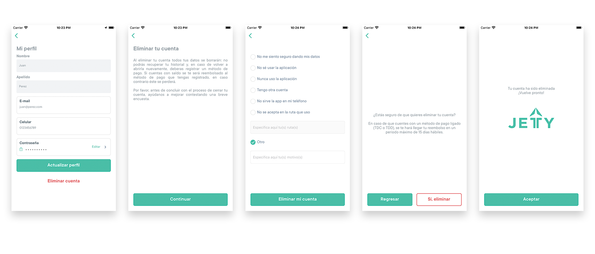

  

    

      <h1>Términos para la eliminación de cuentas</h1>
    

    

      <h3>¡Lamentamos que tomes esta decisión, te extrañaremos!</h3>
      
Si crees que no volverás a usar tu cuenta de Jetty y quieres eliminar tu cuenta, Podemos ayudarte a hacerlo. Ten en cuenta que no podrás volver a activarla ni recuperar tus datos e historial de viajes.

      
En jetty estamos comprometidos con nuestros usuarios, esperamos que regreses pronto.

      
Para realizar la eliminación de tu cuenta:

      <ul>
        <li>Ingresa a tu app</li>
        <li>Inicia sesión con tu usuario y contraseña</li>
        <li>Ve al menú de la app y despliégalo.</li>
        <li>Ingresa a la opción: “Mi perfil.”</li>
        <li>Selecciona la opcion: “Eliminar cuenta.”</li>
        <li>Verifica los términos y oprime el botón continuar.</li>
        <li>Responde en la opciones disponibles el motivo por el cual eliminas la cuenta.</li>
        <li>Da Click en el botón: “Eliminar mi cuenta”.</li>
        <li>Visualizarás la pantalla donde te confirma la eliminación de tu cuenta y por ultimo das Click en el botón “Si, eliminar”.</li>
        <li>Aparecerá la confirmación tu cuenta ha sido eliminada.</li>
      </ul>

      
Nota: Si tienes saldo en tu app será reembolsado a tu método de pago registrado en un tiempo no mayor a 15 días hábiles.

      
    

  

