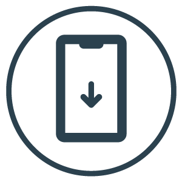
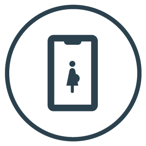

  

    

      

        <h1>Benefits</h1>

        
We know that your business is transportation and we want it to continue to be. With Jetty you have the possibility of adding value to your business and your users, while still doing what you do best. We become your technological arm.

        

        <ul class="beneficiosList">
          <li>
            

              
            

            <h3>Platform as a service</h3>
            
All companies use the same platform configured in different ways. This makes it much more cost efficient and faster to implement. It also means that you will have access to improvements and new features as they become available.

          </li>
          <li>
            

              
            

            <h3>Low risk solution</h3>
            
Our technology is ready to be implemented. In less than 2 weeks it will be working. It is validated by real users so it significantly reduces the risk of implementation

          </li>
          <li>
            

              
            

            <h3>Continuous updates</h3>
            
Our deal is the developing of technology and therefore we know that it is constantly evolving. That is why our team works daily to implement improvements to the platform.

          </li>
          

          <li>
            

              
            

            <h3>Scalable Model</h3>
            
All our technology works in the cloud, so in addition to having access to world-class infrastructure, we can increase capacity while we grow with you.

          </li>
          <li>
            

              
            

            <h3>Adaptability</h3>
            
We have the ability to work with different types of services and all can be configured by the client: registration and modification of routes, price changes, etc.

          </li>
          <li>
            

              
            

            <h3>Real-time reporting</h3>
            
You got access to the administration platform to monitor in real time all the data (sales, users, ratings, etc.). With these data you will have better planning and make better decisions

          </li>
          <li>
            

              
            

            <h3>Additional assistance</h3>
            
Our platform allows drivers to know if users have special needs, with the intention of always being able to give them the best care.

          </li>
          <li>
            

              
            

            <h3>No need for expensive equipment</h3>
            
There is no need to make heavy investments in hardware. The only investment in equipment that you will have to make is in a cell phone.

          </li>
          <li>
            

              
            

            <h3>Focus on users and not on tickets</h3>
            
With our technology, you can go from a ticket-based model to a user-based model. This allows you to have much more information about your usage trends and needs.

          </li>
          <li>
            

              
            

            <h3>Support during the process</h3>
            
All our clients have access to a group of experts to ensure the best implementation of the technology. Induction and training on the use of the application for drivers, supervisors, administrators, monitoring and support.

          </li>
          <li>
            

              
            

            <h3>Keep your brand</h3>
            
The design of the apps can bring the brand, logo and graphic identity of your company.

          </li>
        </ul>

      

    

    

  

