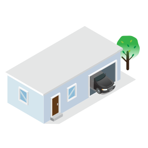
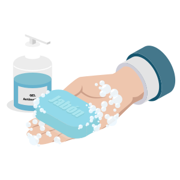
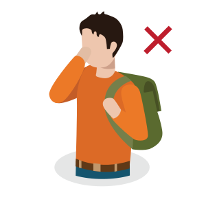
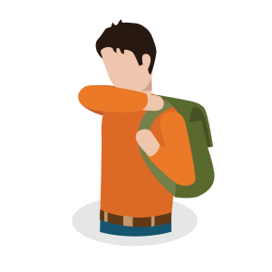
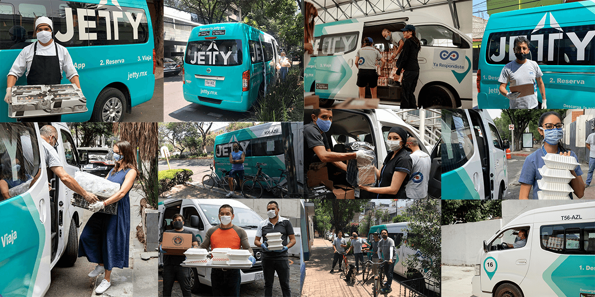
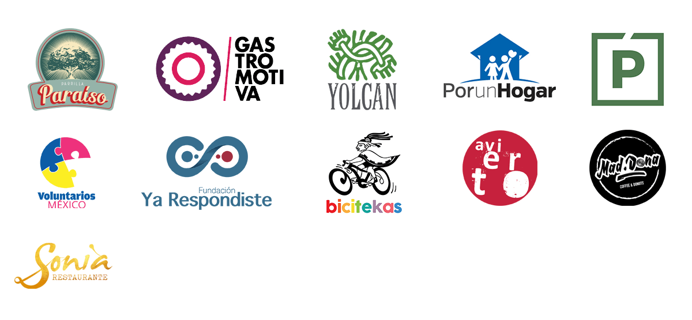

  

    

    

      

        <h2>Centro de información sobre el COVID-19</h2>
        
Obtén más información sobre el coronavirus (COVID-19) en: <a href="https://coronavirus.gob.mx" target="blank">coronavirus.gob.mx.</a>

      

      

        <h2>Sugerencias de prevención</h2>
        
Ayuda a detener la propagación del COVID-19.

        

          <ul class="covidInline">
            <li>
              
              
Respeta las indicaciones de las autoridades locales sobre quedarse en casa.

            </li>
            <li>
              
              
Mantente a una distancia segura de las demás personas.

            </li>
            <li>
              
              
Lávate las manos con frecuencia y desinfecta las superficies de más contacto en tu casa.

            </li>
            <li>
              
              
No te toques los ojos, la nariz ni la boca.

            </li>
            <li>
              

              
Cúbrete con el codo o con un pañuelo al toser o estornudar.

            </li>
          </ul>
        

        

        
<small>Fuente: Organización Mundial de la Salud</small>

      

      

        

          <a href="transporte-personal" class="btn btn-green">Contrata transporte seguro</a>
        

        

        

          <h2>Medidas de higiene y seguridad en unidades</h2>
          
El proceso en todas nuestras unidades incluye desinfección general, le damos prioridad a los puntos de contacto, como manijas, pasamanos, vidrios, etc. El procedimiento se realiza antes y después de cada viaje.

        

        

          <h2>¿Cómo pueden ayudar nuestros usuarios?</h2>

          

            

              <ol style="padding-left: 20px">
                <li>
<b>Usar cubrebocas</b> y procurar no tocarlo al estar abordo de la unidad.
</li>
                <li>
Comprometerse a <b>utilizar gel antibacterial antes de abordar.</b>
</li>
                <li>
Al estornudar o toser <b>cubrirse con el codo o utiliza un pañuelo.</b>
</li>
                <li>
<b>Respetar la sana distancia.</b>
</li>
              </ol>
            

            

              
            

          

        

      

      

        <h2>Viajes donación</h2>
        
Gracias a nuestras alianzas y a la compra de viajes donación de nuestros usuarios llevamos comida al personal médico, a familiares de pacientes y  a personal de limpieza de varios hospitales en la Ciudad de México. También trasladamos cubrebocas, caretas, mascarillas, cajas aerosol y bicicletas.

        

        
      

      

        
Si tienes alguna campaña u organización de ayuda a cualquier ámbito que esté afectando el COVID-19 y necesitas transporte para realizarla, escríbenos a <a href="mailto:plancovid@jetty.mx">plancovid@jetty.mx</a>

      

      

        
      

      

        
      

      

        
      

      

      

        
En Jetty estamos comprometidos con que tengas un buen viaje, SIEMPRE.
         
         Es por eso que monitoreamos muy de cerca los avances de la epidemia de COVID-19. ¡Gracias por seguir confiando en nosotros!

        <a href="transporte-personal" class="btn btn-green">Contrata transporte seguro</a>
      

    

  

