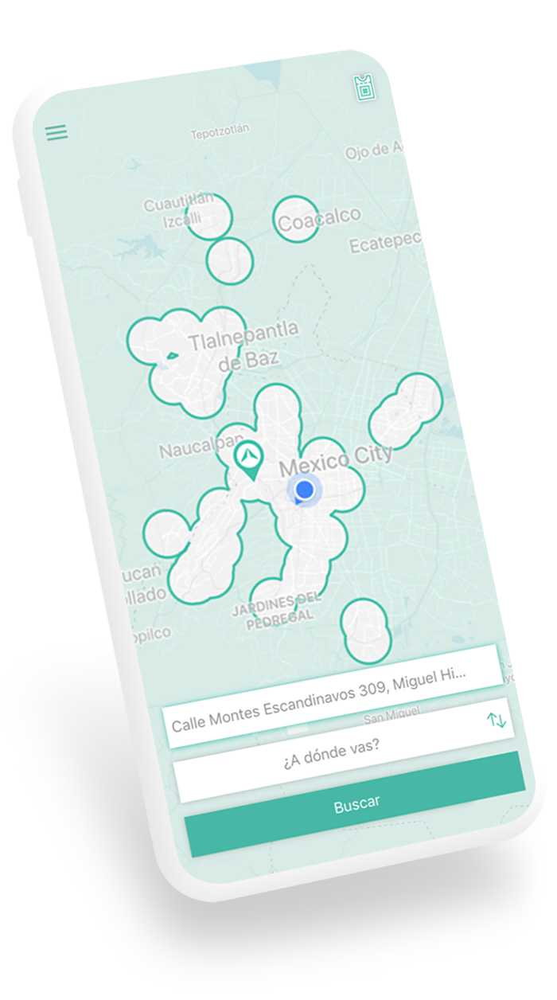
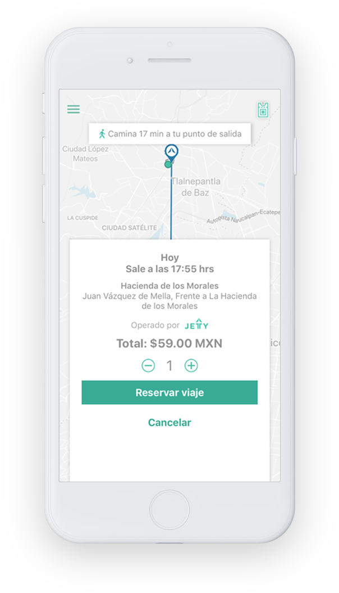
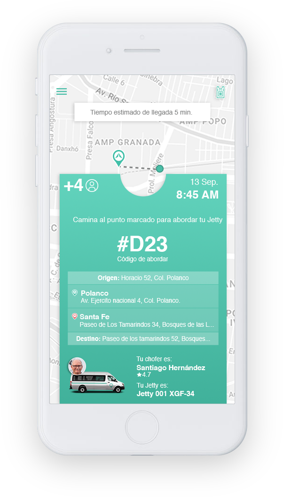
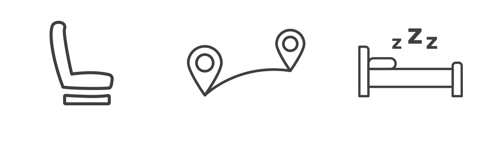

<figure class="header">
  
  <figcaption>
    

      

        

          

             <h2>Are you tired of wasting hours behind the wheel in traffic?</h2>
             <h2>Does it bother you to be standing on the bus?</h2>
             <h2>Are you afraid to travel by public transport?</h2>
             <h2>Stressed to see how the meter advances or the dynamic rates</h2>
          

          
Forget your worries, travel safely and comfortably. Jetty will turn every journey into a good trip.

          
Download the app

          

          
        

        

          
        

      

    

  </figcaption>
</figure>

  

    

      

        
      

      <h3>Safety</h3>
      
All our vehicles have surveillance cameras and are monitored via GPS.

    

    

      

        
      

      <h3>Peace of mind</h3>
      
Our drivers and support team are trained to give you the best service.

    

    

      

        
      

      <h3>Efficiency</h3>
      
Our trips are designed so that you can reach your destination in the most direct way.

    

  

  

  

    

      

        <h1>How it works</h1>
      

      

        

          

            
          

          

            
Drop the pin on your pickup and drop-off points.

          

        

        

          
        

      

      

        

          

            
          

          

            
Review and select the option that best suits you.

          

        

        

          
        

      

      

        

          

            
          

          

            
Book your trip and monitor your Jetty.

             
          

        

        

          
        

      

      

        

          

            
          

          

            
Walk to the boarding point and show your pass to the driver.

          

        

        

          
        

      

      

        
Download the app and enjoy a good trip.

        

        
      

    

  

  

  

    

      

        <h1>GOOD TRIP 
          IS...
        </h1>
      

    

    

      

        

          <!-- Indicators -->
          <ol class="carousel-indicators">
            <li data-target="#carousel-example-generic" data-slide-to="0" class="active"></li>
            <li data-target="#carousel-example-generic" data-slide-to="1"></li>
          </ol>

          <!-- Wrapper for slides -->
          

            

              
            

            

              
            

          

          <!-- Controls -->
          <a class="left carousel-control" href="#carousel-example-generic" role="button" data-slide="prev">
            
            Previous
          </a>
          <a class="right carousel-control" href="#carousel-example-generic" role="button" data-slide="next">
            
            Next
          </a>
        

      

    

    

      

      <a href="beneficios" class="btn btn-default btn-lg btn-green btn-beneficios">Learn more about our benefits</a>
      

    

  

  

   

    

      <h2>Testimonials</h2>
    

      

        

          <!-- Indicators -->
          <!-- <ol class="carousel-indicators">
            <li data-target="#carousel-testimonios" data-slide-to="0" class="active"></li>
            <li data-target="#carousel-testimonios" data-slide-to="1"></li>
          </ol> -->

          <!-- Wrapper for slides -->
          

            

              <h3> A very professional driver. Excellent trip: comfortable and fast. Thank you.  Andrea D.</h3>
            

            

              <h3> Great option, affordable and safe. Really improves my commute. I recommend it!  Natalia M.</h3>
            

            

              <h3> Excellent as always. On time and without inconveniences. Thank you Jetty.  Eunice G.</h3>
            

          

          <!-- Controls -->
          <!-- <a class="left carousel-control" href="#carousel-testimonios" role="button" data-slide="prev">
            
            Previous
          </a>
          <a class="right carousel-control" href="#carousel-testimonios" role="button" data-slide="next">
            
            Next
          </a> -->
        

      

    

