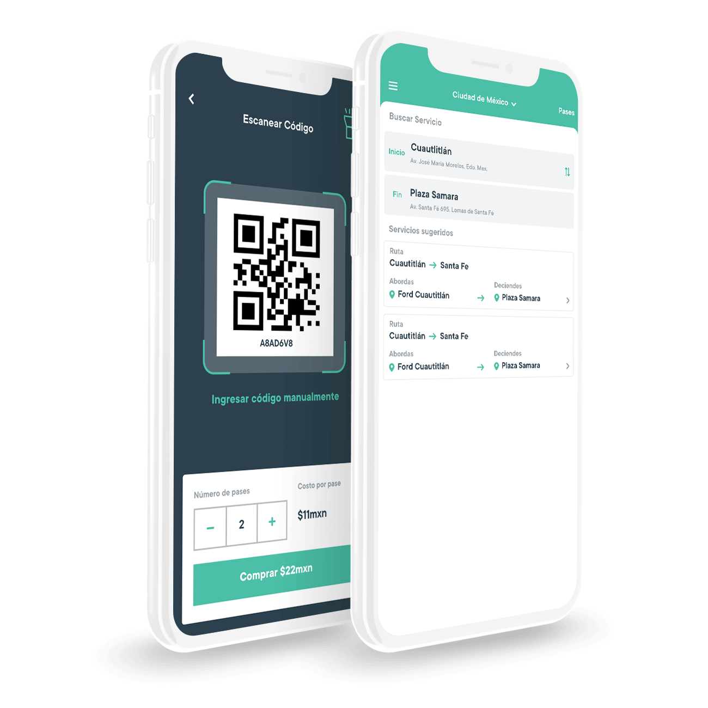
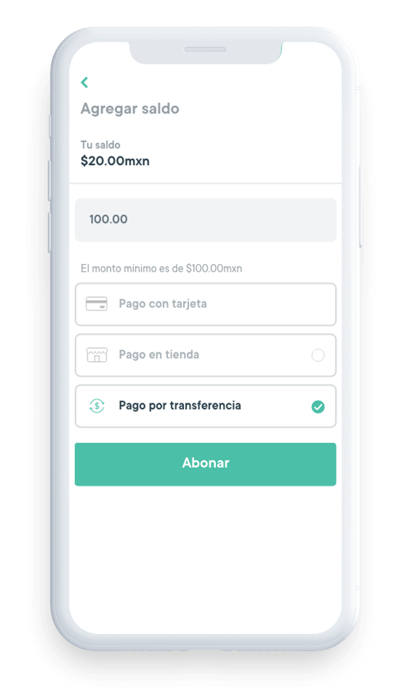
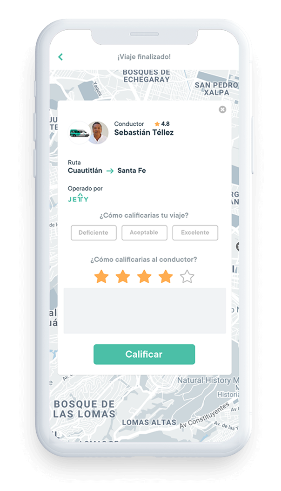
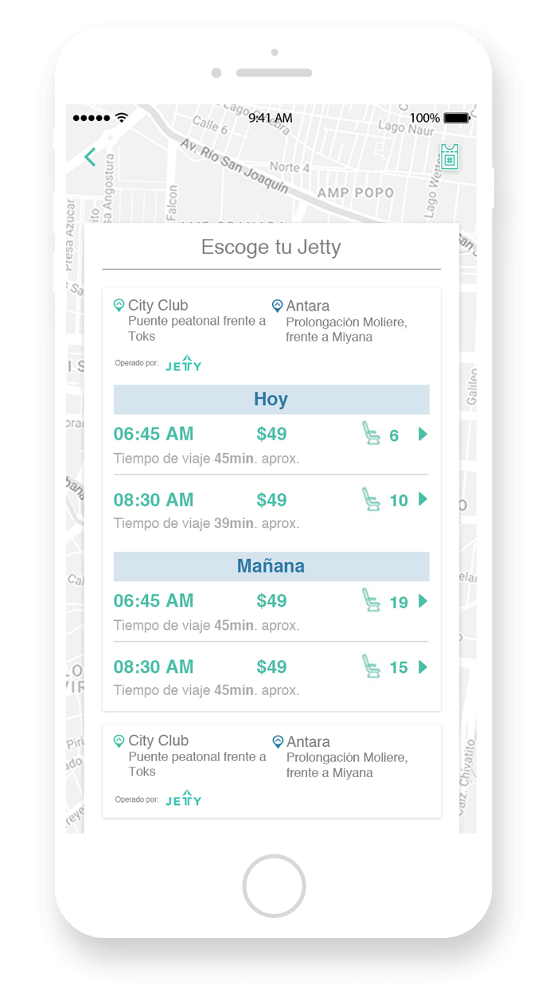
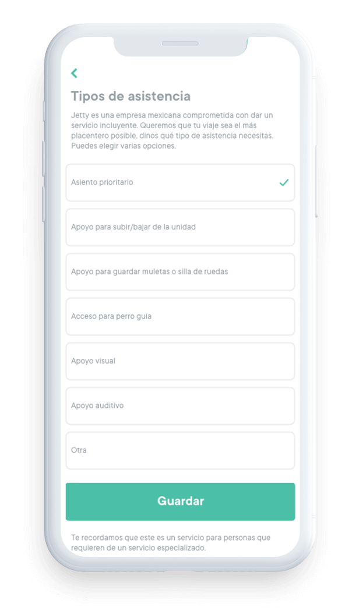

  

    <!-- HEADER -->
    

      

        
      

      

        <h1>Collective Transit Technology</h1>
         
        
Bring the benefits of our technology to collective transit, improving the user experience and contributing to the modernization of the sector

        
Download the app

         

        
      

    

    <!-- AMENIDADES -->
    

      

        
        <h3 class="titleConcesionado">Payment Method</h3>
      

      

        
        <h3 class="titleConcesionado">Customer support</h3>
      

      

        
        <h3 class="titleConcesionado">Tools to monitor operation</h3>
      

      

        
        <h3 class="titleConcesionado">Planning system</h3>
      

    

    

    

      

        

          
          
<b>Boarding pass</b>

        

        

          
          
<b>Payment methods</b>

        

        

          
          
<b>Feedback</b>

        

        

          
          
<b>Pick up / Drop off reservation</b>

        

        

          
          
<b>Assistance request</b>

        

        

          
          
<b>Tracking</b>

        

      

    

    

      

        <a href="producto" class="btn btn-gray">Our technology</a>
      

    

  

