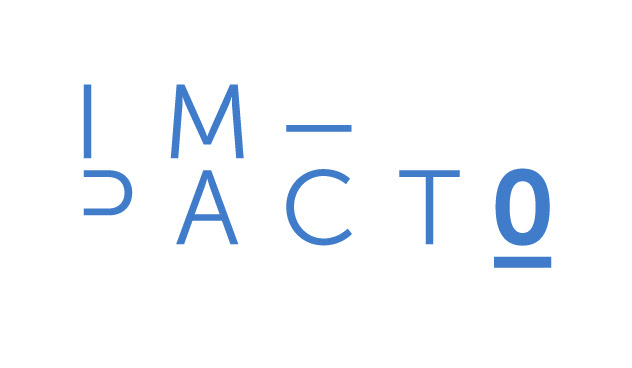
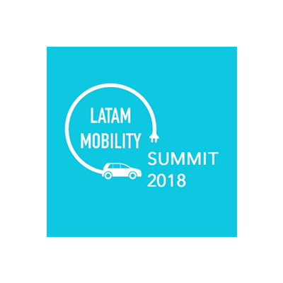

  

    

      

        <h1>Who we   are</h1>
        <h3>We are the technology platform that improves collective transport and mobility in cities.</h3>
      

      

        
We did not invent the black thread. All the inhabitants of Mexican cities know that the traditional collective transport system leaves much to be desired. Like many others, we are aware that the already existing service is insecure, causing distrust and dissatisfaction. We observed that the units were old, that users lacked information, and that drivers received no feedback on their performance. We hear transportation leaders complain about the low profitability of their business, and authorities suffer from the lack of tools to better plan and regulate the system. We were amazed that in many other industries, technology had already enabled substantial changes. Therefore, in 2017 we decided to do our bit by creating Jetty.

      

      

        
At Jetty we are passionate about mobility, we love what we do because we know that it has a great impact on our users and on our cities. That is why we work day by day to evolve transport and contribute to the modernization of the sector with the help of technology; we can adapt it to different needs.

        
Our curiosity, empathy and excellence make us the number one option for any transport group or government that wants to implement technology to improve their business and make more efficient the mobility of their city. Thanks to our transparency, we earn the trust of our allies, users and clients.

      

      

        
      

    

    

      

        <h2>Our awards:</h2>
      

      

        
        
In 2019 we were recognized among thousands of startups by the Massachusetts Institute of Technology (MIT) for our ability to increase the income of transport entrepreneurs, improve the working conditions of drivers and above all, for improving the experience of commuting to work for thousands of people.

      

      

        
        
In June 2019 the Keeling Curve Prize announced that we won the transportation category, as an initiative with the potential to alter and accelerate current efforts to reduce global warming.

      

      

        
        
In 2018 we won the Smart Urbanization and Settlements category at the Word Summit Awards. We were recognized as one of the 40 digital innovations that are revolutionizing the status quo.

      

      

        <h3>More awards</h3>
        <ul class="alianzas">
          <li>
            
          </li>
          <li>
            
          </li>
          <li>
            
          </li>
          <li>
            
          </li>
          <li>
            
          </li>
          <li>
            
          </li>
          <li>
            
          </li>
          <li>
            
          </li>
        </ul>
      

    

    

      

        <h2>Press</h2>
        <ul class="alianzas">
          <li>
            
          </li>
          <li>
            
          </li>
          <li>
            
          </li>
          <li>
            
          </li>
          <li>
            
          </li>
          <li>
            
          </li>
          <li>
            
          </li>
          <li>
            
          </li>
          <li>
            
          </li>
          <li>
            
          </li>
          <li>
            
          </li>
          <li>
            
          </li>
          <li>
            
          </li>
          <li>
            
          </li>
          <li>
            
          </li>
          <li>
            
          </li>
          <li>
            
          </li>
        </ul>
        <a href="/prensa" class="btn-green hvr-shadow">Press</a>
      

      <!-- 

        <h2>Nuestros aliados</h2>
        <ul class="alianzas">
          <li>
            
          </li>
          <li>
            
          </li>
          <li>
            
          </li>
          <li>
            
          </li>
          <li>
            
          </li>
          <li>
            
          </li>
        </ul>
      
 -->

    

    

      

        <h2>We are members of:</h2>
        

          

            
          

          

            
It is a coalition of companies that promotes the Principles of Shared Mobility for Livable Cities.

            <a href="https://static1.squarespace.com/static/59c2e59b4c326d11fcf1f516/t/5a677b38c83025d21f6c5bd5/1516731192772/10+Points+WRI+Spanish.pdf" target="_blank">More information</a>
          

        

        

          

            
          

          

            
It is a Civil Association that represents the most innovative startups and companies that are transforming the mobility experience in Latin America, based on technology and with a vision of sustainability.

            <a href="http://maaslatam.org" target="_blank">More information</a>
          

        

      

    

  

