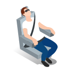
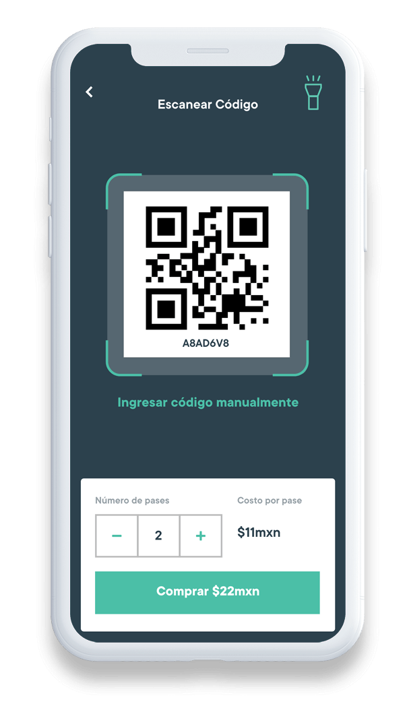
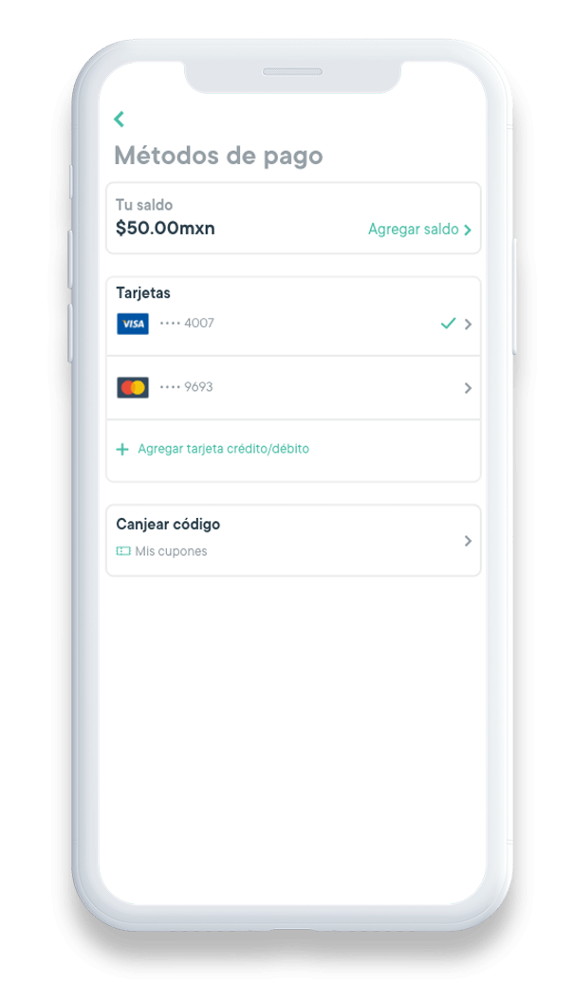
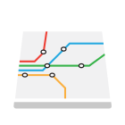

  

    

      

        <h1>Transit Services</h1>
      

    

    

      

        
        <h3><strong>You always have a place</strong></h3>
        
You can reserve your seat with the app, you will always arrive comfortable and safe.

      

      

        
        <h3><strong>Direct routes</strong></h3>
        
There are no unnecessary turns, the driver knows his route and knows the pickup and dropoff points.

      

      

        
        <h3><strong>Chilling</strong></h3>
        
On Jetty you can relax knowing that the driver knows what he is doing.

      

    

    

      

        
        <h3><strong>Costs</strong></h3>
        
Jetty costs you 30% less than taking your own car and 60% less than other services.

      

      

        
        <h3><strong>Safety</strong></h3>
        
On Jetty you can quietly take out your laptop, cell phone or video game.

      

      

        
        <h3><strong>Professional driver</strong></h3>
        
All our drivers are trained to offer you the best service

      

    

    

      

        <h1>How does it work?</h1>
      

      

        <ul class="nav nav-tabs como-funciona-tabs-list" role="tablist">
          <li role="presentation" class="active">
            <a href="#home" aria-controls="home" role="tab" data-toggle="tab">
              Booked seat
            </a>
          </li>
          <li role="presentation"><a href="#profile" aria-controls="profile" role="tab" data-toggle="tab">Payment with QR</a></li>
        </ul>

        

          

            

              

                

                  
                  
Tell us where you star the trip and where you are going.

                

                

                  
                

              

              

                

                  
                  
Check the day, time and choose the one that suits you best.

                

                

                  
                

              

            

            

              

                

                  
                  
Book your seat by paying with a card and monitor your Jetty.

                

                

                  
                

              

              

                

                  
                  
Walk to the pick up point and show your pass to the driver.

                

                

                  
                

              

            

          

          

             

              

                

                  
                  
Find the QR code when boarding the units.

                

                

                  
                

              

              

                

                  
                  
Scan and select the number of tickets.

                

                

                  
                

              

            

            

              

                

                  
                  
Pay with your card with the Jetty app.

                

                

                  
                

              

              

                

                  
                  
Show your pass to the driver.

                

                

                  
                

              

            

          

        

      

      

      

        <h3>Do you have a vehicle that you would like to work with Jetty?</h3>
        <a href="/en/transporte-de-personal-y-escolar" class="btn btn-gray" style="margin-top: 5px;">Learn more</a>
      

      

      

        
         
        
Know our service areas

        <a href="cobertura" class="btn btn-gray-small" target="_self">Service areas</a>
      

      

        
         
        
Rent a vehicle for an event

        <a href="transporte-eventos" class="btn btn-gray-small" target="_self">Contratar tranporte</a>
      

      

        
         
        
Staff transportation options

        <a href="nuestro-servicio" class="btn btn-gray-small" target="_self">Transporte de personal</a>
      

      

    

  

