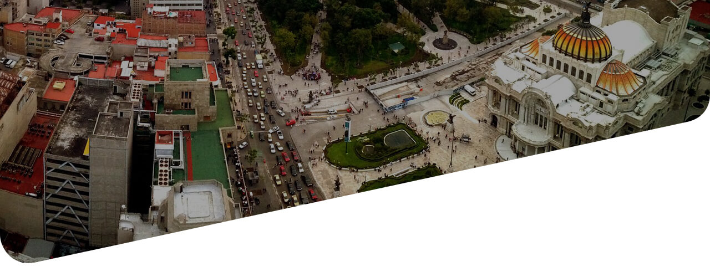

<figure class="header-tours">
  
  <figcaption>
    

      

        

          <h1>Conoce nuestros tours por la Ciudad de México de la mano de Time Out</h1>
          <!-- <h3>Nos adaptamos a tu necesidad al mejor precio para resolver tu transporte.</h3> -->
        

      

    

  </figcaption>
</figure>

  

    

      

        

          

            
          

          

            
          

        

      

      

      

        
        <h3>Nuevo Muralismo Mexicano</h3>
        
Te llevaremos a conocer de cerca el trabajo de artistas urbanos como Smithe, Curiot, Jesús Benítez “Dhear” y Colectivo Germen.

        
<b>Precio por persona:</b>  $980 MXN

        
<b>Duración: 5hrs</b>

        
<b>Incluye:</b> Guía, lunch y transporte

        
<b>Próxima fecha:</b> 11 de mayo

         
        <button type="button" class="btn btn-green-small" data-toggle="modal" data-target="#ModalTourMuralismo">
          Agendar
        </button>
        <a href="{{site.baseurl}}/tours/nuevo-muralismo-mexicano" class="btn btn-dark-gray-small">Más información</a>
      

      

        
        <h3>Mercado de San Juan</h3>
        
Además de comer en locales como Triana Café Gourmet y Las Tapas de San Juan, tendrás una clase de cocina con el chef Bernardo Bukantz.

        
<b>Precio por persona:</b>  $2,890 MXN

        
<b>Duración: 6hrs</b>

        
<b>Incluye:</b> Guía, comida y transporte

        
<b>Próxima fecha:</b> 18 de mayo

        <button type="button" class="btn btn-green-small" data-toggle="modal" data-target="#ModalTourMercado">
          Agendar
        </button>
        <a href="{{site.baseurl}}/tours/mercado-san-juan" class="btn btn-dark-gray-small">Más información</a>
      

      

        
        <h3>Santa María la Ribera</h3>
        
Visitarás lugares como el Kiosco Morisco, el Museo del Chopo, Museo de San Carlos, Casa Equis y Chilakillers.

        
<b>Precio por persona:</b>  $990 MXN

        
<b>Duración: 6hrs</b>

        
<b>Incluye:</b> Guía, desayuno, comida y transporte

        
<b>Próxima fecha:</b> 25 de mayo

         
        <button type="button" class="btn btn-green-small" data-toggle="modal" data-target="#ModalTourSantamaria">
          Agendar
        </button>
        <a href="{{site.baseurl}}/tours/santa-maria" class="btn btn-dark-gray-small">Más información</a>
      

    

  

<!-- MODAL TOURS MURALISMO-->

  

    

      

        <h2 class="modal-title title-tours-modal" id="myModalLabel">Nuevo Muralismo Mexicano</h2>
      

      <form class="js--form-events">
        

          

            

              

                <label for="nuevo-muralismo-name">Nombre</label>
                <input name="name" id="nuevo-muralismo-name" type="text" class="form-control" maxlength="30" placeholder="Nombre">
                <input name="eventname" type="hidden" value="Nuevo Muralismo Mexicano">
              

              

                <label for="nuevo-muralismo-lastname">Apellido</label>
                <input name="lastname" id="nuevo-muralismo-lastname" type="text" class="form-control" maxlength="60" placeholder="Apellido">
              

              

                <label for="nuevo-muralismo-email">Correo electrónico</label>
                <input name="email" id="nuevo-muralismo-email" type="email" class="form-control" placeholder="Correo electrónico">
              

              

                <label for="nuevo-muralismo-phone">Celular</label>
                <input name="phone" id="nuevo-muralismo-phone" type="text" class="form-control" placeholder="Número telefónico">
              

            

          

          

            

              

                <label for="nuevo-muralismo-people">Número de personas</label>
                <input name="people" id="nuevo-muralismo-people" type="text" class="form-control" placeholder="Número">
              

              

                <label for="nuevo-muralismo-date">Fecha de salida</label>
                <select class="form-control" id="nuevo-muralismo-date" name="origin_date">
                  <option value="11/Mayo/2019">11 de Mayo del 2019</option>
                </select>
              

            

          

        

        

          <button type="button" class="btn btn-default" data-dismiss="modal">Cerrar</button>
          <button type="submit" class="btn btn-green-small">Enviar</button>
        

      </form>

    

  

<!-- MODAL TOURS MERCADO-->

  

    

      

        <h2 class="modal-title title-tours-modal" id="myModalLabel">Mercado de San Juan</h2>
      

      <form class="js--form-events">
        

          

            

              

                <label for="nuevo-mercado-name">Nombre</label>
                <input name="name" id="nuevo-mercado-name" type="text" class="form-control" maxlength="30" placeholder="Nombre">
                <input name="eventname" type="hidden" value="Mercado de San Juan">
              

              

                <label for="nuevo-mercado-lastname">Apellido</label>
                <input name="lastname" id="nuevo-mercado-lastname" type="text" class="form-control" maxlength="60" placeholder="Apellido">
              

              

                <label for="nuevo-mercado-email">Correo electrónico</label>
                <input name="email" id="nuevo-mercado-email" type="email" class="form-control" placeholder="Correo electrónico">
              

              

                <label for="nuevo-mercado-phone">Celular</label>
                <input name="phone" id="nuevo-mercado-phone" type="text" class="form-control" placeholder="Número telefónico">
              

            

          

          

            

              

                <label for="nuevo-mercado-people">Número de personas</label>
                <input name="people" id="nuevo-mercado-people" type="text" class="form-control" placeholder="Número">
              

              

                <label for="nuevo-mercado-date">Fecha de salida</label>
                <select class="form-control" id="nuevo-mercado-date" name="origin_date">
                  <option value="18/Mayo/2019">18 de Mayo del 2019</option>
                </select>
              

            

          

        

        

          <button type="button" class="btn btn-default" data-dismiss="modal">Cerrar</button>
          <button type="submit" class="btn btn-green-small">Enviar</button>
        

      </form>

    

  

<!-- MODAL TOURS SANTA MARIA-->

  

    

      

        <h2 class="modal-title title-tours-modal" id="myModalLabel">Santa María la Ribera</h2>
      

      <form class="js--form-events">
        

          

            

              

                <label for="nuevo-santamaria-name">Nombre</label>
                <input name="name" id="nuevo-santamaria-name" type="text" class="form-control" maxlength="30" placeholder="Nombre">
                <input name="eventname" type="hidden" value="Santa María la Ribera">
              

              

                <label for="nuevo-santamaria-lastname">Apellido</label>
                <input name="lastname" id="nuevo-santamaria-lastname" type="text" class="form-control" maxlength="60" placeholder="Apellido">
              

              

                <label for="nuevo-santamaria-email">Correo electrónico</label>
                <input name="email" id="nuevo-santamaria-email" type="email" class="form-control" placeholder="Correo electrónico">
              

              

                <label for="nuevo-santamaria-phone">Celular</label>
                <input name="phone" id="nuevo-santamaria-phone" type="text" class="form-control" placeholder="Número telefónico">
              

            

          

          

            

              

                <label for="nuevo-santamaria-people">Número de personas</label>
                <input name="people" id="nuevo-santamaria-people" type="text" class="form-control" placeholder="Número">
              

              

                <label for="nuevo-santamaria-date">Fecha de salida</label>
                <select class="form-control" id="nuevo-santamaria-date" name="origin_date">
                  <option value="25/Mayo/2019">25 de Mayo del 2019</option>
                </select>
              

            

          

        

        

          <button type="button" class="btn btn-default" data-dismiss="modal">Cerrar</button>
          <button type="submit" class="btn btn-green-small">Enviar</button>
        

      </form>

    

  

