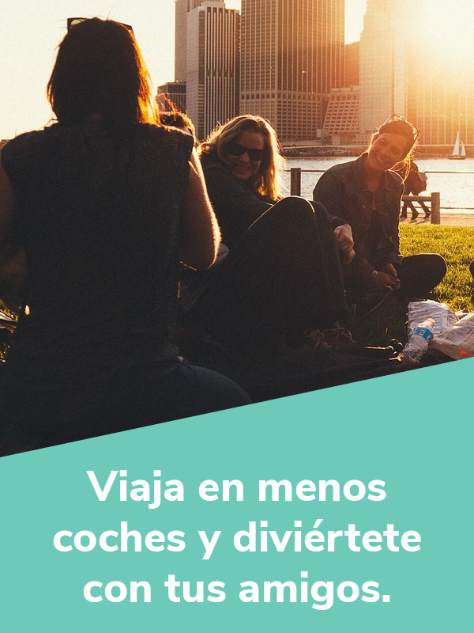

  

    

      

        <h1>¿NECESITAS UN JETTY?</h1>
      

      

        <h2>Para tu boda, un concierto o un evento deportivo, <b>Jetty es para tí.</b></h2>
        <a class="typeform-share btn btn-default btn-green" href="https://cledestino.typeform.com/to/t9Vmjl" data-mode="1" target="_blank">Cotiza</a>
        
      

    

  

  

    

      

        <h2>Ya sea para...</h2>
      

    

    

      

        
      

      

        
      

      

        
      

      

        
      

    

  

  

    

      

        <h1>Beneficios</h1>
      

    

    

      

        
      

      

        
      

      

        
      

    

   <!--  

      

       

          <svg id="automovile" xmlns="http://www.w3.org/2000/svg" x="0px" y="0px" width="141px" height="141px" viewBox="0 0 141.7 141.7" style="enable-background:new 0 0 141.7 141.7;" >
          
          <g>
            <path class="st0" d="M22.3,70.4c-2.4-0.8-4.7-1.6-7-2.4c-0.5-0.2-0.9-0.3-1.4-0.5c-2.2-0.8-2.9-2.3-2.2-4.5c0.3-1,0.7-1.9,1.2-2.8
              c0.6-1,1.5-1.4,2.6-1.4c4.4,0,8.9,0,13.5,0c0.6-1.7,1.1-3.5,1.7-5.2c1-3,1.9-6,3.2-8.9c0.9-1.9,2.7-3,4.9-3c1.2,0,2.4-0.1,3.6-0.1
              c19.6,0,39.3,0,58.9,0c2.1,0,3.9,0.4,5.4,1.9c1.1,1.1,1.6,2.6,2.1,4c0.8,2.3,1.5,4.7,2.3,7.1c0.3,1.1,0.6,2.1,1,3.2
              c0.2,0.7,0.5,1.1,1.4,1.1c4.2-0.1,8.4-0.1,12.6,0c0.8,0,1.7,0.4,2.3,1c1.3,1.3,1.6,3,1.8,4.7c0.1,1.2-1.2,2.5-2.8,3.1
              c-2.4,0.8-4.8,1.6-7.1,2.4c-0.3,0.1-0.7,0.2-1.3,0.6c0.5,0.4,1,0.7,1.5,1.1c2.1,1.9,4.3,3.7,6.3,5.7c1.2,1.2,1.8,2.8,1.8,4.6
              c0,11.3,0,22.5,0,33.8c0,1.9-1.4,3.4-3.3,3.4c-4.7,0-9.5,0-14.2,0c-1.6,0-2.8-1.1-2.9-2.6c-0.2-2.1-0.2-4.2-0.1-6.3
              c0-0.9-0.2-1.2-1.2-1.2c-24.1,0-48.2,0-72.3,0c-1,0-1.3,0.3-1.3,1.3c0,2.1,0,4.3-0.1,6.4c-0.1,1.3-1.3,2.4-2.6,2.4
              c-4.8,0.1-9.6,0.1-14.4,0c-1.9,0-3.3-1.6-3.3-3.5c0-4.6,0-9.1,0-13.7c0-6.1,0.1-12.2,0-18.3c-0.1-3.6,1.3-6.3,4-8.5
              c1.8-1.4,3.5-3,5.2-4.5C22.3,70.7,22.3,70.5,22.3,70.4z"/>
            <g>
              <path class="st0" d="M117.2,80.7c-2.9,0.6-15.8,3.3-16.8,3.7c-1.7,0.8-2.4,2.5-1.9,4.4c0.3,1.1,1.9,2.5,3.6,2.5
                c2.5-0.1,12.9,0,15.6,0c1.4,0,2.9-0.9,3.1-2.2c0.3-2,0.4-4.1,0.1-6C120.6,81.2,118.6,80.5,117.2,80.7z"/>
              <path class="st0" d="M43.8,88.7c0.4-1.9-0.4-3.9-2-4.4c-1.7-0.6-14.9-3.3-16.6-3.6c-1.6-0.3-3.2,0.6-3.6,2.2
                c-0.6,2.1-0.7,4.3,0.1,6.3c0.4,1.1,1.3,2.1,2.7,2.1c2.7,0,13.5,0,16.2-0.1C41.9,91.2,43.6,89.9,43.8,88.7z"/>
              <path class="st0" d="M38.7,52.4c-1.2,3.7-2.5,7.3-3.7,11c-0.4,1.1-0.6,2.2-1,3.4c24.8,0,49.4,0,74.3,0c-0.7-2.1-1.3-4.1-1.9-6
                c-0.5-1.6-1-3.3-1.5-4.9c-0.5-1.4-0.8-2.9-1.5-4.2c-1.2-2.4-3.3-3.4-5.9-3.4c-17.4,0-34.9,0-52.3,0c-0.4,0-0.8,0-1.3,0
                C41.3,48.6,39.3,50.4,38.7,52.4z"/>
            </g>
          </g>
          </svg>

          
Viaja en menos coches.

        

        

          <svg id="asiento" xmlns="http://www.w3.org/2000/svg" x="0px" y="0px" width="141px" height="141px" viewBox="0 0 141.7 141.7" style="enable-background:new 0 0 141.7 141.7;" >
          
          <g>
            <path class="st0" d="M37.3,25.9c-5,8.5-0.4,40.8,12.2,73.6c13,1.8,52.6,2.1,55.5,0.8c1.8-0.9,2.6-6.5,2.9-10.4
              c0.2-2.4-1.4-4.6-3.7-5.1c-6.9-1.6-20.1-4-44.2-0.8c-1.3-3.6-10.5-47.8-8.6-53.5C54,21.8,40.5,20.5,37.3,25.9z"/>
            <path class="st1" d="M51.3,110.6v7.4c0,0.7,0.6,1.3,1.3,1.3H103c0.7,0,1.3-0.6,1.3-1.3v-7.1c0-0.8-0.7-1.4-1.5-1.3
              c-3.2,0.4-11.5,1.5-27.1,1c-14-0.5-20.6-1-23-1.2C52,109.2,51.3,109.8,51.3,110.6z"/>
          </g>
          </svg>

          
Saber que siempre tendrás tu lugar sentado.

        

        

          <svg id="rutas" xmlns="http://www.w3.org/2000/svg" x="0px" y="0px" width="141px" height="141px" viewBox="0 0 141.7 141.7" style="enable-background:new 0 0 141.7 141.7;">
        
        <g>
          <g>
            <circle class="st0" cx="26.6" cy="69.4" r="8.9"/>
            <path class="st1" d="M44.2,69.4c0,9.7-17.6,34.5-17.6,34.5S9,79.1,9,69.4s7.9-17.6,17.6-17.6S44.2,59.7,44.2,69.4z"/>
          </g>
          <g>
            <circle class="st0" cx="117.4" cy="49.1" r="7.4"/>
            <path class="st1" d="M132,49.1c0,8.1-14.6,28.7-14.6,28.7s-14.6-20.6-14.6-28.7s6.6-14.6,14.6-14.6S132,41.1,132,49.1z"/>
          </g>
          <path class="st0" d="M26.6,103.8c0,0,34.5-34.5,90.8-26"/>
        </g>
        </svg>
          
No perder tiempo en vueltas innecesarias.

        

        

          <svg id="zzz" xmlns="http://www.w3.org/2000/svg" x="0px" y="0px" width="141px" height="141px" viewBox="0 0 141 141" style="enable-background:new 0 0 141 141;" >
            
            <g>
              <rect x="19.1" y="78.4" class="st0" width="103.8" height="22"/>
              <path class="st0" d="M122.9,111.8H134V74.5c0-2-1.7-3.7-3.7-3.7h-3.7c-2,0-3.7,1.7-3.7,3.7C122.9,74.5,122.9,111.8,122.9,111.8z"/>
              <path class="st0" d="M8,111.8h11.1V54.9c0-2-1.7-3.7-3.7-3.7H8V111.8z"/>
              <path class="st0" d="M46.3,78.4H19.1v-6.8c0-3.5,2.8-6.3,6.3-6.3h20.9c3.5,0,6.3,2.8,6.3,6.3v0.5C52.6,75.6,49.8,78.4,46.3,78.4z"
                />
              <g>
                <path class="st1" d="M53.1,50.8h6.6v2.9H48.6V51l6.2-7h-6.1v-2.9h10.8v2.6L53.1,50.8z"/>
              </g>
              <g>
                <path class="st1" d="M96.1,50.3h7.7v3.4H90.9v-3.1l7.2-8.1H91v-3.4h12.5v3L96.1,50.3z"/>
              </g>
              <g>
                <path class="st1" d="M75,43.1h9.8v4.3H68.3v-4L77.6,33h-9.2v-4.3h16.1v3.8L75,43.1z"/>
              </g>
            </g>
            </svg>
          
Recuperar horas perdidas de sueño.

        

      

    
 -->

    <!-- 

      

        

          <svg id="cartera" xmlns="http://www.w3.org/2000/svg" x="0px" y="0px" width="141px" height="141px" viewBox="0 0 141 141" style="enable-background:new 0 0 141 141;" >
            
            <g>
              <g>
                <rect x="11.3" y="42.5" class="st0" width="119.7" height="57.1"/>
                <circle class="st0" cx="71.2" cy="71" r="15.1"/>
                <g>
                  <circle class="st0" cx="97.5" cy="71" r="3"/>
                  <circle class="st0" cx="44.8" cy="71" r="3"/>
                </g>
                <path class="st0" d="M131,57.6c-8.3,0-15.1-6.8-15.1-15.1"/>
                <path class="st0" d="M26.4,42.5c0,8.3-6.8,15.1-15.1,15.1"/>
                <path class="st0" d="M11.3,84.4c8.3,0,15.1,6.8,15.1,15.1"/>
                <path class="st0" d="M115.9,99.5c0-8.3,6.8-15.1,15.1-15.1"/>
              </g>
              <g>
                <path class="st1" d="M72.9,71h-3.5c-1.3,0-2.3-1-2.3-2.3v-0.1c0-1.3,1-2.3,2.3-2.3h3.5c1.3,0,2.3,1,2.3,2.3"/>
                <path class="st1" d="M72.9,71c1.3,0,2.3,1,2.3,2.3v0.1c0,1.3-1,2.3-2.3,2.3h-3.5c-1.3,0-2.3-1-2.3-2.3"/>
                <line class="st1" x1="71.2" y1="62.8" x2="71.2" y2="66.2"/>
                <line class="st1" x1="71.2" y1="75.8" x2="71.2" y2="79.2"/>
              </g>
            </g>
            </svg>
          
No tener que gastar toda tu quincena en traslados.

        

        

          <svg id="laptop" xmlns="http://www.w3.org/2000/svg" x="0px" y="0px" width="141px" height="141px" viewBox="0 0 141 141" style="enable-background:new 0 0 141 141;" >
            
            <g>
              <path class="sty0" d="M123.6,91.3v-57c0-2.1-1.7-3.8-3.8-3.8H23c-2.1,0-3.8,1.7-3.8,3.8v56.9"/>
              <path class="sty0" d="M10.8,98.5v9.2c0,2.1,1.7,3.8,3.8,3.8h113.6c2.1,0,3.8-1.7,3.8-3.8v-9.2H88.7l-2.6,3.3H57.2l-3.1-3.3H10.8z"/>
              <rect x="21.1" y="104.7" class="sty1" width="4.6" height="2.6"/>
              <rect x="29.1" y="104.7" class="sty1" width="4.6" height="2.6"/>
              <line class="sty0" x1="19.2" y1="41.1" x2="123.6" y2="41.1"/>
            </g>
            </svg>
          
Mandar ese último correo en el viaje de regreso y disfrutar del acceso al WiFi gratis.

        

        

          <svg id="chofer" xmlns="http://www.w3.org/2000/svg" x="0px" y="0px" width="141px" height="141px" viewBox="0 0 141 141" style="enable-background:new 0 0 141 141;">
            
            <g>
              <path class="chof" d="M80.2,19.4c0,0-4.4-1.2-9.5-1.2s-9.5,1.2-9.5,1.2l2,2.6c0,0-0.1,1.2,0,2.1c1,0.7,4.8,1.3,7.5,1.3
                s6.5-0.6,7.5-1.3c0.1-0.9,0-2.1,0-2.1L80.2,19.4z"/>
              <path class="chof" d="M63.1,28.3c0,4.1,3.4,7.5,7.5,7.5s7.5-3.4,7.5-7.5"/>
              <path class="chof" d="M83.3,42L83.3,42L83.3,42H59.4l0,0l0,0c-3.3,0-6,2.7-6,6v33.8c0,1.9,1.5,3.4,3.4,3.4h2.7v33.9
                c0,2.6,1.9,4.9,4.4,5.1c2.9,0.3,5.4-2,5.4-4.9v-36c0-1,0.7-2,1.7-2.2c1.3-0.2,2.4,0.8,2.4,2.1v36c0,2.6,1.9,4.9,4.4,5.1
                c2.9,0.3,5.4-2,5.4-4.9V85.2h2.7c1.9,0,3.4-1.5,3.4-3.4V48.1C89.3,44.7,86.6,42,83.3,42z"/>
              <line class="chof" x1="83.3" y1="85.3" x2="83.3" y2="50.4"/>
              <line class="chof" x1="59.4" y1="50.4" x2="59.4" y2="85.3"/>
            </g>
            </svg>
          
Tener un conductor profesional y considerado.

        

      

    
 -->

    

      

      <a class="typeform-share btn btn-default btn-lg btn-gray " href="https://cledestino.typeform.com/to/t9Vmjl" data-mode="1" target="_blank">Cotiza</a>
      

    

  

  

  

    

      <h3 class="text-center">Nuestro servicio incluye:</h3>
      <ul class="lead">
        <li>Vehículos: Crafter de Volkswagen 2015/2017</li>
        <li>Asientos: 19 reclinables con cinturones de seguridad en todos los asientos</li>
        <li>Equipamiento: Aire acondicionado en cabina y para pasajeros, 4 cargadores USB por fila, GPS, WiFi, Cámaras de seguridad hacia el interior y el exterior.</li>
        <li>Conductor: El conductor pasó un estricto proceso de selección que incluye entrevistas, exámenes toxicológicos y evaluaciones psicométricas, entre otras.</li>
      </ul>
    

    

      <a class="typeform-share btn btn-default btn-green" href="https://cledestino.typeform.com/to/t9Vmjl" data-mode="1" target="_blank">Cotiza</a>
    

  

