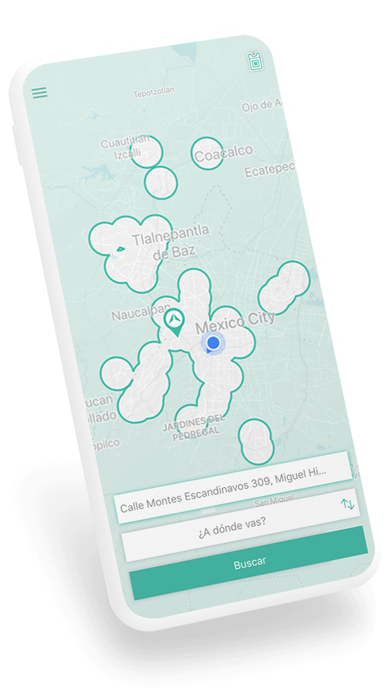
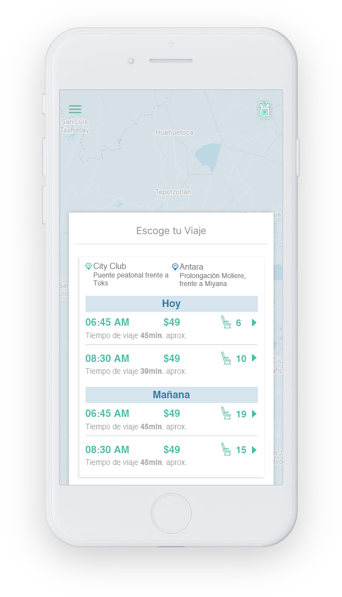
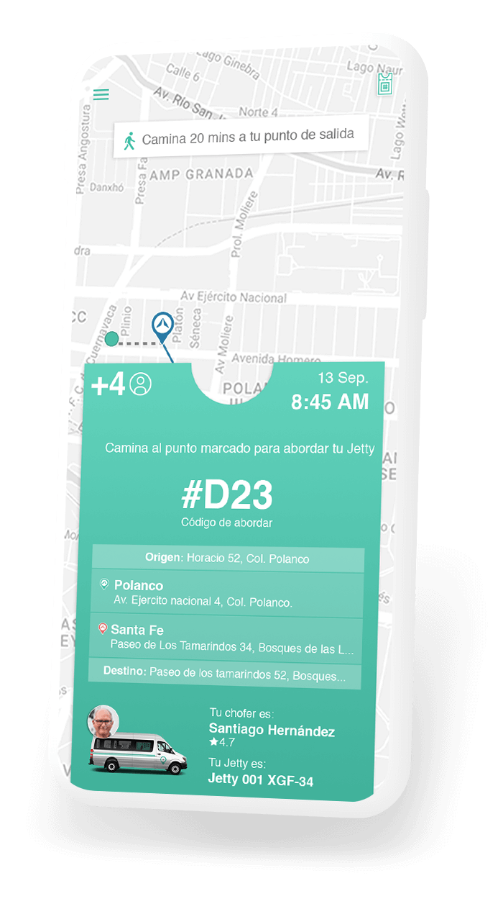
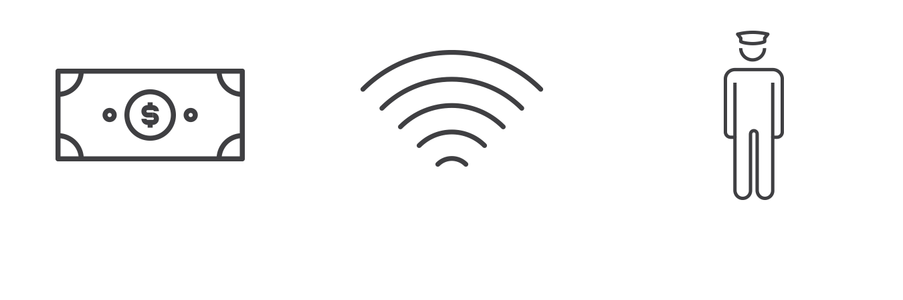

  

    

      

        

           <h2>¿Estás cansado de perder horas atrás del volante en el tráfico?</h2>
           <h2>¿Te incomoda ir parado en el camión?</h2>
           <h2>¿Te da miedo viajar en transporte público?</h2>
           <h2>¿Te estresa ver cómo avanza el taxímetro y las tarifas dinámicas?</h2>
        

        
Olvida esas preocupaciones, viaja cómodo y seguro. En Jetty convertiremos cada traslado en un buen viaje.

        
Descarga la app.

        <!-- <a href="solicitud" class="btn btn-default btn-lg btn-green btn-header">¿A dónde te llevamos?</a> -->

        

        
      

      

        
      

    

  

  

    

      

        
      

      <h3>Seguridad</h3>
      
Todas nuestras unidades cuentan con cámaras de vigilancia y son monitoreadas vía GPS.

    

    

      

        
      

      <h3>Conectividad</h3>
      
Durante el viaje, carga tu celular y conéctate a nuestro Wi-Fi.

    

    

      

        
      

      <h3>Tranquilidad</h3>
      
Nuestros conductores y el equipo de soporte, están capacitados para darte el mejor servicio.

    

    

      

        
      

      <h3>Eficiencia</h3>
      
Nuestro viajes están pensados para que puedas llegar a tu destino de la manera más directa.

    

  

  

  

    

      

        <h1>Cómo Funciona</h1>
      

      

        

          

            
          

          

            
Dinos de dónde sales y a dónde viajas.

             
          

        

        

          
        

      

      

        

          

            
          

          

            
Revisa las opciones y elige la que más te convenga.

          

        

        

          
        

      

      

        

          

            
          

          

            
Reserva pagando con tu tarjeta y monitorea tu Jetty.

          

        

        

          
        

      

      

        

          

            
          

          

            
Camina al punto de abordaje y muéstrale tu pase al conductor.

          

        

        

          
        

      

      

        
Descarga la app y disfruta de un buen viaje.

        

        
      

    

  

  

  

    

      

        <h1>Buen viaje 
          es...
        </h1>
      

    

    

      

        

          <!-- Indicators -->
          <ol class="carousel-indicators">
            <li data-target="#carousel-example-generic" data-slide-to="0" class="active"></li>
            <li data-target="#carousel-example-generic" data-slide-to="1"></li>
          </ol>

          <!-- Wrapper for slides -->
          

            

              
            

            

              
            

          

          <!-- Controls -->
          <a class="left carousel-control" href="#carousel-example-generic" role="button" data-slide="prev">
            
            Previous
          </a>
          <a class="right carousel-control" href="#carousel-example-generic" role="button" data-slide="next">
            
            Next
          </a>
        

      

    

    

      

      <a href="beneficios" class="btn btn-default btn-lg btn-gray btn-beneficios">Conoce más de nuestros beneficios</a>
      

    

  

  

