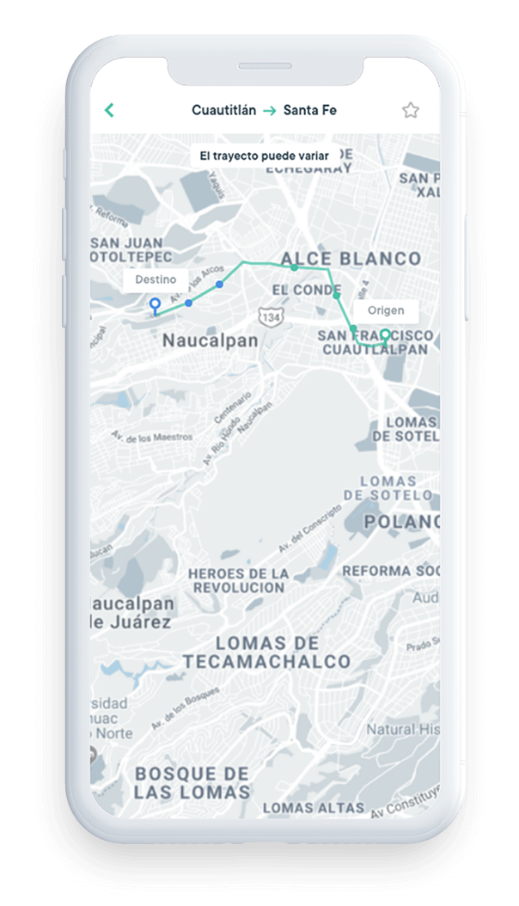

  

    <!-- HEADER -->
    

      

        
      

      

        <h1>Tecnología para el transporte colectivo.</h1>
         
        
Lleva lleva los beneficios de la tecnología Jetty a tu empresa de transporte público, de personal, turístico o escolar, mejorando la experiencia del usuario; contribuyendo a la modernización del sector y a la mejora de la movilidad en las ciudades.

        
Descarga la app.

         

        
      

    

    <!-- AMENIDADES -->
    

      

        
        <h3 class="titleConcesionado">Medio de pago</h3>
      

      

        
        <h3 class="titleConcesionado">Canal de atención al usuario</h3>
      

      

        
        <h3 class="titleConcesionado">Herramientas de supervisión y monitoreo de la operación</h3>
      

      

        
        <h3 class="titleConcesionado">Sistema de planificación</h3>
      

    

    

    

      

        

          
          
<b>Pase de abordar</b>

        

        

          
          
<b>Métodos de pago</b>

        

        

          
          
<b>Retroalimentación</b>

        

        

          
          
<b>Reserva origen/destino</b>

        

        

          
          
<b>Solicitud de asistencia</b>

        

        

          
          
<b>Seguimiento de la unidad</b>

        

      

    

    

      

        <a href="soluciones-tecnologicas" class="btn btn-gray">Conoce nuestra tecnología</a>
      

    

  

<!--  -->