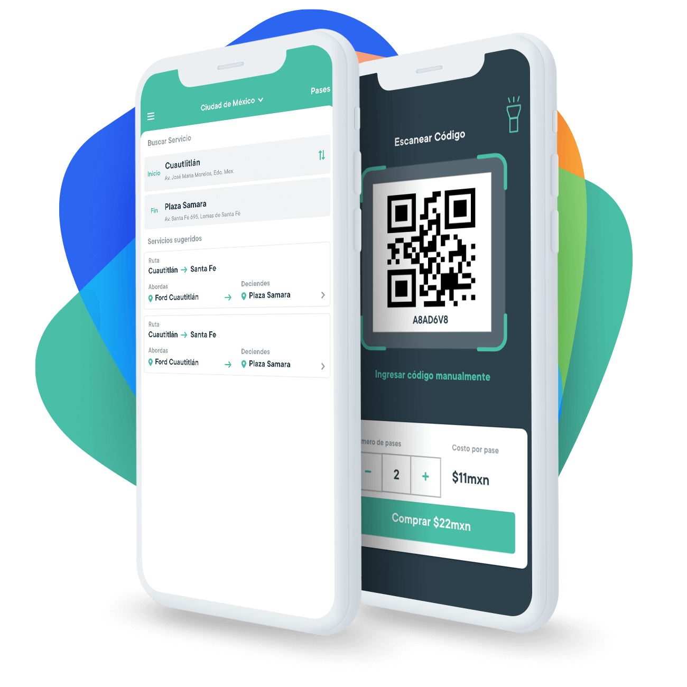
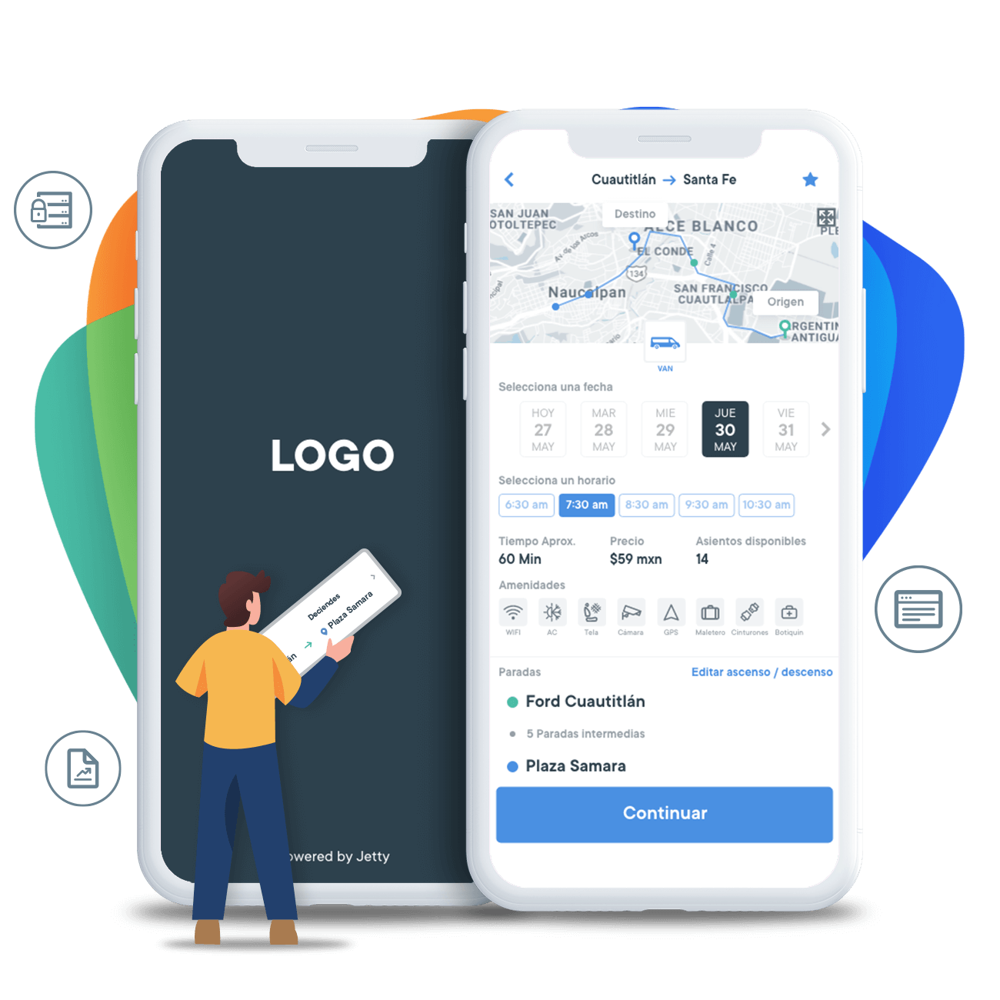
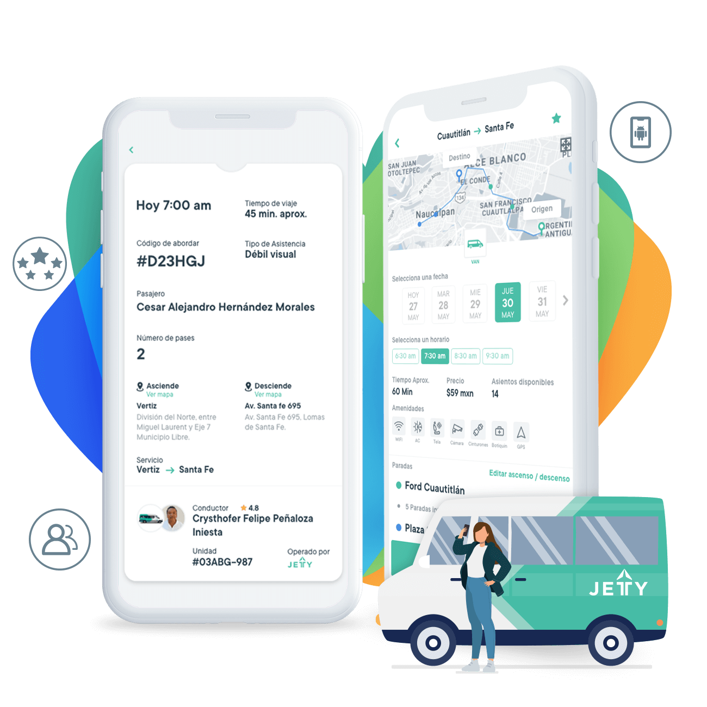
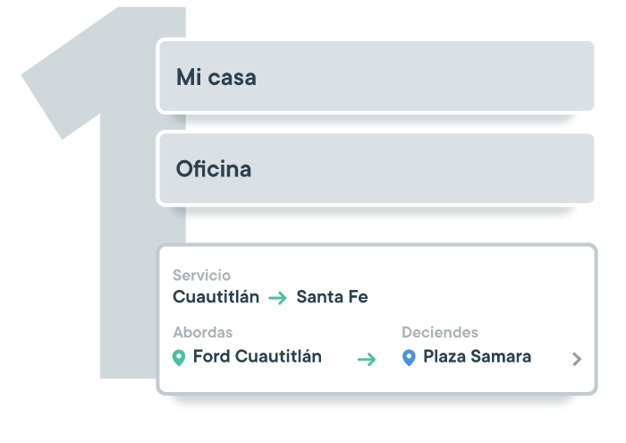
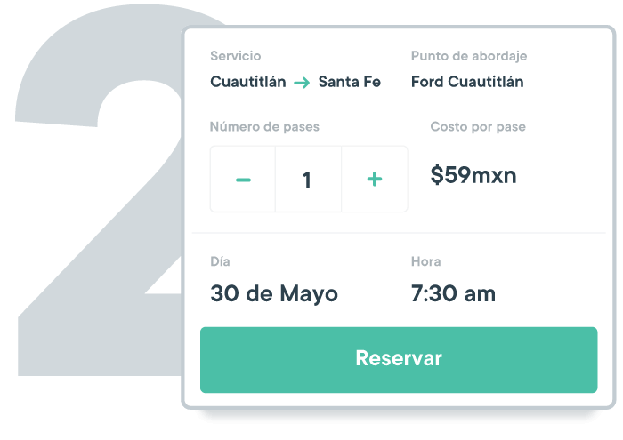
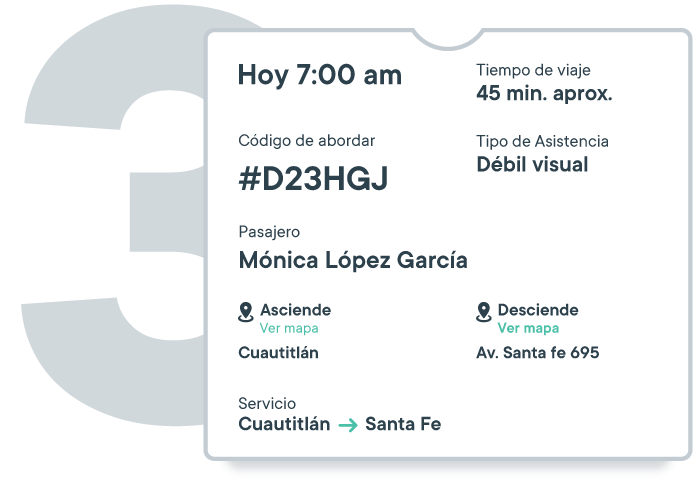

  

    <!-- HEADER -->
    

      

        <h1>Tecnología para el  
          transporte colectivo
        </h1>
        
Somos una empresa de tecnología que mejora la experiencia de los usuarios en el transporte colectivo, brindándoles el poder y todas las herramientas para una movilidad más eficiente y segura, con la finalidad de lograr la modernización del sector y de las ciudades.

      

      

        
      

    

    

      

        <h1>Cómo lo hacemos</h1>
      

      

        
      

      

        <h2>Soluciones  tecnológicas</h2>
        
Llevamos todos los beneficios de nuestra tecnología a empresas de transporte público, corporativos, servicios turísticos o instituciones educativas, para mejorar la experiencia de sus usuarios en la movilidad. 

        
Elige nuestra tecnología; tenemos diversas modalidades que puedes implementar en tu servicio: Sistema de reserva de asientos, pago con QR, evaluación de conductores, canal de atención a usuarios, herramientas para el manejo y optimización de flotas y planificación de rutas.

        <a href="soluciones-tecnologicas" class="btn-green hvr-shadow">Ver tecnología</a>
      

    

    

      

        
      

      

        <h2>Servicios de  transporte</h2>
        
Cuando eliges Jetty comienzas a disfrutar la ciudad, ya que nos encargamos de supervisar tus viajes en tiempo real  y de ofrecerte los más altos estándares de calidad.

        
Contamos con múltiples beneficios, que buscan darle el poder al usuario: Calificar viajes, seguridad en traslados, rutas optimizadas, horarios establecidos, diferentes modalidades de pago y mucho más. ¡Comienza a moverte en Jetty y transforma tus traslados!

        <a href="servicios-de-transporte" class="btn-green hvr-shadow">Ver tecnología</a>
      

    

    

      

        <h3>Conoce nuestra app</h3>
      

      

        
        <h3>Busca tu ruta</h3>
      

      

        
        <h3>Reserva tu asiento</h3>
      

      

        
        <h3>Disfruta de un Buen Viaje</h3>
      

    

  

<!--  -->