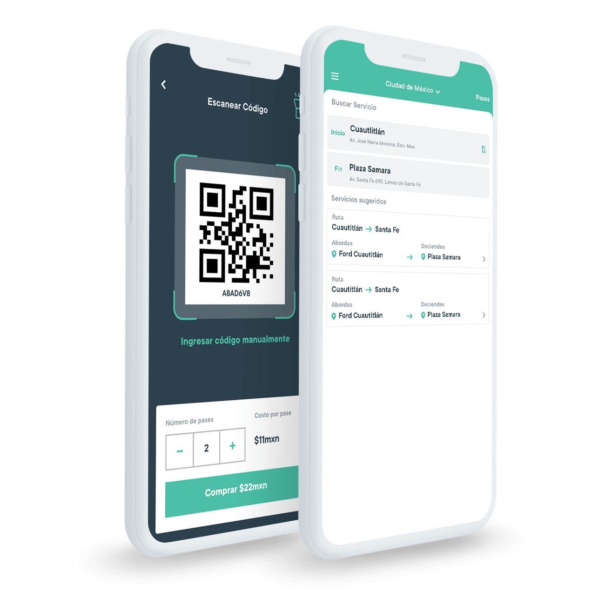
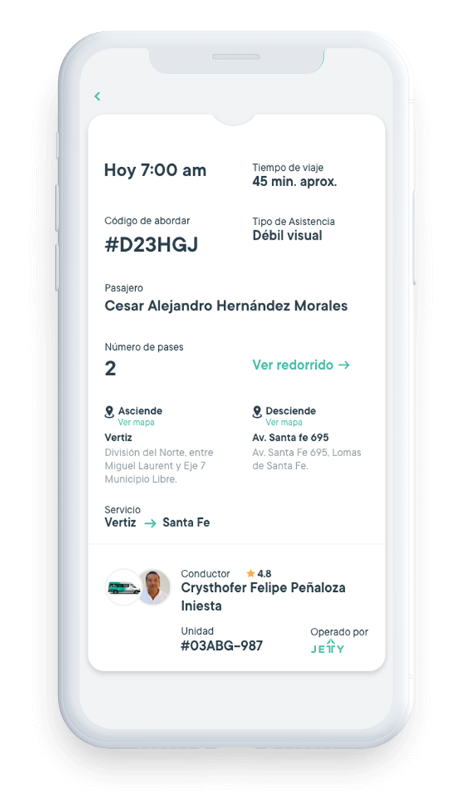
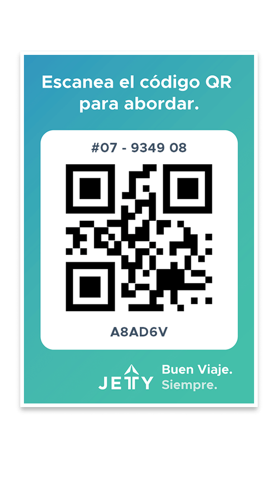
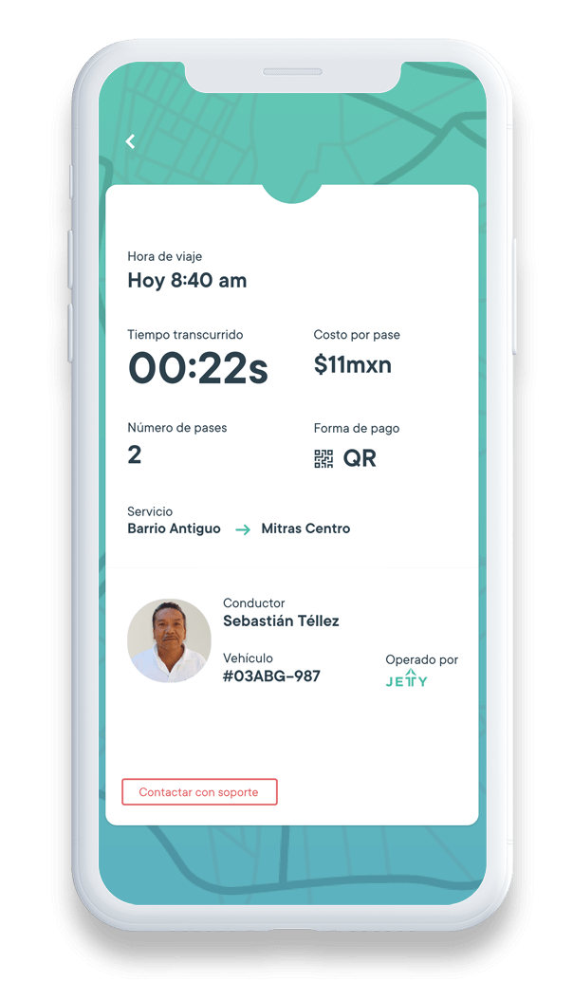

  

    <!-- HEADER -->
    <!-- 

      

        <lottie-player
            src="lottie/transporte.json" background="transparent" speed="0.5" loop autoplay class="lottie-trasnporte">
        </lottie-player>
      

      

        <h1>Tecnología para el transporte colectivo.</h1>
         
        
Lleva los beneficios de la tecnología Jetty al transporte colectivo, mejorando la experiencia del usuario y contribuyendo a la modernización del gremio transportista.

        
Descarga la app.

         

        
      

    
 -->

    

      

        
      

      

        <h1>Tecnología para el transporte colectivo.</h1>
         
        
Lleva los beneficios de la tecnología Jetty al transporte colectivo, mejorando la experiencia del usuario y contribuyendo a la modernización del sector.

        
Descarga la app.

         

        
      

    

    <!-- AMENIDADES -->
    

      

        
        <h3 class="titleConcesionado">Medio de pago</h3>
      

      

        
        <h3 class="titleConcesionado">Canal de atención al usuario</h3>
      

      

        
        <h3 class="titleConcesionado">Herramientas de supervisión y monitoreo de la operación</h3>
      

      

        
        <h3 class="titleConcesionado">Sistema de planificación</h3>
      

    

    <!-- 

      

        
        <h3 style="font-weight: 800">Seguridad</h3>
        
Todos nuestros viajes son monitoreados por nuestro equipo de soporte.

      

      

        
        <h3 style="font-weight: 800">Tranquilidad</h3>
        
Nuestros conductores y el equipo de soporte, están capacitados para darte el mejor servicio.

      

      

        
        <h3 style="font-weight: 800">Eficiencia</h3>
        
Nuestros viajes están pensados para que puedas llegar a tu destino de la manera más directa.

      

    
 -->

    

    <!-- CLIENTES -->
    <!-- 

      

        <h1>Clientes:</h1>
      

      

      

        <a href="/transporte-privado" class="indexClientes">
          
           
          Transporte Escolar / Personal
        </a>
      

      

        <a href="/transporte-publico" class="indexClientes">
          
           
          Transporte Público
        </a>
      

      

        <a href="/transporte-gobierno" class="indexClientes">
          
           
          Agencia de Gobierno
        </a>
      

    
 -->

    

      

        

          
          
Pase de abordar

        

        

          
          
Métodos de pago

        

        

          
          
Retroalimentación

        

        

          
          
Reserva origen/destino

        

        

          
          
Solicitud de asistencia

        

      

    

    

      

        <a href="producto" class="btn btn-gray">Conoce nuestra tecnología</a>
      

    

    <!-- COMO FUNCIONA -->
    <!-- 

      

        <h1>¿Cómo funciona?</h1>
      

      

        <ul class="nav nav-tabs como-funciona-tabs-list" role="tablist">
          <li role="presentation" class="active">
            <a href="#home" aria-controls="home" role="tab" data-toggle="tab">
              Mediante Reserva
            </a>
          </li>
          <li role="presentation"><a href="#profile" aria-controls="profile" role="tab" data-toggle="tab">Pago con QR</a></li>
        </ul>

        

          

            

              

                

                  
                  
Dinos de dónde sales y a dónde viajas.

                

                

                  
                

              

              

                

                  
                  
Revisa el día, horario y elige el que más te convenga.

                

                

                  
                

              

            

            

              

                

                  
                  
Reserva tu asiento pagando con tarjeta y monitorea tu Jetty.

                

                

                  
                

              

              

                

                  
                  
Camina al punto de abordaje y muéstrale tu pase al conductor.

                

                

                  
                

              

            

          

          

             

              

                

                  
                  
Busca el código QR al abordar las unidades.

                

                

                  
                

              

              

                

                  
                  
Escanea y selecciona el número de pases.

                

                

                  
                

              

            

            

              

                

                  
                  
Paga con tu tarjeta desde la app de Jetty.

                

                

                  
                

              

              

                

                  
                  
Muéstrale tu pase al conductor.

                

                

                  
                

              

            

          

        

      

      

      

        
¡Descarga la app!

        

        
      

    
 -->

    <!-- BENEFICIOS USUARIOS -->
    <!-- 

      

        <h1>¿Por qué nos prefieren nuestros usuarios?</h1>
      

    

    

      

        
        
<strong>Información sobre rutas, paradas, tiempos de viaje y frecuencias de los servicios.</strong>

      

      

        
        
<strong>Pagar desde la app, no hay necesidad de llevar efectivo.</strong>

      

      

        
        
<strong>Recarga saldo desde casi cualquier lugar.</strong>

      

    

    

      

        
        
<strong>Calificar el servicio y  dar retroalimentación sobre el conductor y la experiencia de viaje.</strong>

      

      

        
        
<strong>Conoce a tu conductor, vehículo y punto de ascenso.</strong>

      

      

        
        
<strong>Tienes servicio de soporte, antes, durante y después del viaje.</strong>

      

    

    

    

      

        <a href="servicios-ejecutivos" class="btn btn-gray">Beneficio de servicios ejecutivos</a>
      

    
-->

    <!-- TESTIMONIOS -->
    <!-- 

      

        <h1>Lo que dicen nuestros usuarios</h1>
      

      

        

          <ol class="carousel-indicators">
            <li data-target="#carousel-example-generic" data-slide-to="0" class="active"></li>
            <li data-target="#carousel-example-generic" data-slide-to="1"></li>
            <li data-target="#carousel-example-generic" data-slide-to="2"></li>
            <li data-target="#carousel-example-generic" data-slide-to="3"></li>
            <li data-target="#carousel-example-generic" data-slide-to="4"></li>
            <li data-target="#carousel-example-generic" data-slide-to="5"></li>
          </ol>

          

            

              

                

                  
                

                

                   
                  
Excelente servicio, de hecho extraordinario de verdad, lo recomendaré mucho. <i>Juan Carlos C.</i>

                

              

            

            

              

                

                  
                

                

                  
Genial servicio! Conductor súper amable. Cada vez van abriendo más servicios y si no te queda alguna puedes preguntar para que te digan por donde pasa y te recojan. Seguro, rápido y cómodo. No hay mejor manera para llegar a Santa Fé. <i>Nancy G.</i>

                

              

            

            

              

                

                  
                

                

                  
Muy buen servicio, las camionetas son super puntuales, cuentan con cámaras de seguridad y el servicio al cliente siempre está atento a lo que necesites, lo utilizaré casi diario. <i>Rafael C.</i>

                

              

            

            

              

                

                  
                

                

                  
Excelente, llevo varios meses viajando en Jetty y el servicio es perfecto, Enrique es super amable muy educado y siempre preocupado porque lleguemos a tiempo y con bien a nuestro destino, al servicio y a Enrique les doy 5 estrellas, gracias. <i>Hugo C.</i>

                

              

            

            

              

                

                  
                

                

                   
                  
Excelente servicio, ya no uso mi carro para ir a la oficina. <i>Luis Antonio F.</i>

                

              

            

            

              

                

                  
                

                

                  
Como ya se está volviendo una maravillosa costumbre, JETTY me acompaña casi diario para comenzar bien mi día... ¡Son únicos! ¡Los amo! <i>Klaus</i>

                

              

            

          

          <a class="left carousel-control" href="#carousel-example-generic" role="button" data-slide="prev">
            
            Previous
          </a>
          <a class="right carousel-control" href="#carousel-example-generic" role="button" data-slide="next">
            
            Next
          </a>
        

      

    
 -->

  

<!--  -->