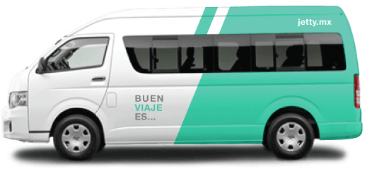
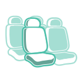

  

    

      

        <h1>El transporte 
          que mereces.
        </h1>
        

           <h2>¿Estás cansado de perder horas atrás del volante en el tráfico?</h2>
           <h2>¿Te incomoda ir parado en el camión</h2>
           <h2>¿Te da miedo viajar en transporte público?</h2>
           <h2>¿Te estresa ver como avanza el taxímetro y las tarifas dinámicas?</h2>
        

        <!--  <h2 id="example">¿Estás cansado de perder horas atrás del volante en el tráfico?</h2> -->
        
Olvida esas preocupaciones y viaja cómodo y seguro. En Jetty convertiremos cada traslado en un buen viaje.

        
<strong>Si estás listo para el transporte que te mereces</strong>

        <a href="cobertura" class="btn btn-default btn-lg btn-green">¿A dónde te llevamos?</a>
        
<i>Jetty opera bajo demanda. Danos tu origen y tu destino y pronto abriremos un servicio para ti.</i>

      

      

        
      

    

   <!--  

      

        
      

    
 -->

    <!-- Search -->
    <!-- 

      

        <form>
          

            

              <h3>¿A dónde quieres ir?</h3>
            

            

              

                <input type="text" class="form-control" id="exampleInputName2" placeholder="Origen">
              

            

            

              

                <input type="text" class="form-control" id="exampleInputName2" placeholder="Destino">
              

            

            

              <button type="submit" class="btn btn-default btn-block btn-green">Ver ruta</button>
            

          

        </form>
      

    
 -->

  

  

  

    

      

        

          <h1>Cómo Funciona
          </h1>
        

        

          <ul>
            <li>
               1. Dinos de dónde sales y a dónde vas
            </li>
            <li>
               2. Escoge tu ruta y horario,
            </li>
            <li>
               3. Reserva tu asiento y paga,
            </li>
          </ul>
        

        

          <ul>
            <li>
               4. Camina al punto de abordaje y súbete al Jetty.
            </li>
            <li>
               5. Relájate y disfruta de un buen viaje.
            </li>
          </ul>
        

        

          <a href="cobertura" class="btn btn-default btn-block btn-lg btn-green">¿A dónde te llevamos?</a>
        

      

    

  

  

  

    

      

        <h1>Buen viaje 
          es...
        </h1>
      

    

    

      

        

          
          
Saber que siempre tendrás tu lugar sentado.

        

        

          
          
No perder tiempo en paradas o vueltas innecesarias.

        

        

          
          
Recuperar horas perdidas de sueño.

        

      

    

    

      

        

          
          
No tener que gastar toda tu quincena en traslados.

        

        

          
          
Mandar ese último correo en el viaje de regreso.

        

        

          
          
Tener un conductor profesional y considerado

        

      

    

    

      

      <a href="beneficios" class="btn btn-default btn-block btn-lg btn-gray">Conoce más de nuestros beneficios</a>
      

    

  

  

