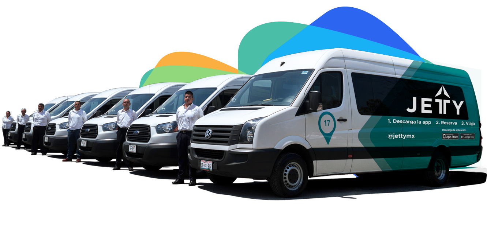

  

    

      

        

          <h1>¡Llevamos a tu personal seguro y a tiempo!</h1>
          
En Jetty nos adaptamos a las necesidades de tu organización bajo diferentes esquemas, para alcanzar los mejore resultados.

          <button type="button" class="btn btn-default btn-gray" data-toggle="modal" data-target="#ModalOrganizaciones">
            Solicita información
          </button>
        

        

          
        

      

    

  

  

    

      

        <h1>Algunos de nuestros clientes:</h1>
        <ul class="clientes">
          <li>
            
          </li>
          <li>
            
          </li>
          <li>
            
          </li>
          <li>
            
          </li>
          <li>
            
          </li>
          <li>
            
          </li>
          <li>
            
          </li>
        </ul>
      

    

  

  

    

      

        <h2>Beneficios para tu organización</h2>
      

    

    

      

        
        
<strong>Más productividad</strong>

        
Al viajar en Jetty puedes trabajar o descansar durante el trayecto.

      

      

        
        
<strong>Responsabilidad social</strong>

        
 Impulsar el uso de transporte colectivo en beneficio del medio ambiente.

      

      

        
        
<strong>Ahorro</strong>

        
Con Jetty ahorras en el costo de traslados y estacionamiento.

      

      

        
        
<strong>Un plus de reclutamiento</strong>

        
Tener transporte es un factor importante a la hora de elegir trabajo

      

      

        <button type="button" class="btn btn-default btn-gray" data-toggle="modal" data-target="#ModalOrganizaciones">
          Solicita información
        </button>
      

    

  

  

    

      

        

          
          <h2>Tecnología</h2>
        

        
Con la <b>app de Jetty,</b> es más fácil revisar y reservar tus trayectos. Además puedes <b>monitorear la ubicación</b> de tu Jetty.

      

      

        

          
          <h2>Conductores expertos</h2>
        

        
Todos pasan por un <b>estricto proceso de selección</b> que incluye entrevistas, exámenes toxicológicos y evaluaciones psicométricas.

      

      

        

          
          <h2>Flexibilidad</h2>
        

        
Jetty no es un servicio de transporte tradicional. Te ofrecemos diferentes esquemas para adaptarnos a las necesidades de tu organización

      

    

    

      <button type="button" class="btn btn-default btn-gray" data-toggle="modal" data-target="#ModalOrganizaciones">
        Solicita información
      </button>
    

  

  <!-- 

    

      

        

          

            <h2>Jetty no es un servicio de transporte tradicional</h2>

            
Te ofrecemos diferentes esquemas para adaptarnos a las necesidades de tu organización:

            
• Promueve los servicios de Jetty. Podemos crearte un código de descuento.

            
• Cotiza servicios exclusivos para la gente de tu organización.

            
• Subsidia parte o el 100% de viajes de tus colaboradores.

              
          

        

      

    

  
 -->

<!-- Modal Organizaciones -->

  

    

      

        <button type="button" class="close" data-dismiss="modal" aria-label="Close">
          &times;
        </button>
      

    

    

    

  

<!-- Modal Conductor -->
<!-- 

  

    

      

        <button type="button" class="close" data-dismiss="modal" aria-label="Close">
          &times;
        </button>
        <h4 class="modal-title" id="myModalLabel">Recibimos tu solicitud</h4>
      

      

        

          

              <h5>Nos pondremos en contacto contigo dentro de poco.</h5>
          

        

      

    

  

 -->