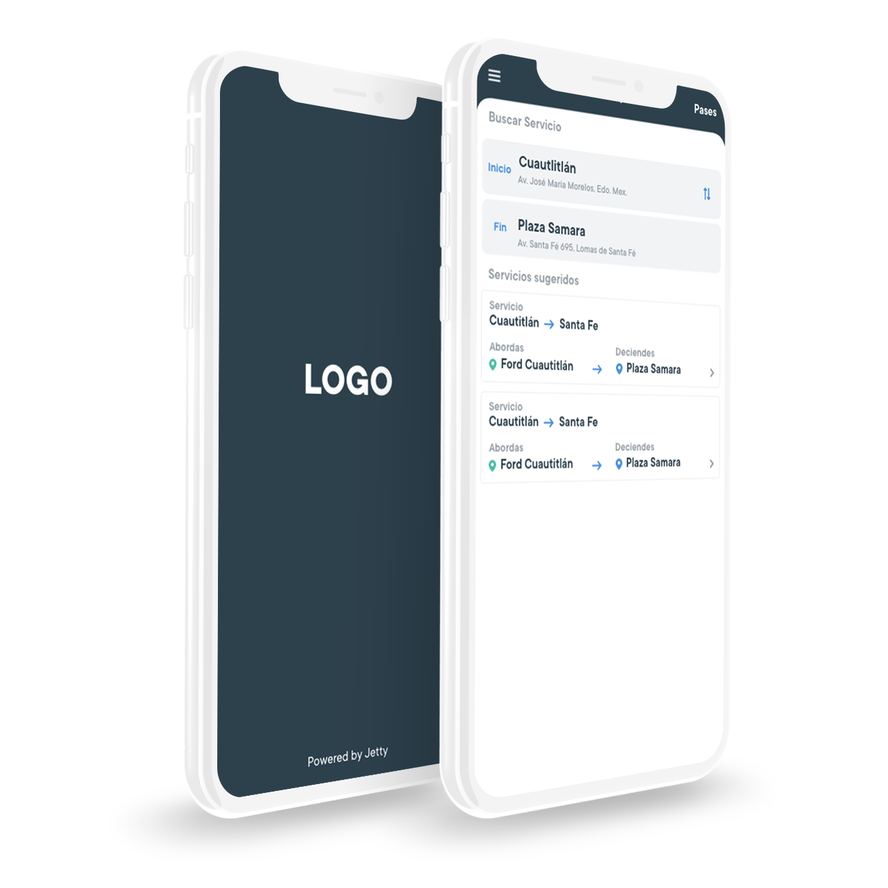
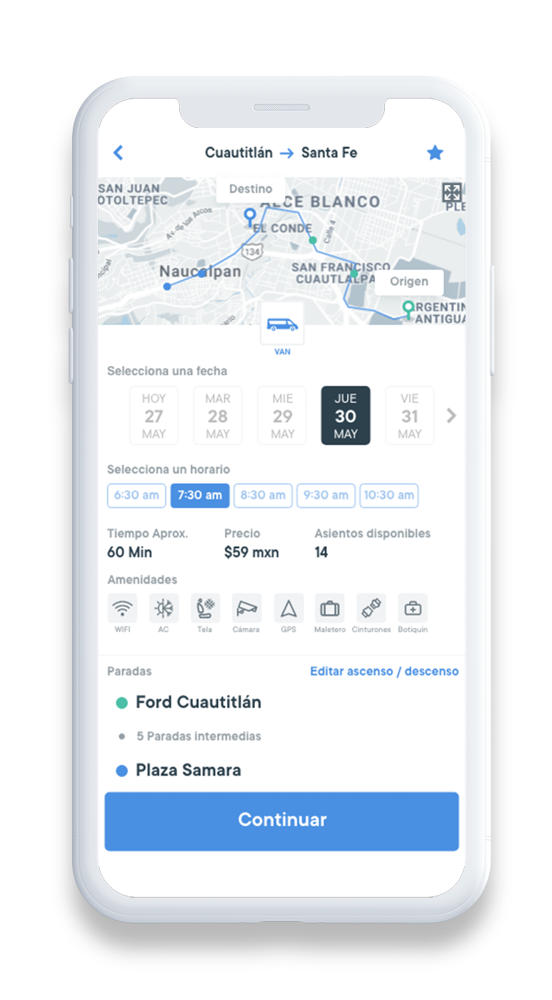
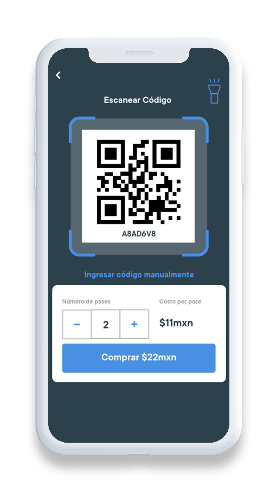
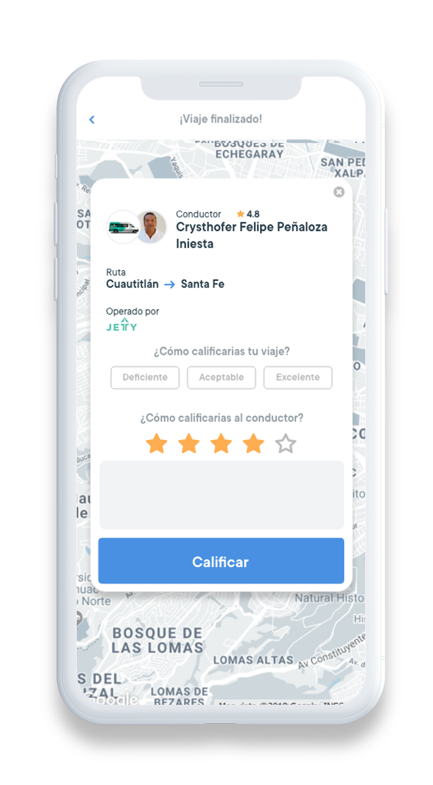
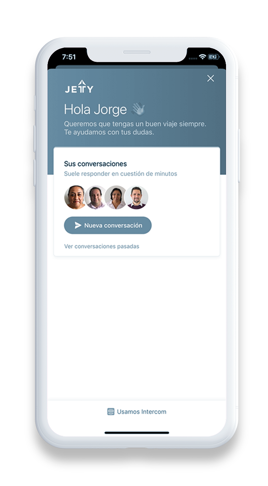

  

    

      

        
      

      

        <h1>Texto del white label</h1>
         
        
Lleva lleva los beneficios de la tecnología Jetty a tu empresa de transporte público, de personal, turístico o escolar, mejorando la experiencia del usuario; contribuyendo a la modernización del sector y a la mejora de la movilidad en las ciudades.

      

    

    

      

        <h1 class="titleConcesionado">Tenemos diversos productos que puedes implementar: </h1>
      

      

        <h3>Sistema de reserva de asiento</h3>
        
      

      

        <h3>Pago con QR</h3>
         
        
      

      

        <h3>Sistema de evaluación de conductores</h3>
        
      

      

        <h3>Canal de atención inmediata a usuarios</h3>
        
      

    

    

    

      <a href="beneficios" class="btn btn-gray">Conoce los beneficios</a>
    

    

        

          <h2 style="color: #ffffff">Herramientas para el manejo de la flota</h2>
        

        

          
          
Visualizar información sobre la operación.

        

        

          
          
Administrar información de unidades, conductores, rutas, corridas.

        

        

          
          
Tener un canal de retroalimentación.

        

      

      

        

          <h2 style="color: #ffffff">Herramientas para planificación</h2>
        

        

          
La tecnología de Jetty permite identificar y ubicar demanda de servicios de transporte colectivo, esto mediante la información proporcionada por los usuarios que nos usan y nos solicitan viajes.

        

      

      

      

        <h1>Tenemos 3 modalidades de servicio:</h1>
      

      

      

        

          
        

        

        

          <h2>Transporte de personal y escolar</h2>
          
¿Quieres ofrecer a tus clientes un mayor valor agregado?

          <a href="/transporte-de-personal-y-escolar" class="btn btn-gray" style="margin-top: 5px;">Conoce más</a>
        

      

      

        

          
        

        

        

          <h2>Transporte Público</h2>
           
          
¿Tienes una concesión de transporte público?

          <a href="/transporte-publico" class="btn btn-gray" style="margin-top: 5px;">Conoce más</a>
        

      

      

        

          
        

        

        

          <h2>Gobiernos</h2>
           
          
¿Quieres desarrollar una política pública innovadora para mejorar el sistema de transporte público de tu ciudad?

          <a href="/transporte-gobierno" class="btn btn-gray">Conoce más</a>
        

      

      

        <h2>Quienes nos respaldan</h2>
        <ul class="clientes">
          <li>
            
          </li>
          <li>
            
          </li>
          <li>
            
          </li>
        </ul>
      

    

    

  

