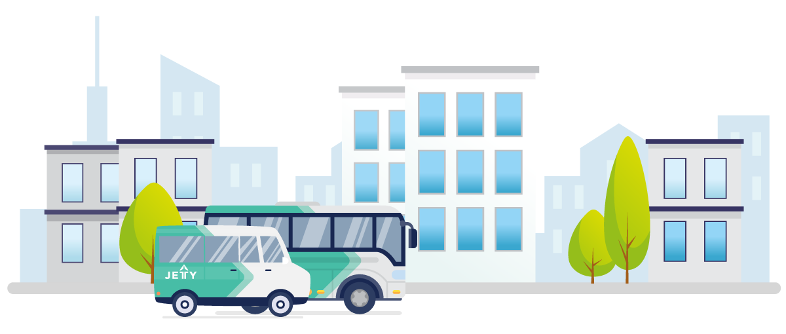
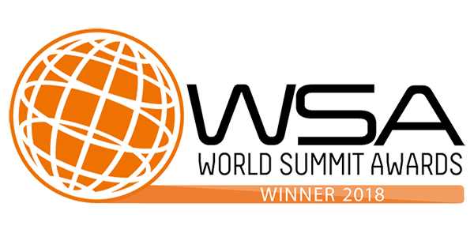
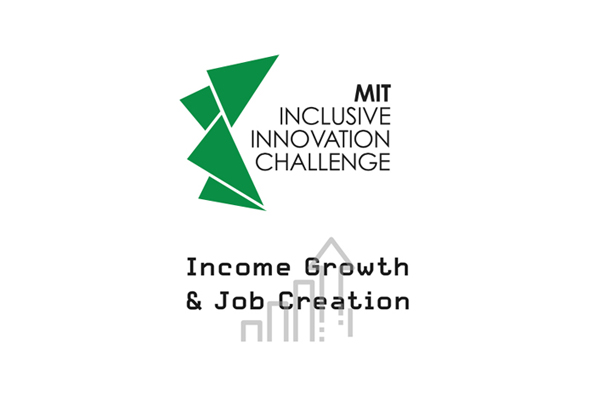
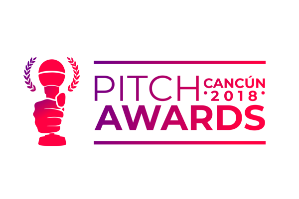
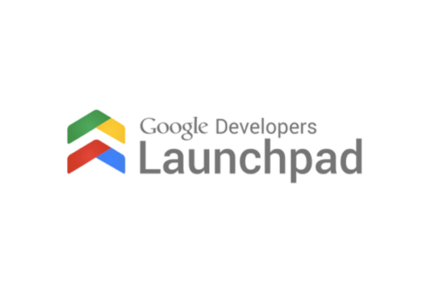

  

    

      

        <h1>Nuestro objetivo   como empresa:</h1>
        <h3>Somos la plataforma de tecnología que mejora el transporte colectivo y la movilidad en las ciudades.</h3>
      

      

        
No inventamos el hilo negro. Todos los habitantes de las ciudades mexicanas sabemos que el sistema de transporte colectivo tradicional deja mucho que desear. Como muchos, observamos que el servicio disponible es poco digno, ya que es inseguro y eso mismo provoca desconfianza e insatisfacción. Observamos que las unidades eran viejas, que los usuarios carecían de información y que los conductores casi nunca recibían retroalimentación sobre su desempeño. Escuchamos a transportistas quejarse de la poca rentabilidad de su negocio, y a autoridades sufrir con la ausencia de herramientas para planificar y regular de mejor manera al sistema. Nos asombraba que en muchas otras industrias la tecnología ya había permitido cambios sustanciales. Por ello, en 2017 decidimos poner nuestro granito de arena creando Jetty. 

      

      

        
En Jetty somos apasionados de la movilidad, amamos lo que hacemos porque sabemos que tiene un gran impacto en nuestros usuarios y en nuestras ciudades. Por eso trabajamos todos los días en evolucionar el transporte y contribuir  a la modernización del sector con ayuda de la tecnología; la cual podemos adaptar a cualquier tipo de necesidad.

        
Nuestra curiosidad, empatía y excelencia nos llevan a ser la opción número uno para todo aquel transportista o gobierno que quiera implementar la tecnología para mejorar y eficientar la movilidad de su ciudad. Gracias a nuestra transparencia nos ganamos la confianza de nuestros aliados, usuarios y clientes.

      

      

        
      

    

    

      

        <h2>Nuestros premios y reconocimientos:</h2>
      

      

        
        
En el 2019 fuimos reconocidos entre miles de startups por el Instituto Tecnológico de Massachussetts (MIT) por nuestra capacidad de incrementar el ingreso de los empresarios transportistas, mejorar las condiciones de empleo de los conductores y sobre todo, por mejorar la experiencia de viajes al trabajo de miles de personas.

      

      

        
        
En junio del 2019 el Keeling Curve Prize anunció que ganamos la categoría de transporte, por ser una iniciativa con potencial de alterar y acelerar los esfuerzos actuales para reducir el calentamiento global.

      

      

        
        
En el 2018 ganamos la categoría de Urbanización y Asentamientos Inteligentes del Word Summit Awards. Siendo reconocidos como una de las 40 innovaciones digitales que están revolucionando el estatus quo.

      

      

        <h3>Más premios</h3>
        <ul class="alianzas">
          <li>
            
          </li>
          <li>
            
          </li>
          <li>
            
          </li>
          <li>
            
          </li>
          <li>
            
          </li>
          <li>
            
          </li>
          <li>
            
          </li>
          <li>
            
          </li>
        </ul>
      

    

    

      

        <h2>Prensa</h2>
        <ul class="alianzas">
          <li>
            
          </li>
          <li>
            
          </li>
          <li>
            
          </li>
          <li>
            
          </li>
          <li>
            
          </li>
        </ul>
        <a href="/prensa" class="btn btn-green">Prensa</a>
      

      

        <h2>Nuestros aliados</h2>
        <ul class="alianzas">
          <li>
            
          </li>
          <li>
            
          </li>
          <li>
            
          </li>
          <li>
            
          </li>
          <li>
            
          </li>
          <li>
            
          </li>
        </ul>
      

    

    

      

        <h2>Somos miembros de:</h2>
        

          

            
          

          

            
Es una coalición de empresas que promueve los <b>Principios de Movilidad Compartida para Ciudades Vivibles.</b>

            <a href="https://static1.squarespace.com/static/59c2e59b4c326d11fcf1f516/t/5a677b38c83025d21f6c5bd5/1516731192772/10+Points+WRI+Spanish.pdf" target="_blank">Conoce cuáles son</a>
          

        

        

          

            
          

          

            
Es una Asociación Civil que representa a las startups y empresas más innovadoras que están transformando la experiencia de movilidad en América Latina, basadas en la tecnología y con una una visión de sustentabilidad.

            <a href="http://maaslatam.org" target="_blank">Conoce más</a>
          

        

      

    

  

