

  

    

      

        

          <h1>¡Llevamos a tu personal seguro y a tiempo!</h1>
          
En Jetty nos adaptamos a las necesidades de tu empresa bajo diferentes esquemas, para alcanzar los mejores resultados.

          <!-- <a href="https://form.jotform.com/202037881254857" class="btn btn-default btn-gray">Solicita información</a> -->

          <button type="button" class="btn btn-default btn-gray" data-toggle="modal" data-target="#myModal">
            Solicita información
          </button>
        

        

          
        

      

    

  

  

    

      

        <h1 class="textGray">Tu seguridad nuestra prioridad</h1>
        
Tenemos protocolos estrictos de higiene y seguridad en todas nuestras unidades:

      

      

        

          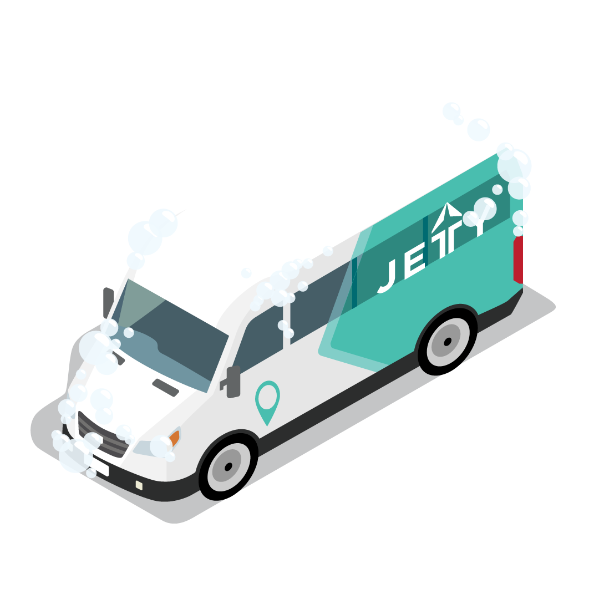
          
<b>Desinfección general</b>

          
Reforzamos limpieza y desinfección. Damos prioridad a puntos de contacto: manijas, pasamanos, vidrios, etc. Antes y después de cada viaje.

        

        

          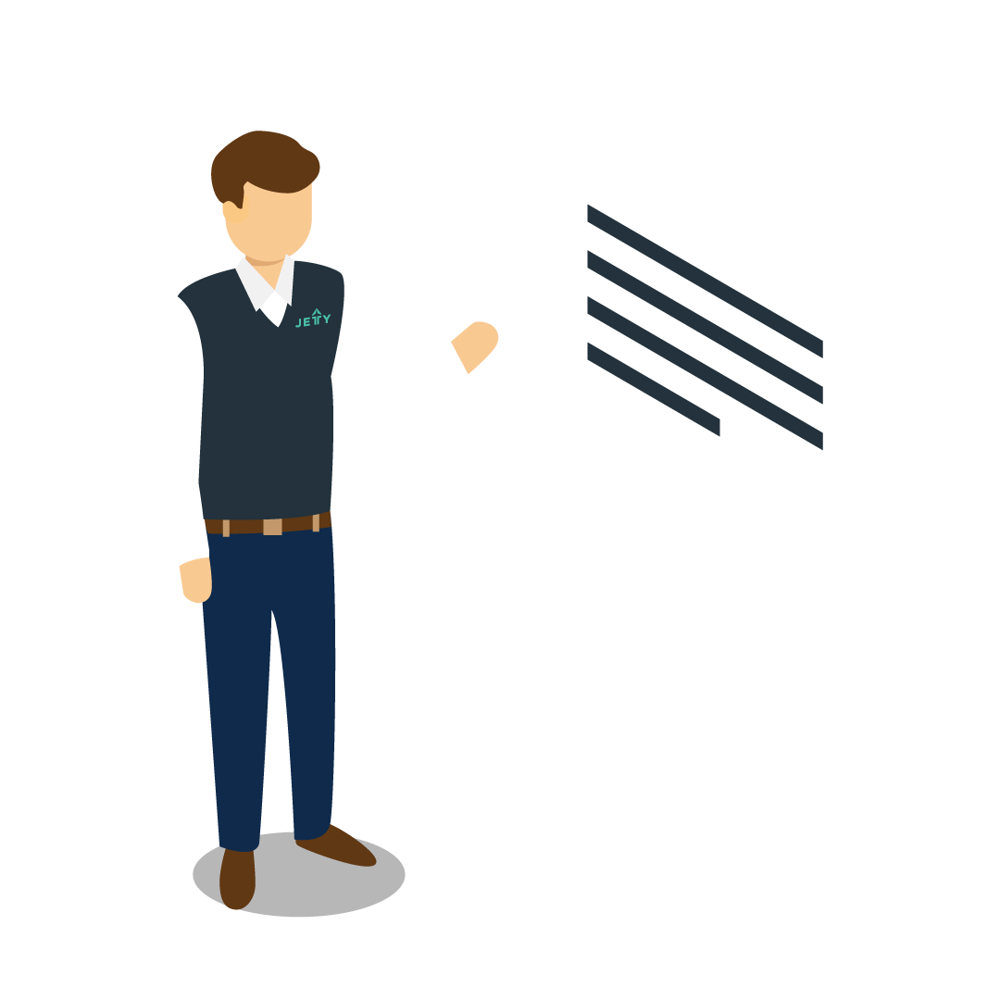
          
<b>Conductores capacitados</b>

          
Todos nuestros conductores están preparados e informados con todas las medidas de prevención. 

        

        

          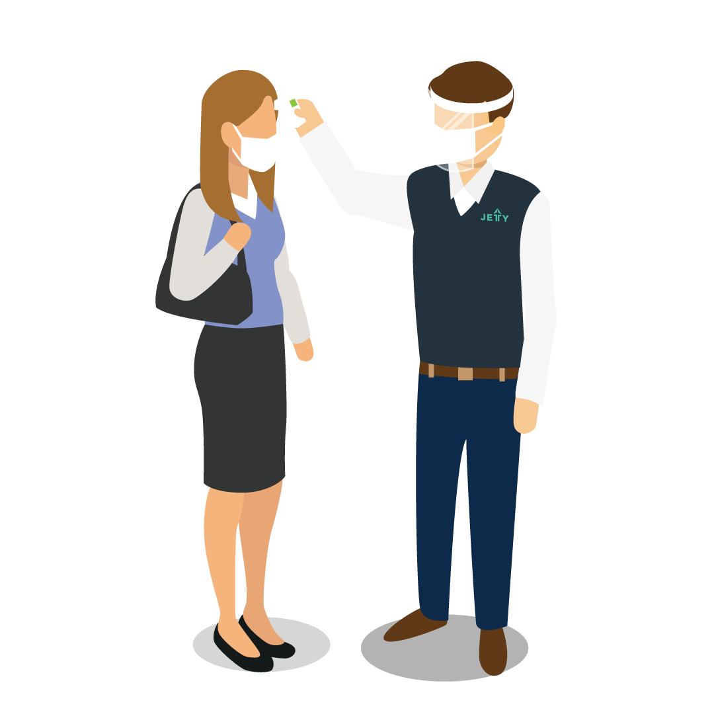
          
<b>Toma de temperatura y gel antibacterial </b>

          
Antes de abordar la unidad, el conductor revisará la temperatura de todos los pasajeros (ésta no puede exceder los 36.9º). Además proporcionaremos gel antibacterial. 

        

        

          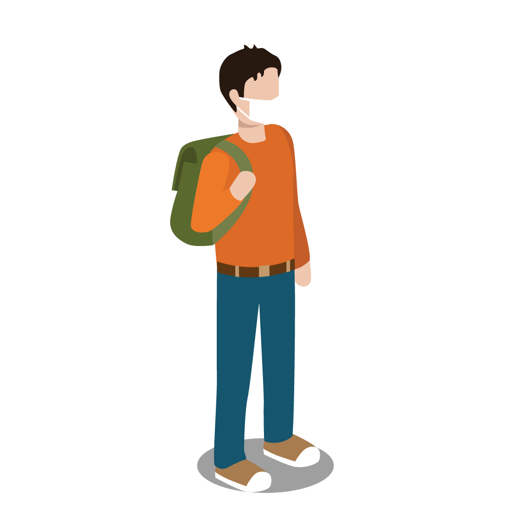
          
<b>Cubrebocas obligatorio</b>

          
Todos los pasajeros deben portar cubrebocas. Es necesario ajustarlo para que cubra nariz y boca en su totalidad.

        

        

          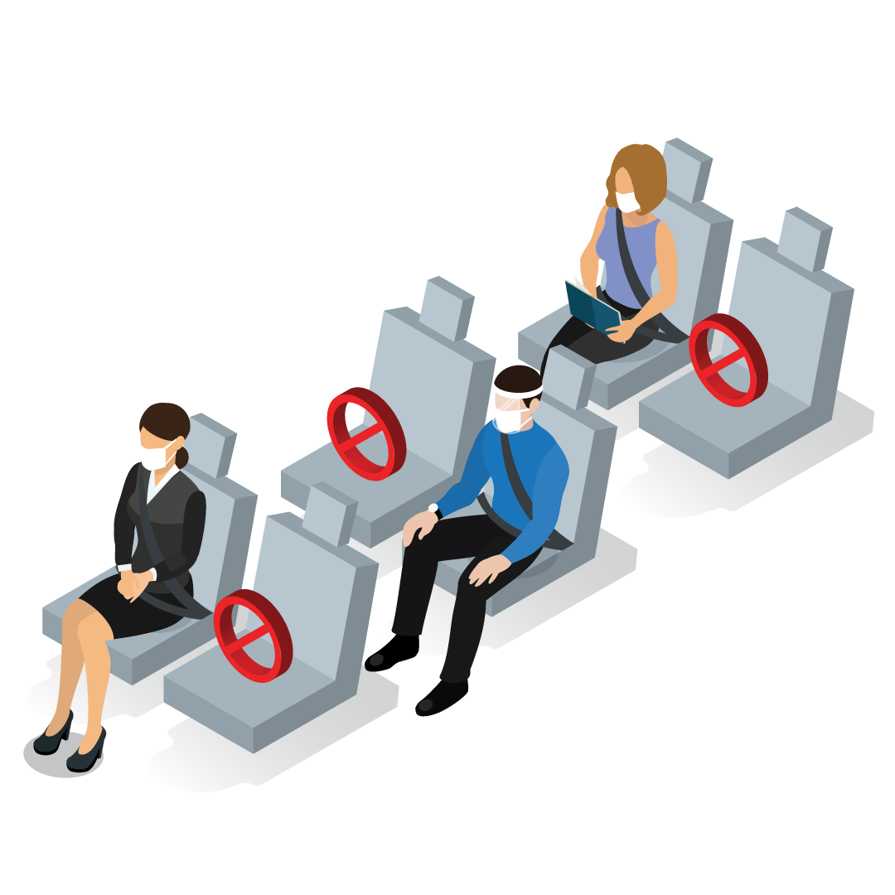
          
<b>Maximización de espacios</b>

          
El espacio en cada unidad será maximizando el espacio entre colaboradores y colaboradoras para su seguridad y comodidad. 

        

        

          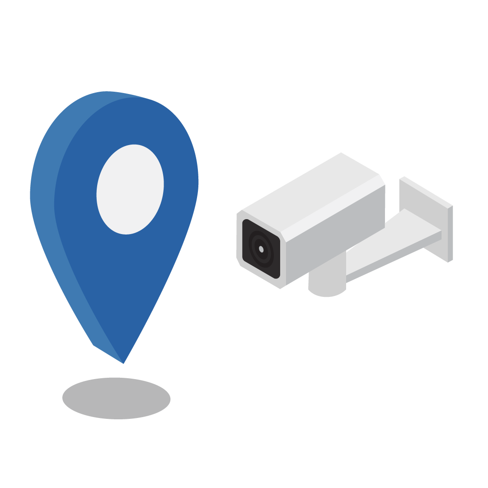
          
<b>Monitoreo GPS</b>

          
Todas nuestras unidades se encuentran vigiladas en tiempo real.

        

        

          <!-- <a href="https://form.jotform.com/202037881254857" class="btn btn-default btn-gray">Solicita información</a> -->
          <button type="button" class="btn btn-default btn-gray" data-toggle="modal" data-target="#myModal">
            Solicita información
          </button>
        

      

    

    

      

        <h1 class="textGray">Beneficios</h1>
      

    

    

      

        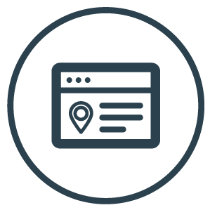
        
<b>Diseño de recorridos</b>

        
Optimizamos las rutas, para una mejor experiencia de trayecto.

      

      

        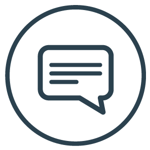
        
<b>Equipo de soporte</b>

        
Recibe atención de nuestro equipo de atención,  antes durante y después de cada viaje.

      

      

        
        
<b>Más productividad</b>

        
Al viajar en Jetty puedes trabajar o descansar durante el trayecto. Los viajes  felices aumentan la motivación. 

      

      

        
        
<b>Responsabilidad social</b>

        
Al moverte en Jetty ayudas a impulsar una ciudad más sostenible en beneficio del medio ambiente.

      

      

        
        
<b>Económico</b>

        
Con Jetty ahorras en el costo de traslados y estacionamiento.

      

      

        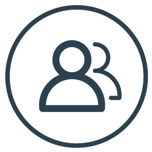
        
<b>Un plus de reclutamiento</b>

        
Tener transporte es un factor importante a la hora de elegir trabajo, ya que mejora la calidad de vida y el clima laboral.

      

      

        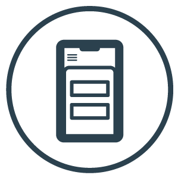
        
<b>Tecnología</b>

        
Con nuestra app, es más fácil revisar y reservar tus trayectos. Además puedes monitorear la ubicación de tu Jetty.

      

      

        
        
<b>Conductores profesionales</b>

        
Todos pasan por un estricto proceso de selección que incluye entrevistas, exámenes toxicológicos y evaluaciones psicométricas.

      

      

        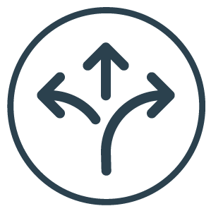
        
<b>Flexibilidad</b>

        
Te ofrecemos diferentes esquemas, tu eliges el que mejor se adapte a tus necesidades.

      

      

        <!-- <a href="https://form.jotform.com/202037881254857" class="btn btn-default btn-gray">Solicita información</a> -->
        <button type="button" class="btn btn-default btn-gray" data-toggle="modal" data-target="#myModal">
            Solicita información
          </button>
      

    

  

  

    

      

        <h1 class="textGray">Modalidades</h1>
      

      

        
        <h2 class="textWhite">Compartido:</h2>
        
<b>Pases:</b>  Nosotros reservamos tus viajes, sólo nos indicas que rutas y horarios de los que tenemos vigentes te interesan.

        
<b>Recarga de saldo:</b> Eliges la cantidad a abonar de saldo para los trayectos de tus colaboradores. Estos también corresponden a nuestras rutas actuales. Es decir comparten la ruta con nuestros usuarios.

      

      

        
        <h2 class="textWhite">Exclusivo:</h2>
        
Es sólo para el personal de tu empresa, nosotros nos encargamos de la logística de las rutas. Este servicio es completamente personalizado.

      

    

    

      <!-- <a href="https://form.jotform.com/202037881254857" class="btn btn-default btn-gray">Solicita información</a> -->
      <button type="button" class="btn btn-default btn-gray" data-toggle="modal" data-target="#myModal">
        Solicita información
      </button>
    

  

  

    

      

        <h1 class="textGray">Nuestros clientes:</h1>
        <ul class="clientes">
          <li>
            
          </li>
          <li>
            
          </li>
          <li>
            
          </li>
          <li>
            
          </li>
          <li>
            
          </li>
          <li>
            
          </li>
          <li>
            
          </li>
          <li>
            
          </li>
          <li>
            
          </li>
          <li>
            <a href="#" target="_blank">
              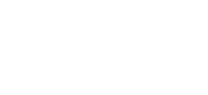
            </a>
          </li>
          <li>
            
          </li>
          <li>
            
          </li>
        </ul>
      

    

  

  

    

      

        <button type="button" class="close" data-dismiss="modal" aria-label="Close">&times;</button>
      

      

        

      

    

  

