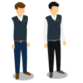

  

    

      

        <h1>Servicios de transporte</h1>
      

    

    

      

        
        <h3><strong>Siempre tienes un lugar</strong></h3>
        
Puedes reservar tu asiento desde la app, siempre llegarás cómodo y seguro.

      

      

        
        <h3><strong>Rutas directas</strong></h3>
        
No hay vueltas innecesarias, el conductor conoce su ruta, y sabe los puntos de ascenso y descenso.

      

      

        
        <h3><strong>Tranquilidad</strong></h3>
        
En Jetty puedes ir relajado sabiendo que el conductor sabe lo que hace.

      

    

    

      

        
        <h3><strong>Costos</strong></h3>
        
Jetty te cuesta 30% menos que llevar tu auto y 60% menos que otros servicios.

      

      

        
        <h3><strong>Seguridad</strong></h3>
        
En Jetty puedes sacar tranquilamente tu laptop, celular o videojuego.

      

      

        
        <h3><strong>Conductor profesional</strong></h3>
        
Todos nuestros conductores están altamente calificados para ofrecerte el mejor servicio.

      

    

    

    

      

        <h1>Transporte público</h1>
      

      

        
        <h3><strong>Prescindir de efectivo</strong></h3>
        
Olvídate de tener que llevar cambio exacto.

      

      

        
        <h3><strong>Ubicación de unidades</strong></h3>
        
Sigue en tiempo real las unidades cerca de ti.

      

      

        
        <h3><strong>Visibilidad de frecuencias por ruta</strong></h3>
        
Conoce el periodo de espera entre una unidad de otra y planifica tus viajes.

      

    

    

      

        <h1>¿Cómo funciona?</h1>
      

      

        <ul class="nav nav-tabs como-funciona-tabs-list" role="tablist">
          <li role="presentation" class="active">
            <a href="#home" aria-controls="home" role="tab" data-toggle="tab">
              Mediante Reserva
            </a>
          </li>
          <li role="presentation"><a href="#profile" aria-controls="profile" role="tab" data-toggle="tab">Pago con QR</a></li>
        </ul>

        

          

            

              

                

                  
                  
Dinos de dónde sales y a dónde viajas.

                

                

                  
                

              

              

                

                  
                  
Revisa el día, horario y elige el que más te convenga.

                

                

                  
                

              

            

            

              

                

                  
                  
Reserva tu asiento pagando con tarjeta y monitorea tu Jetty.

                

                

                  
                

              

              

                

                  
                  
Camina al punto de abordaje y muéstrale tu pase al conductor.

                

                

                  
                

              

            

          

          

             

              

                

                  
                  
Busca el código QR al abordar las unidades.

                

                

                  
                

              

              

                

                  
                  
Escanea y selecciona el número de pases.

                

                

                  
                

              

            

            

              

                

                  
                  
Paga con tu tarjeta desde la app de Jetty.

                

                

                  
                

              

              

                

                  
                  
Muéstrale tu pase al conductor.

                

                

                  
                

              

            

          

        

      

      

      

        <h3>¿Tienes un vehículo que te gustaría trabajar con Jetty?</h3>
        <a href="/transporte-de-personal-y-escolar" class="btn btn-gray" style="margin-top: 5px;">Conoce más</a>
      

      

      

        
         
        
Conoce nuestra cobertura

        <a href="cobertura" class="btn btn-gray-small" target="_self">Ver cobertura</a>
      

      

        
         
        
Contrata un vehículo para un evento

        <a href="transporte-eventos" class="btn btn-gray-small" target="_self">Contratar tranporte</a>
      

      

        
         
        
Opciones para transporte de personal

        <a href="nuestro-servicio" class="btn btn-gray-small" target="_self">Transporte de personal</a>
      

      

    

  

