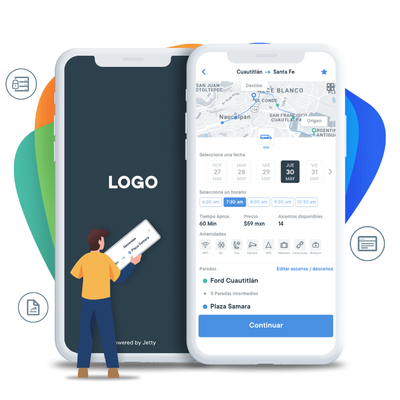
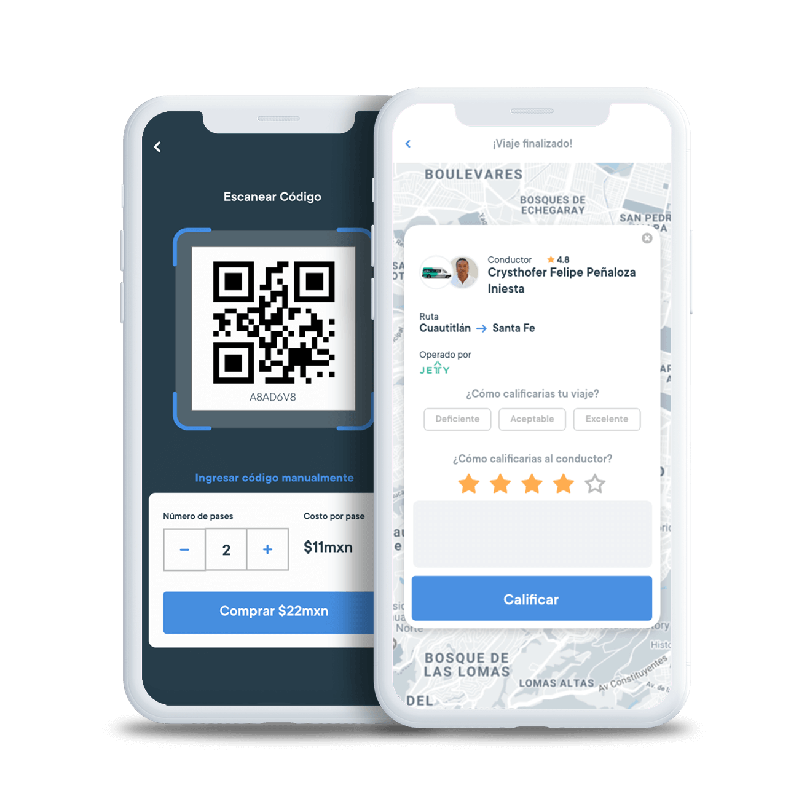
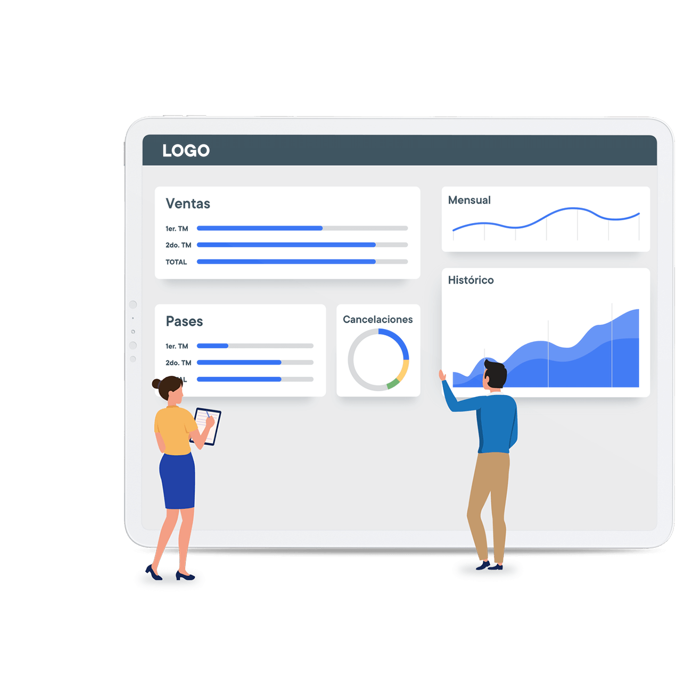
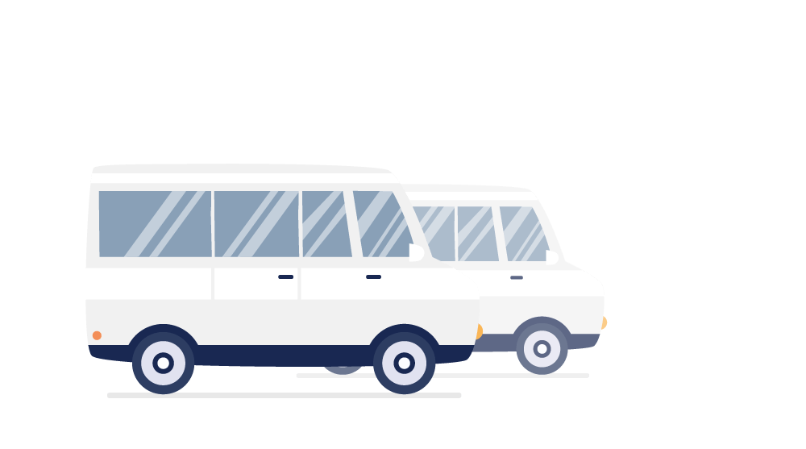
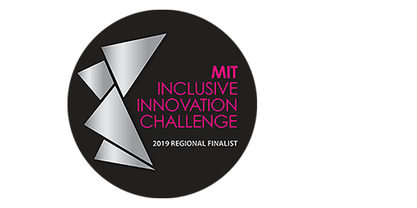
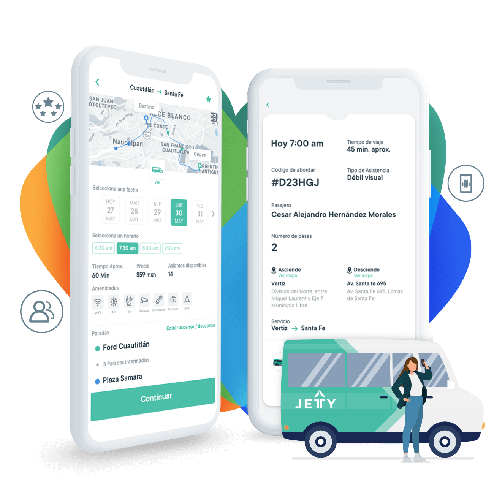

  

    

      

        
      

      

        <h1>Soluciones  tecnológicas</h1>
        
Al elegir implementar nuestra tecnología obtienes diversos beneficios, entre los que destacan tener opción a personalización de la aplicación y la plataforma administrativa, tanto para usuarios como para operaciones internas. ¡Nos adaptamos a tus necesidades!

        
Solicita un demo para conocer más de nuestra tecnología.

        
Si trabajas con: Transporte escolar, transporte de personal. transporte público o agencia de gobierno.

        <button type="button" class="btn-green hvr-shadow" data-toggle="modal" data-target="#ModalConcesionado">
          Solicitar demo
        </button>
      

    

    

      

        <h2>Características de la app</h2>
        
Cuando adquieres la tecnología de Jetty, obtienes un producto listo para usarse y con múltiples beneficios para ti y tus usuarios.

      

    

    

      

        

          

            
          

          

            

             Actualizaciones constantes
               
              Nuestra especialidad es la tecnología y sabemos que evoluciona constantemente. Es por eso que nuestro equipo trabaja diariamente en implementar mejoras a la plataforma.

          

          

            
          

          

            

             Configurable
               
              Tenemos la capacidad de trabajar con diferentes tipos de servicios y todos pueden configurarse: alta y modificación de rutas, cambios de precios, etc.

          

          

            
          

          

            

             Asistencia adicional
               
              Nuestra plataforma permite a los conductores, conocer si los usuarios tienen necesidades especiales, con la intención de brindarles la mejor atención siempre.

          

          

            
          

          

            

             Sin necesidad de equipos caros
               
              No es necesario invertir en hardware. La única inversión en equipo que tendrás que hacer es en un celular.

          

          

            
          

          

            

             Conserva tu marca
               
              Una app completamente personalizada de tu marca, con tu logo e identidad gráfica.

          

        

      

      

        
      

    

    

      

        <h2>Características de la plataforma</h2>
        
Validada por usuarios reales, por lo que disminuye significativamente el riesgo de implementar tecnología.

      

    

    

      

        

          

            
          

          

            

             Reportes en tiempo real
               
              Podrás acceder a tu propia plataforma de administrador y ver en tiempo real toda la información (ventas, usuarios, calificaciones y más). Con esta información podrás planificar mejor y tomar decisiones basadas en datos reales.

          

          

            
          

          

            

             Plataforma como servicio
               
              Utilizamos una misma plataforma configurada de diferentes maneras. Así eficientamos costos y es más rápida de implementar. Esto significa que tendrás acceso a mejoras y nuevas características en cuanto estén disponibles.

          

          

            
          

          

            

             Escalable
               
              Nuestra tecnología funciona en la nube, por lo que además de tener acceso a infraestructura de nivel mundial, podemos aumentar la capacidad al mismo tiempo que vamos creciendo contigo.

          

          

            
          

          

            

             Enfoque en cuentas y no en pases
               
              Con nuestra tecnología logras pasar de un modelo basado en pases a un modelo basado en usuarios. Lo que permite tener mucha más información sobre sus tendencias de uso y necesidades.

          

        

      

      

        
      

    

    

      

        
En Jetty te acompañamos durante todo el proceso, nuestros clientes tienen acceso a expertos para asegurar la mejor implementación de la tecnología, recibe: inducción, capacitación sobre el uso de la aplicación a conductores, supervisores, administradores, seguimiento y soporte.

      

    

    

      

        <h2>Beneficios para tus usuarios</h2>
        
Si quieres mejorar la experiencia de servicio de tus usuarios, te proporcionamos las herramientas para lograrlo, y así, dar más valor a tu servicio.

      

    

    

      

        

          

            
          

          

            

             Valor agregado
               
              Ofrece a tus usuarios tecnología para monitorear sus viajes, establece horarios y puntos de ascenso y descenso.

          

          

            
          

          

            

             Mejora la experiencia
               
              Con la tecnología logra un servicio más eficaz, confiable y mejor. Optimizando las frecuencias de tus  rutas y horarios en todos tus servicios.

          

          

            
          

          

            

             Calificación a conductores
               
              Supervisa a tus conductores, gracias a la retroalimentación de tus usuarios.

          

          

            
          

          

            

             Ubicación por GPS
               
              Mantén ubicadas todas tus unidades en tiempo real.

               
          

          

            
          

          

            

             Capacitación a conductores 
               
              Recibe capacitaciones y cursos en servicio al cliente y perspectiva de género para todos tus conductores.

          

        

      

      

        
      

    

    

      

        

          <h3>Conoce los tres tipos de modalidades</h3>
        

        

          
          <h3 class="titleBold">Transporte de personal  y escolar</h3>
          
¿Estás buscando ofrecer a tus clientes un mayor valor agregado?

        

        

          
          <h3 class="titleBold">Transporte Público</h3>
           
          
Si quieres adquirir todas las ventajas para sacar el máximo potencial a tu concesión de transporte.

        

        

          
          <h3 class="titleBold">Gobiernos</h3>
           
          
¿Quieres desarrollar una política pública para el sistema de transporte público en tu ciudad?

        

      

    

    

      

        <h3>Solicita un demo para conocer más</h3>
        
Si trabajas con: Transporte Escolar, Transporte Corporativo, Transporte Público o Agencia de Gobierno.

        <button type="button" class="btn-green hvr-shadow" data-toggle="modal" data-target="#ModalConcesionado">
          Solicitar demo
        </button>
      

      

        <h3>Quienes nos respaldan</h3>
        <ul class="clientes">
          <li>
            
          </li>
          <li>
            
          </li>
          <li>
            
          </li>
        </ul>
      

    

  

  

    

      
    

    

      <h3>Conoce más acerca de nuestros servicios de transporte</h3>
      
Cuando eliges Jetty comienzas a disfrutar la ciudad, ya que nos encargamos de supervisar tus viajes en tiempo real  y de ofrecerte los más altos estándares de calidad.

      <a href="servicios-de-transporte" class="btn-green hvr-shadow">Ver servicios</a>
    

  

<!-- Modal Concesionado -->

  

    

      

        <button type="button" class="close" data-dismiss="modal" aria-label="Close">&times;</button>
        <h4 id="myModalLabel">Déjanos tus datos y nos pondremos en contacto</h4>
      

      <form id="form-concesionado">
        

            

              <label  for="from-concesionado--name">Nombre</label>
              <input  type="text"
                      class="form-control"
                      placeholder="Nombre"
                      maxlength="30"
                      name="name"
                      id="form-concesionado--name"
                      required />
            

            

              <label  for="form-concesionado--lastname">Apellidos</label>
              <input  type="text"
                      class="form-control"
                      placeholder="Apellidos"
                      maxlength="60"
                      name="lastname"
                      id="form-concesionado--lastname"
                      required />
            

            

              <label  for="form-concesionado--mail">Correo electrónico</label>
              <input  type="text"
                      class="form-control"
                      maxlength="60"
                      placeholder="Correo electrónico"
                      name="email"
                      id="form-concesionado--email"
                      />
            

            

              <label  for="form-concesionado--phone">Número telefónico</label>
              <input  type="text"
                      class="form-control"
                      maxlength="20"
                      placeholder="Número telefonico"
                      name="phone"
                      id="form-concesionado--phone"
                      required>
            

            

              <label for="form-concesionado--city">¿En qué ciudad estás?</label>
              <input  type="text"
                      class="form-control"
                      maxlength="120"
                      name="city"
                      id="form-concesionado--city"
                      required />
            

            

              <label for="form-concesionado--route">¿Qué ruta operas?</label>
              <input  type="text"
                      class="form-control"
                      maxlength="120"
                      name="route"
                      id="form-concesionado--route"
                      required />
            

            

              
<b>Cuéntanos tu experiencia como operador de transporte:</b>

              <label for="form-concesionado--years">Años de experiencia</label>
              <select class="form-control" name="years" id="form-concesionado--years">
                <option disabled selected>Selecciona una opción</option>
                <option>1 a 5</option>
                <option>5 a 10</option>
                <option>10 a 15</option>
                <option>15 a 20</option>
                <option>Más de 20</option>
              </select>
            

            

              <label for="form-concesionado--vehiculos">¿Cuántos Vehículos tienes?</label>
              <select class="form-control" name="vehiculos" id="form-concesionado--vehiculos">
                <option disabled selected>Selecciona una opción</option>
                <option>1 a 25</option>
                <option>25 a 50</option>
                <option>Más de 50</option>
              </select>
            

            

              <label for="form-concesionado--tipo">¿Qué tipos de vehículos tienes?</label>
              <textarea class="form-control" rows="3" name="tipo" id="form-concesionado--tipo"></textarea>
            

            

              <label for="form-concesionado--why">Por qué quieres trabajar con Jetty</label>
              <textarea class="form-control" rows="3" name="why" id="form-concesionado--why"></textarea>
            

            

              <label for="">¿Cómo te enteraste de Jetty?</label>
              

                <label>
                  <input  type="radio"
                          name="how"
                          value="amigo-trabaja-en-jetty" />
                  Por un amigo que trabaja en Jetty
                </label>
              

              

                <label>
                  <input  type="radio"
                          name="how"
                          value="vi-vehiculo-en-calle" />
                  Vi un vehículo en la calle
                </label>
              

              

                <label>
                  <input  type="radio"
                          name="how"
                          value="recomendacion" />
                  Recomendación
                </label>
              

              

                <label>
                  <input  type="radio"
                          name="how"
                          value="prensa" />
                  Prensa
                </label>
              

              

                <label>
                  <input  type="radio"
                          name="how"
                          value="redes" />
                  Redes sociales
                </label>
              

              

                <label>
                  <input  type="radio"
                          name="how"
                          value="otro" />
                  Otro
                </label>
              

            

            

              <label for="">Tipo de operador</label>
              

                <label>
                  <input  type="radio"
                          name="type"
                          value="privado" />
                  Privado
                </label>
              

              

                <label>
                  <input  type="radio"
                          name="type"
                          value="gobierno" />
                  Gobierno
                </label>
              

            

        

        

        

          <button type="button" class="btn btn-default" data-dismiss="modal">Cancelar</button>
          <button type="submit" class="btn btn-green-small" data-loading-text="Espera...">Enviar</button>
        

      </form>

    

  

 <!-- Modal Transportistas Success -->

  

    

      

        <button type="button" class="close" data-dismiss="modal" aria-label="Close">&times;</button>
        <h4 class="modal-title" id="myModalLabel">Recibimos tu solicitud</h4>
      

      

        

          

              <h5>Nos pondremos en contacto contigo dentro de poco.</h5>
          

        

      

    

  

<!-- Modal Gobierno -->

  

    

      

        <button type="button" class="close" data-dismiss="modal" aria-label="Close">&times;</button>
        <h4 class="modal-title" id="myModalLabel">Déjanos tus datos y nos pondremos en contacto</h4>
      

      <form id="form-gobierno">
        

            

              <label  for="from-gobierno--name">Nombre</label>
              <input  type="text"
                      class="form-control"
                      placeholder="Nombre"
                      maxlength="30"
                      name="name"
                      id="form-gobierno--name"
                      required />
            

            

              <label  for="form-gobierno--lastname">Apellidos</label>
              <input  type="text"
                      class="form-control"
                      placeholder="Apellidos"
                      maxlength="60"
                      name="lastname"
                      id="form-gobierno--lastname"
                      required />
            

            

              <label  for="form-gobierno--mail">Correo electrónico</label>
              <input  type="text"
                      class="form-control"
                      maxlength="60"
                      placeholder="Correo electrónico"
                      name="email"
                      id="form-gobierno--email"
                      />
            

            

              <label  for="form-gobierno--phone">Número telefónico</label>
              <input  type="text"
                      class="form-control"
                      maxlength="20"
                      placeholder="Número telefonico"
                      name="phone"
                      id="form-gobierno--phone"
                      required>
            

            

              <label for="form-gobierno--city">¿En qué ciudad estás?</label>
              <input  type="text"
                      class="form-control"
                      maxlength="120"
                      name="city"
                      id="form-gobierno--city"
                      required />
            

            

              <label for="form-gobierno--route">¿Representas a alguna agencia de gobierno?</label>
              <input  type="text"
                      class="form-control"
                      maxlength="120"
                      name="route"
                      id="form-gobierno--agency"
                      required />
            

            

              
<b>Cuéntanos más</b>

              <label for="form-gobierno--reason">Por qué quieres trabajar con Jetty</label>
              <textarea class="form-control" rows="3" name="years" id="form-gobierno--years"></textarea>
            

            

              <label for="">¿Cómo te enteraste de Jetty?</label>
              

                <label>
                  <input  type="radio"
                          name="how"
                          value="amigo-trabaja-en-jetty" />
                  Por un amigo que trabaja en Jetty
                </label>
              

              

                <label>
                  <input  type="radio"
                          name="how"
                          value="vi-vehiculo-en-calle" />
                  Vi un vehículo en la calle
                </label>
              

              

                <label>
                  <input  type="radio"
                          name="how"
                          value="recomendacion" />
                  Recomendación
                </label>
              

              

                <label>
                  <input  type="radio"
                          name="how"
                          value="press" />
                  Prensa
                </label>
              

              

                <label>
                  <input  type="radio"
                          name="how"
                          value="redes" />
                  Redes sociales
                </label>
              

              

                <label>
                  <input  type="radio"
                          name="how"
                          value="otro" />
                  Otro
                </label>
              

            

        

        

        

          <button type="button" class="btn btn-default" data-dismiss="modal">Cancelar</button>
          <button type="submit" class="btn btn-green-small" data-loading-text="Espera...">Enviar</button>
        

      </form>

    

  

<!-- Modal Gobierno -->

  

    

      

        <button type="button" class="close" data-dismiss="modal" aria-label="Close">&times;</button>
        <h4 class="modal-title" id="myModalLabel">Recibimos tu solicitud</h4>
      

      

        

          

              <h5>Nos pondremos en contacto contigo dentro de poco.</h5>
          

        

      

    

  

