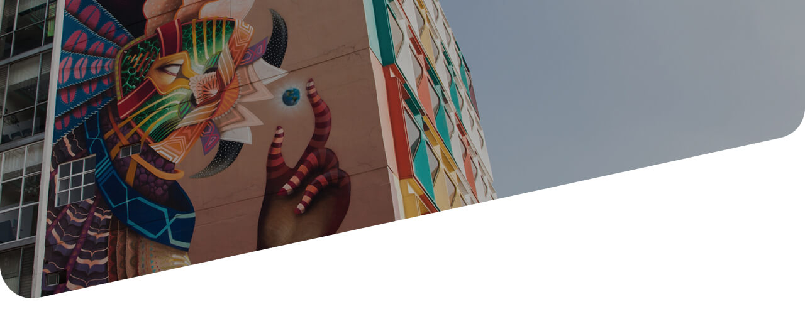

<figure class="header-tours">
  
  <figcaption>
    

      

        

        <h1>Nuevo Muralismo Mexicano</h1>
      

      

    

  </figcaption>
</figure>

  

    

      

        
<b>CANTIDAD DE PERSONAS</b>

        
 12 o 19 personas.

         

        
<b>LUGAR DE SALIDA</b>

        
Roma

         

        
<b>HORAS DE DURACIÓN</b>

        
5 horas.

         

        
<b>INCLUYE</b>

        
Un lunch, transporte a cada punto.

         

        
<b>DISPONIBLE</b>

        
En español y en inglés

         

        
<b>ITINERARIO</b>

        <ul class="list-tours">
          <li>
            
<b>10:00am</b> | Salida Roma-Condesa.  Mural JM Calle San Luis Potosí (Proyecto Va Por La Roma)

          </li>
          <li>
            
<b>10:30am</b> | Ella, Smithe. Arcos de Belén. Metro Salto del Agua.

          </li>
          <li>
            
<b>11:00am</b> | Mural de la Familia Burrón y arte urbano en jardín Regina (Calle Regina)

          </li>
          <li>
            
<b>11:30am</b> | Murales Calle San Jerónimo

          </li>
          <li>
            
<b>12:00pm</b> | Similia Similius Curentur, Jesús Benitez. Hospital Nacional Homeopático Chimalpopoca 135, Obrera. Metro Pino Suárez. Enfrente: mural Pelagato Astral (Lienzo Capital -INJUVE) -A la vuelta: mural El Tri y mural Seher (Lienzo Capital -INJUVE)

          </li>
          <li>
            
<b>12:45pm</b> | Cerrada Fray Servando (conjunto habitacional, murales Festival Cromática) Mural de X Familia -Torre Cuauhtemoc . Retna (Tlatelolco)

          </li>
        </ul>
         

        
<b>Precio por persona</b>

        
$980 MXN

         

        
<b>ACERCA DE NOSOTROS</b>

        
Museo Citadino es una plataforma enfocada en el desarrollo de contenidos y de experiencias creadas con base en nuestro conocimiento sobre las audiencias y la ciudad.

        
En 2012 lanzamos Time Out México, la guía de entretenimiento y cultura más importante del mundo presente en la Ciudad de México. Desde ese entonces nos hemos convertido no solo en una voz relevante en términos de entretenimiento, sino también en un actor activo de la vida cultural de la ciudad.

         

        
<b>QUÉ HAREMOS</b>

        
El muralismo no dejó de existir en México, solo se ha transformado. Aunque ya no tiene una función primordialmente política como en la era de Diego Rivera o David Alfaro Siqueiros, el arte mural revive en los espacios públicos a través de artistas jóvenes que toman la calle como su lienzo. Como parte de un movimiento global de arte urbano, en este tour te llevamos a conocer cinco ejemplos de nuevo muralismo en la Ciudad de México.

         

        
<b>QUÉ TRAER</b>

        <ul class="list-tours">
          <li>
            
Llevar tenis y ropa cómoda.

          </li>
          <li>
            
Llevar protector solar.

          </li>
          <li>
            
Llevar cámara o celular para tomar fotos a los murales.

          </li>
        </ul>
         

        

          

            
          

          

            
          

          

            
          

        

      

    

    

      

        <button type="button" class="btn btn-green" data-toggle="modal" data-target="#ModalTourMuralismo">
          Agendar
        </button>
      

    

  

  

  

    

      

        <h2>Nuestros Tours</h2>
      

    

    

      

      

        
        <h3>Mercado de San Juan</h3>
        
Además de comer en locales como Don Vergas, Triana Café Gourmet y Las Tapas de San Juan, tendrás una clase de cocina con el chef Bernardo Bukantz.

        
<b>Duración: 6hrs</b>

        
<b>Incluye:</b> Guía y transporte

        <button type="button" class="btn btn-green-small" data-toggle="modal" data-target="#ModalTourMercado">
          Agendar
        </button>
        <a href="{{site.baseurl}}/tours/mercado-san-juan" class="btn btn-dark-gray-small">Más información</a>
      

      

        
        <h3>Santa María la Ribera</h3>
        
Visitarás lugares como el Kiosco Morisco, el Museo de Geología, Casa Equis, María Ciento 38 y Casa Nool.

        
<b>Duración: 6hrs</b>

        
<b>Incluye:</b> Guía y transporte

         
        <button type="button" class="btn btn-green-small" data-toggle="modal" data-target="#ModalTourSantamaria">
          Agendar
        </button>
        <a href="{{site.baseurl}}/tours/santa-maria" class="btn btn-dark-gray-small">Más información</a>
      

    

  

  

<!-- MODAL TOURS MURALISMO-->

  

    

      

        <h2 class="modal-title title-tours-modal" id="myModalLabel">Nuevo Muralismo Mexicano</h2>
      

      <form class="form-modal-tours">
        

          

            

              

                <label for="">Nombre</label>
                <input type="" class="form-control" id="" placeholder="Claudia">
              

              

                <label for="">Apellido</label>
                <input type="" class="form-control" id="" placeholder="Tapía">
              

              

                <label for="">Correo electrónico</label>
                <input type="" class="form-control" id="" placeholder="claudia@ejemplo.com">
              

              

                <label for="">Celular</label>
                <input type="" class="form-control" id="" placeholder="55 9876 4321">
              

            

          

          

            

              

                <label for="">Número de personas</label>
                <input type="" class="form-control" id="" placeholder="5 personas">
              

              

            <label for="">Fecha</label>
            

              <input type='text' class="form-control" />
              
                  
              
            

          

            

          

        

        

          <button type="button" class="btn btn-gray-small" data-dismiss="modal">Cerrar</button>
          <button type="submit" class="btn btn-green-small">Enviar</button>
        

      </form>

    

  

<!-- MODAL TOURS MERCADO-->

  

    

      

        <h2 class="modal-title title-tours-modal" id="myModalLabel">Mercado de San Juan</h2>
      

      <form class="form-modal-tours">
        

          

            

              

                <label for="">Nombre</label>
                <input type="" class="form-control" id="" placeholder="Claudia">
              

              

                <label for="">Apellido</label>
                <input type="" class="form-control" id="" placeholder="Tapía">
              

              

                <label for="">Correo electrónico</label>
                <input type="" class="form-control" id="" placeholder="claudia@ejemplo.com">
              

              

                <label for="">Celular</label>
                <input type="" class="form-control" id="" placeholder="55 9876 4321">
              

            

          

          

            

              

                <label for="">Número de personas</label>
                <input type="" class="form-control" id="" placeholder="5 personas">
              

              

            <label for="">Fecha</label>
            

              <input type='text' class="form-control" />
              
                  
              
            

          

            

          

        

        

          <button type="button" class="btn btn-gray-small" data-dismiss="modal">Cerrar</button>
          <button type="submit" class="btn btn-green-small">Enviar</button>
        

      </form>

    

  

<!-- MODAL TOURS SANTA MARIA-->

  

    

      

        <h2 class="modal-title title-tours-modal" id="myModalLabel">Santa María la Ribera</h2>
      

      <form class="form-modal-tours">
        

          

            

              

                <label for="">Nombre</label>
                <input type="" class="form-control" id="" placeholder="Claudia">
              

              

                <label for="">Apellido</label>
                <input type="" class="form-control" id="" placeholder="Tapía">
              

              

                <label for="">Correo electrónico</label>
                <input type="" class="form-control" id="" placeholder="claudia@ejemplo.com">
              

              

                <label for="">Celular</label>
                <input type="" class="form-control" id="" placeholder="55 9876 4321">
              

            

          

          

            

              

                <label for="">Número de personas</label>
                <input type="" class="form-control" id="" placeholder="5 personas">
              

              

            <label for="">Fecha</label>
            

              <input type='text' class="form-control" />
              
                  
              
            

          

            

          

        

        

          <button type="button" class="btn btn-gray-small" data-dismiss="modal">Cerrar</button>
          <button type="submit" class="btn btn-green-small">Enviar</button>
        

      </form>

    

  

