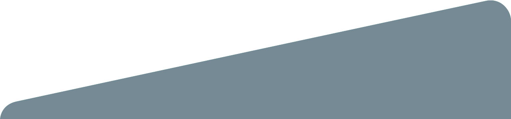

<figure class="header-tours">
  
  <figcaption>
    

      

        

        <h1>Las joyas de la Santa María la Ribera</h1>
      

      

    

  </figcaption>
</figure>

  

    

      

        
<b>CANTIDAD DE PERSONAS</b>

        
12 o 19 personas.

         

        
<b>LUGAR DE SALIDA</b>

        
Roma

         

        
<b>DURACIÓN</b>

        
6 horas.

         

        
<b>FECHAS</b>

        
4 de mayo

         

        
<b>INCLUYE </b>

        
Un desayuno, una comida, entradas a los museos.

         

        
<b>DISPONIBLE</b>

        
En español y en inglés 

         

        
<b>ITINERARIO</b>

        <ul class="list-tours">
          <li>
            
<b>9am</b> | Salida. Roma-Condesa.

          </li>
          <li>
            
<b>9:30am</b> |  Desayuno Casa Nool.

          </li>
          <li>
            
<b>10:30am</b> | Kiosko Morisco.

          </li>
          <li>
            
<b>11:15am</b> | Casa Equis.

          </li>
          <li>
            
<b>12pm</b> | Museo de Geología.

          </li>
          <li>
            
<b>1pm</b> | Museo del Chopo.

          </li>
          <li>
            
<b>2pm</b> | Comida en María Ciento 38.

          </li>
          <li>
            
<b>3:30pm</b> | Salida de la Santa María la Ribera.

          </li>
          <li>
            
<b>4:00pm</b> | Llegada a la Roma-Condesa

          </li>
        </ul>
         

        
<b>Precio por persona</b>

        
$980 MXN

         

        
<b>ACERCA DE NOSOTROS</b>

        
Museo Citadino es una plataforma enfocada en el desarrollo de contenidos y de experiencias creadas con base en nuestro conocimiento sobre las audiencias y la ciudad.

        
En 2012 lanzamos Time Out México, la guía de entretenimiento y cultura más importante del mundo presente en la Ciudad de México. Desde ese entonces nos hemos convertido no solo en una voz relevante en términos de entretenimiento, sino también en un actor activo de la vida cultural de la ciudad.

         

        
<b>QUÉ HAREMOS</b>

        
En este tour exploraremos las joyas de la Santa María la Ribera, desenterraremos su gloria porfiriana y descubrirás que es un barrio vivo en el que están pasando más cosas de las que crees.

        
El punto de salida es de la colonia Roma, de ahí no dirigiremos a desayunar a Casa Nool, después te invitamos a descubrir más de esta colonia, comenzando por el Kiosco Morisco, diseñado por el ingeniero José Ramón Ibarrola y que fue declarado Monumento Artístico de la Nación por el Instituto Nacional de Antropología e Historia (INAH).

        
Llegamos a la parte cultural de nuestro recorrido ya que visitaremos Casa Equis , el Museo de Geología y el Museo Universitario del Chopo. Por último, disfrutaremos una deliciosa comida en María 138. 

         

        
<b> QUÉ TRAER </b>

        <ul class="list-tours">
          <li>
Llevar tenis y ropa cómodos.
</li>
          <li>
Llevar un poco de dinero extra en pesos mexicanos por si quieren hacer compras en las tiendas de los museos.
</li>
          <li>
Llevar una botella de agua para el recorrido.
</li>
        </ul>

        

          

            
          

          

            
          

          

            
          

        

      

    

    

      

        <button type="button" class="btn btn-green" data-toggle="modal" data-target="#ModalTourSantamaria">
          Agendar
        </button>
      

    

  

  

  

    

      

        <h2>Nuestros Tours</h2>
      

    

    

      

      

        
        <h3>Mercado de San Juan</h3>
        
Además de comer en locales como Triana Café Gourmet y Las Tapas de San Juan, tendrás una clase de cocina con el chef Bernardo Bukantz.

        
<b>Duración: 6hrs</b>

        
<b>Incluye:</b> Guía y transporte

        
<b>Fecha:</b> 2 de mayo

        
<b>Precio:</b> $2,890 MXN

        <button type="button" class="btn btn-green-small" data-toggle="modal" data-target="#ModalTourMercado">
          Agendar
        </button>
        <a href="{{site.baseurl}}/tours/mercado-san-juan" class="btn btn-dark-gray-small">Más información</a>
      

      

        
        <h3>Nuevo Muralismo Mexicano</h3>
        
Te llevaremos a conocer de cerca el trabajo de artistas urbanos como Smithe, Curiot, Jesús Benítez “Dhear” y Colectivo Germen.

        
<b>Duración: 5hrs</b>

        
<b>Incluye:</b> Guía y transporte

        
<b>Fecha:</b> 3 de mayo

        
<b>Precio:</b> $980 MXN

         
        <button type="button" class="btn btn-green-small" data-toggle="modal" data-target="#ModalTourMuralismo">
          Agendar
        </button>
        <a href="{{site.baseurl}}/tours/nuevo-muralismo-mexicano" class="btn btn-dark-gray-small">Más información</a>
      

    

  

  

  

    

      

        <button type="button" class="close" data-dismiss="modal" aria-label="Close">&times;</button>
        <h4 class="modal-title" id="myModalLabel">Recibimos tu solicitud</h4>
      

      

        

          

            <h5>Nos pondremos en contacto contigo dentro de poco.</h5>
          

        

      

    

  

<!-- MODAL TOURS MURALISMO-->

  

    

      

        <h2 class="modal-title title-tours-modal" id="myModalLabel">Nuevo Muralismo Mexicano</h2>
      

      <form class="js--form-events">
        

          

            

              

                <label for="nuevo-muralismo-name">Nombre</label>
                <input name="name" id="nuevo-muralismo-name" type="text" class="form-control" maxlength="30" placeholder="Nombre">
                <input name="eventname" type="hidden" value="Nuevo Muralismo Mexicano">
              

              

                <label for="nuevo-muralismo-lastname">Apellido</label>
                <input name="lastname" id="nuevo-muralismo-lastname" type="text" class="form-control" maxlength="60" placeholder="Apellido">
              

              

                <label for="nuevo-muralismo-email">Correo electrónico</label>
                <input name="email" id="nuevo-muralismo-email" type="email" class="form-control" placeholder="Correo electrónico">
              

              

                <label for="nuevo-muralismo-phone">Celular</label>
                <input name="phone" id="nuevo-muralismo-phone" type="text" class="form-control" placeholder="Número telefónico">
              

            

          

          

            

              

                <label for="nuevo-muralismo-people">Número de personas</label>
                <input name="people" id="nuevo-muralismo-people" type="text" class="form-control" placeholder="Número">
              

              

                <label for="nuevo-muralismo-date">Fecha de salida</label>
                <select class="form-control" id="nuevo-muralismo-date" name="origin_date">
                  <option value="3/Mayo/2019">3 de Mayo del 2019</option>
                </select>
              

            

          

        

        

          <button type="button" class="btn btn-gray-small" data-dismiss="modal">Cerrar</button>
          <button type="submit" class="btn btn-green-small">Enviar</button>
        

      </form>

    

  

<!-- MODAL TOURS MERCADO-->

  

    

      

        <h2 class="modal-title title-tours-modal" id="myModalLabel">Mercado de San Juan</h2>
      

      <form class="js--form-events">
        

          

            

              

                <label for="nuevo-mercado-name">Nombre</label>
                <input name="name" id="nuevo-mercado-name" type="text" class="form-control" maxlength="30" placeholder="Nombre">
                <input name="eventname" type="hidden" value="Mercado de San Juan">
              

              

                <label for="nuevo-mercado-lastname">Apellido</label>
                <input name="lastname" id="nuevo-mercado-lastname" type="text" class="form-control" maxlength="60" placeholder="Apellido">
              

              

                <label for="nuevo-mercado-email">Correo electrónico</label>
                <input name="email" id="nuevo-mercado-email" type="email" class="form-control" placeholder="Correo electrónico">
              

              

                <label for="nuevo-mercado-phone">Celular</label>
                <input name="phone" id="nuevo-mercado-phone" type="text" class="form-control" placeholder="Número telefónico">
              

            

          

          

            

              

                <label for="nuevo-mercado-people">Número de personas</label>
                <input name="people" id="nuevo-mercado-people" type="text" class="form-control" placeholder="Número">
              

              

                <label for="nuevo-mercado-date">Fecha de salida</label>
                <select class="form-control" id="nuevo-mercado-date" name="origin_date">
                  <option value="2/Mayo/2019">2 de Mayo del 2019</option>
                </select>
              

            

          

        

        

          <button type="button" class="btn btn-gray-small" data-dismiss="modal">Cerrar</button>
          <button type="submit" class="btn btn-green-small">Enviar</button>
        

      </form>

    

  

<!-- MODAL TOURS SANTA MARIA-->

  

    

      

        <h2 class="modal-title title-tours-modal" id="myModalLabel">Santa María la Ribera</h2>
      

      <form class="js--form-events">
        

          

            

              

                <label for="nuevo-santamaria-name">Nombre</label>
                <input name="name" id="nuevo-santamaria-name" type="text" class="form-control" maxlength="30" placeholder="Nombre">
                <input name="eventname" type="hidden" value="Santa María la Ribera">
              

              

                <label for="nuevo-santamaria-lastname">Apellido</label>
                <input name="lastname" id="nuevo-santamaria-lastname" type="text" class="form-control" maxlength="60" placeholder="Apellido">
              

              

                <label for="nuevo-santamaria-email">Correo electrónico</label>
                <input name="email" id="nuevo-santamaria-email" type="email" class="form-control" placeholder="Correo electrónico">
              

              

                <label for="nuevo-santamaria-phone">Celular</label>
                <input name="phone" id="nuevo-santamaria-phone" type="text" class="form-control" placeholder="Número telefónico">
              

            

          

          

            

              

                <label for="nuevo-santamaria-people">Número de personas</label>
                <input name="people" id="nuevo-santamaria-people" type="text" class="form-control" placeholder="Número">
              

              

                <label for="nuevo-santamaria-date">Fecha de salida</label>
                <select class="form-control" id="nuevo-santamaria-date" name="origin_date">
                  <option value="4/Mayo/2019">4 de Mayo del 2019</option>
                </select>
              

            

          

        

        

          <button type="button" class="btn btn-gray-small" data-dismiss="modal">Cerrar</button>
          <button type="submit" class="btn btn-green-small">Enviar</button>
        

      </form>

    

  

