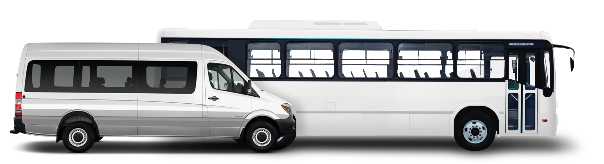

  

    

      

        <h1>¿Tienes vehículos que te gustaría trabajar con Jetty o una concesión de transporte público?</h1>
         
      

      

        
      

    

    

      

        <h2>Beneficios de ser Socio Jetty.</h2>
      

      

        
        <h3>Ingresos garantizados</h3>
        
Al trabajar con nosotros tienes un ingreso garantizado que cubre los costos de operación del vehículo.

      

      

        
        <h3>Rutas y horarios definidos</h3>
        
Con Jetty te liberas de planear los recorridos y tiempos de traslado, nosotros lo hacemos por ti.

      

      

        
        <h3>Oportunidad de crecimiento</h3>
        
Además de participar en la operación diaria, tienes la oportunidad de incrementar tus ingresos al trabajar en eventos especiales como conciertos, eventos deportivos y más.

      

      

        <button type="button" class="btn btn-gray" data-toggle="modal" data-target="#ModalTransportistas">
          Regístrate con Jetty
        </button>
      

    

    

      

        <h2>Preguntas frecuentes</h2>
      

      

        

          

            

              <h4 class="panel-title">
                <a role="button" data-toggle="collapse" data-parent="#accordion" href="#collapseOne" aria-expanded="true" aria-controls="collapseOne">
                  ¿Qué tipo de licencia de conductor necesito para trabajar en Jetty?
                </a>
              </h4>
            

            

              

                Si tu vas a manejar la unidad o vas a contratar a un conductor se necesita la Licencia tipo C
              

            

          

          

            

              <h4 class="panel-title">
                <a class="collapsed" role="button" data-toggle="collapse" data-parent="#accordion" href="#collapseTwo" aria-expanded="false" aria-controls="collapseTwo">
                  ¿Qué tipo de seguro se necesita para trabajar con Jetty?
                </a>
              </h4>
            

            

              

                Póliza de seguro de transporte público con cobertura amplia, nosotros te podemos aconsejar que con quien contratar.
              

            

          

          

            

              <h4 class="panel-title">
                <a class="collapsed" role="button" data-toggle="collapse" data-parent="#accordion" href="#collapseThree" aria-expanded="false" aria-controls="collapseThree">
                  ¿Qué tipo de placas necesita el vehículo?
                </a>
              </h4>
            

            

              

                De preferencia placas federales para que puedas participar en los viajes privados de fin de semana.
              

            

          

        

      

      

        

          

            

              <h4 class="panel-title">
                <a role="button" data-toggle="collapse" data-parent="#accordionTwo" href="#collapseUno" aria-expanded="true" aria-controls="collapseUno">
                  ¿Cuánto puedo ganar al ser socio de Jetty?
                </a>
              </h4>
            

            

              

                Contactanos para hacerte una propuesta de acuerdo con tus expectativas.
              

            

          

          

            

              <h4 class="panel-title">
                <a class="collapsed" role="button" data-toggle="collapse" data-parent="#accordionTwo" href="#collapseDos" aria-expanded="false" aria-controls="collapseDos">
                  ¿El conductor de la unidad es contratado por Jetty?
                </a>
              </h4>
            

            

              

                No, los dueños de los vehículos se encargan de la relación laboral con los conductores.
              

            

          

          

            

              <h4 class="panel-title">
                <a class="collapsed" role="button" data-toggle="collapse" data-parent="#accordionTwo" href="#collapseTres" aria-expanded="false" aria-controls="collapseTres">
                  ¿Qué tipo de camionetas se pueden utilizar?
                </a>
              </h4>
            

            

              

                Sprinter (Mercedes Benz), Hiace (Toyota ), Crafter (Volkswagen), Transit (Ford), Urvan (Nissan)..
              

            

          

        

      

    
<!-- Fin Preguntas -->

  

 <!-- Modal Transportistas -->

  

    

      

        <button type="button" class="close" data-dismiss="modal" aria-label="Close">&times;</button>
        <h4 class="modal-title" id="myModalLabel">Déjanos tus datos y nos pondremos en contacto</h4>
      

      <form id="form-transportistas">
        

            

              <label  for="from-transportistas--name">Nombre</label>
              <input  type="text"
                      class="form-control"
                      placeholder="Nombre"
                      maxlength="30"
                      name="name"
                      id="form-transportistas--name"
                      required />
            

            

              <label  for="form-transportistas--lastname">Apellidos</label>
              <input  type="text"
                      class="form-control"
                      placeholder="Apellidos"
                      maxlength="60"
                      name="lastname"
                      id="form-transportistas--lastname"
                      required />
            

            

              <label  for="form-transportistas--mail">Correo electrónico</label>
              <input  type="text"
                      class="form-control"
                      maxlength="60"
                      placeholder="Correo electrónico"
                      name="email"
                      id="form-transportistas--email"
                      />
            

            

              <label  for="form-transportistas--phone">Número telefónico</label>
              <input  type="text"
                      class="form-control"
                      maxlength="20"
                      placeholder="Número telefonico"
                      name="phone"
                      id="form-transportistas--phone"
                      required>
            

            

              <label for="form-transportistas--address">¿En qué colonia tendría origen la unidad?</label>
              <input  type="text"
                      class="form-control"
                      maxlength="120"
                      name="address"
                      id="form-transportistas--address"
                      required />
            

            

              <label for="form-transportistas--licencia">Tipo de licencia del Conductor:</label>
              <input  type="text"
                      class="form-control"
                      maxlength="120"
                      name="licencia"
                      id="form-transportistas--licencia"
                      required />
            

            

              <label for="">¿Tienes experiencia en transporte de personal o transporte público?</label>
              

                <label>
                  <input  type="radio"
                          name="experience"
                          value="SI"
                          checked />
                  Sí
                </label>
              

              

                <label>
                  <input  type="radio"
                          name="experience"
                          value="NO" />
                  No
                </label>
              

            

            

              
<b>Cuéntanos tu experiencia como operador de transporte:</b>

              <label for="form-transportistas--years">Años de experiencia</label>
              <textarea class="form-control" rows="3" name="years" id="form-transportistas--years"></textarea>
            

            

              <label for="form-transportistas--vehiculos">¿Cuántos Vehículos tienes?</label>
              <textarea class="form-control" rows="3" name="vehiculos" id="form-transportistas--vehiculos"></textarea>
            

            

              <label for="form-transportistas--tipo">¿Qué tipos de vehículos tienes?</label>
              <textarea class="form-control" rows="3" name="tipo" id="form-transportistas--tipo"></textarea>
            

            

              <label for="form-transportistas--why">Porqué quieres trabajar con Jetty</label>
              <textarea class="form-control" rows="3" name="why" id="form-transportistas--why"></textarea>
            

            

              <label for="">¿Cómo te enteraste de Jetty?</label>
              

                <label>
                  <input  type="radio"
                          name="how"
                          value="amigo-trabaja-en-jetty" />
                  Amigo que trabaja en Jetty
                </label>
              

              

                <label>
                  <input  type="radio"
                          name="how"
                          value="vi-vehiculo-en-calle" />
                  Vi un vehículo en la calle
                </label>
              

              

                <label>
                  <input  type="radio"
                          name="how"
                          value="recomendacion" />
                  Recomendación
                </label>
              

              

                <label>
                  <input  type="radio"
                          name="how"
                          value="otro" />
                  Otro
                </label>
              

            

        

        

        

          <button type="button" class="btn btn-default" data-dismiss="modal">Cancelar</button>
          <button type="submit" class="btn btn-green-small">Enviar</button>
        

      </form>

    

  

 <!-- Modal Transportistas Success -->
 

  

    

      

        <button type="button" class="close" data-dismiss="modal" aria-label="Close">&times;</button>
        <h4 class="modal-title" id="myModalLabel">Recibimos tu solicitud</h4>
      

      

        

          

              <h5>Nos pondremos en contacto contigo dentro de poco.</h5>
          

        

      

    

  

