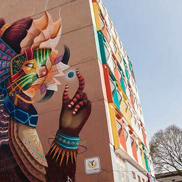

  

    

      

        <h1>¿Estás buscando transporte para un evento?</h1>
        <h1>¿Consideras rentar una camioneta con chofer?</h1>
      

      

        <h3>Nos adaptamos a tu necesidad al mejor precio para resolver tu transporte.</h3>
        <button type="button" class="btn btn-default btn-gray" data-toggle="modal" data-target="#ModalEventos">
          Cotiza
        </button>
      

    

  

  

    

      

        <h2>Ya sea que organices o vayas a un evento masivo, tenemos la solución para ti.</h2>
      

    

    

      

        <ul>
          <li>
            <figure>
              
              <figcaption>
                <h3>Evento Deportivo</h3>
              </figcaption>
            </figure>
          </li>
          <li>
            <figure>
              
              <figcaption>
                <h3>Boda</h3>
              </figcaption>
            </figure>
          </li>
          <li>
            <figure>
              
              <figcaption>
                <h3>Concierto</h3>
              </figcaption>
            </figure>
          </li>
          <li>
            <figure>
              
              <figcaption>
                <h3>Evento Empresarial</h3>
              </figcaption>
            </figure>
          </li>
          <li>
            <figure>
              
              <figcaption>
                <h3>Turismo</h3>
              </figcaption>
            </figure>
          </li>
        </ul>
      

    

    

      

        <a href="javascript:$.scrollTo('#destino',800);" class="btn btn-gray" style="margin-top: 0px">Nuestros Tours</a>
      

    

  

  

    

      

        <h2>Nuestros Tours</h2>
      

    

    

      

        
        <h3>Nuevo Muralismo Mexicano</h3>
        
Te llevaremos a conocer de cerca el trabajo de artistas urbanos como Smithe, Curiot, Jesús Benítez “Dhear” y Colectivo Germen.

        
<b>Duración: 5hrs</b>

        
<b>Incluye:</b> Guía y transporte

         
        <button type="button" class="btn btn-green-small" data-toggle="modal" data-target="#ModalTourMuralismo">
          Agendar
        </button>
        <a href="tours/nuevo-muralismo-mexicano" class="btn btn-dark-gray-small">Más información</a>
      

      

        
        <h3>Mercado de San Juan</h3>
        
Además de comer en locales como Don Vergas, Triana Café Gourmet y Las Tapas de San Juan, tendrás una clase de cocina con el chef Bernardo Bukantz.

        
<b>Duración: 6hrs</b>

        
<b>Incluye:</b> Guía y transporte

        <button type="button" class="btn btn-green-small" data-toggle="modal" data-target="#ModalTourMercado">
          Agendar
        </button>
        <a href="tours/mercado-san-juan" class="btn btn-dark-gray-small">Más información</a>
      

      

        
        <h3>Santa María la Ribera</h3>
        
Visitarás lugares como el Kiosco Morisco, el Museo de Geología, Casa Equis, María Ciento 38 y Casa Nool.

        
<b>Duración: 6hrs</b>

        
<b>Incluye:</b> Guía y transporte

         
        <button type="button" class="btn btn-green-small" data-toggle="modal" data-target="#ModalTourSantamaria">
          Agendar
        </button>
        <a href="tours/santa-maria" class="btn btn-dark-gray-small">Más información</a>
      

    

  

  

  

    

      <h2 class="text-center">Nuestro servicio incluye:</h2>
    

    

      
      <h3>Conductores profesionales</h3>
      
El conductor pasó un estricto proceso de selección que incluye entrevistas, exámenes toxicológicos y evaluaciones psicométricas, entre otras.

    

    

      
      <h3>Equipamiento</h3>
      
Aire acondicionado en cabina y para pasajeros, 4 cargadores USB por fila, GPS, Cámaras de seguridad hacia el interior y el exterior.

    

    

      
      <h3>Vehículos nuevos</h3>
      
Crafter VW - 19pax   Transit Ford - 14 y 17pax

    

    

      <button type="button" class="btn btn-default btn-green" data-toggle="modal" data-target="#ModalEventos">
        Cotiza
      </button>
    

  

<!-- Modal Eventos -->

  

    

      

        <button type="button" class="close" data-dismiss="modal" aria-label="Close">&times;</button>
        <h4 class="modal-title" id="myModalLabel">Déjanos tus datos y nos pondremos en contacto</h4>
      

      <form class="js--form-events">
        

            

              <label  for="name">Nombre</label>
              <input  type="text"
                      class="form-control"
                      required
                      maxlength="30"
                      name="name"
                      placeholder="Nombre" />
            

            

              <label  for="lastname">Apellido</label>
              <input  type="text"
                      class="form-control"
                      required
                      maxlength="60"
                      name="lastname"
                      placeholder="Apellido" />
            

            

              <label for="mail">Correo electrónico</label>
              <input  type="email"
                      class="form-control"
                      required
                      maxlength="60"
                      name="email"
                      placeholder="Correo electrónico" />
            

            

              <label for="cellphone">Número telefónico</label>
              <input  type="text"
                      class="form-control"
                      required
                      maxlength="20"
                      name="phone"
                      placeholder="Número telefónico">
            

            

              <label for="eventname">¿Cómo se llama el evento?</label>
              <input  type="text"
                      class="form-control"
                      required
                      maxlength="150"
                      name="eventname"
                      placeholder="">
            

            

              <label for="company">¿Eres uno de los organizadores?</label>
              

                <label>
                  <input  type="radio"
                          name="organizer"
                          value="true"
                          checked>
                  Sí
                </label>
              

              

                <label>
                  <input  type="radio"
                          name="organizer"
                          value="false">
                  No
                </label>
              

            

            

              <label for="company">¿Cuál es tu necesidad?</label>
              

                <label>
                  <input  type="radio"
                          name="trip"
                          value="Viaje sencillo" checked>
                  Viaje sencillo
                </label>
              

              

                <label>
                  <input  type="radio"
                          name="trip"
                          value="Viaje redondo">
                  Viaje redondo
                </label>
              

              

                <label>
                  <input  type="radio"
                          name="trip"
                          value="Vueltas constantes">
                  Vueltas constantes
                </label>
              

            

            

              <label for="company">¿Número de asistentes?</label>
            

            

              

                <label>
                  <input  type="radio"
                          name="people"
                          value="1-14" checked>
                  1 a 14
                </label>
              

              

                <label>
                  <input  type="radio"
                          name="people"
                          value="15-19">
                  15 a 19
                </label>
              

              

                <label>
                  <input  type="radio"
                          name="people"
                          value="20-28">
                  20 a 28
                </label>
              

            

            

              

                <label>
                  <input  type="radio"
                          name="people"
                          value="29-38">
                  29 a 38
                </label>
              

              

                <label>
                  <input  type="radio"
                          name="people"
                          value="39-58">
                  39 a 58
                </label>
              

              

                <label>
                  <input  type="radio"
                          name="people"
                          value="+59">
                  Más de 59
                </label>
              

            

            

              <label for="adress">Dirección de salida</label>
              <input  type="text"
                      class="form-control"
                      name="origin_address"
                      maxlength="200"
                      placeholder="Calle, Nº, Colonia, Delegación, Ciudad, Estado" />
            

            

              <label for="datetimepicker-event-1">Fecha de salida</label>
              

                <input  type='text'
                        class="form-control event-date-picker"
                        id='datetimepicker-event-1'
                        maxlength="20"
                        name="origin_date"
                        placeholder="Día / Mes / Año"/>
                
                    
                
              

            

            

              <label for="timepicker-event-1">Hora de salida</label>
              <input  type="text"
                      id="timepicker-event-1"
                      maxlength="20"
                      class="form-control event-time-picker"
                      name="origin_time"
                      placeholder="AM / PM" />
            

            

              <label for="adress">Dirección de Llegada</label>
              <input  type="text"
                      class="form-control"
                      maxlength="200"
                      name="destination_address"
                      placeholder="Calle, Nº, Colonia, Delegación, Ciudad, Estado" />
            

            

              <label for="datetimepicker-event-2">Fecha de regreso  </label>
              

                <input  type='text'
                        class="form-control event-date-picker"
                        id='datetimepicker-event-2'
                        maxlength="20"
                        name="destination_date"
                        placeholder="Día / Mes / Año" />
                
                    
                
              

            

            

              <label for="timepicker-event-2">Hora de regreso </label>
              <input  type="text"
                      class="form-control event-time-picker"
                      id="timepicker-event-2"
                      maxlength="20"
                      name="destination_time"
                      placeholder="AM / PM">
            

        

        

        

          <button type="button" class="btn btn-default" data-dismiss="modal">Cancelar</button>
          <button type="submit" class="btn btn-green-small">Enviar</button>
        

      </form>

    

  

 <!-- Modal Conductor -->
 

  

    

      

        <button type="button" class="close" data-dismiss="modal" aria-label="Close">&times;</button>
        <h4 class="modal-title" id="myModalLabel">Recibimos tu solicitud</h4>
      

      

        

          

              <h5>Nos pondremos en contacto contigo dentro de poco.</h5>
          

        

      

    

  

<!-- MODAL TOURS MURALISMO-->

  

    

      

        <h2 class="modal-title title-tours-modal" id="myModalLabel">Nuevo Muralismo Mexicano</h2>
      

      <form class="js--form-events">
        

          

            

              

                <label for="nuevo-muralismo-name">Nombre</label>
                <input name="name" id="nuevo-muralismo-name" type="text" class="form-control" maxlength="30" placeholder="Nombre">
                <input name="eventname" type="hidden" value="Nuevo Muralismo Mexicano">
              

              

                <label for="nuevo-muralismo-lastname">Apellido</label>
                <input name="lastname" id="nuevo-muralismo-lastname" type="text" class="form-control" maxlength="60" placeholder="Apellido">
              

              

                <label for="nuevo-muralismo-email">Correo electrónico</label>
                <input name="email" id="nuevo-muralismo-email" type="email" class="form-control" placeholder="Correo electrónico">
              

              

                <label for="nuevo-muralismo-phone">Celular</label>
                <input name="phone" id="nuevo-muralismo-phone" type="text" class="form-control" placeholder="Número telefónico">
              

            

          

          

            

              

                <label for="nuevo-muralismo-people">Número de personas</label>
                <input name="people" id="nuevo-muralismo-people" type="text" class="form-control" placeholder="Número">
              

              

                <label for="nuevo-muralismo-date">Fecha de salida</label>
                

                  <input  type='text'
                          class="form-control event-date-picker"
                          id='nuevo-muralismo-date'
                          maxlength="20"
                          name="origin_date"
                          placeholder="Día / Mes / Año"/>
                  
                    
                  
                

              

              

                <label for="nuevo-muralismo-time">Hora de salida</label>
                <input  type="text"
                        id="nuevo-muralismo-time"
                        maxlength="20"
                        class="form-control event-time-picker"
                        name="origin_time"
                        placeholder="AM / PM" />
              

            

          

        

        

          <button type="button" class="btn btn-gray-small" data-dismiss="modal">Cerrar</button>
          <button type="submit" class="btn btn-green-small">Enviar</button>
        

      </form>

    

  

<!-- MODAL TOURS MERCADO-->

  

    

      

        <h2 class="modal-title title-tours-modal" id="myModalLabel">Mercado de San Juan</h2>
      

      <form class="form-modal-tours">
        

          

            

              

                <label for="">Nombre</label>
                <input type="" class="form-control" id="" placeholder="Claudia">
              

              

                <label for="">Apellido</label>
                <input type="" class="form-control" id="" placeholder="Tapía">
              

              

                <label for="">Correo electrónico</label>
                <input type="" class="form-control" id="" placeholder="claudia@ejemplo.com">
              

              

                <label for="">Celular</label>
                <input type="" class="form-control" id="" placeholder="55 9876 4321">
              

            

          

          

            

              

                <label for="">Número de personas</label>
                <input type="" class="form-control" id="" placeholder="5 personas">
              

              

            <label for="">Fecha</label>
            

              <input type='text' class="form-control" />
              
                  
              
            

          

            

          

        

        

          <button type="button" class="btn btn-gray-small" data-dismiss="modal">Cerrar</button>
          <button type="submit" class="btn btn-green-small">Enviar</button>
        

      </form>

    

  

<!-- MODAL TOURS SANTA MARIA-->

  

    

      

        <h2 class="modal-title title-tours-modal" id="myModalLabel">Santa María la Ribera</h2>
      

      <form class="form-modal-tours">
        

          

            

              

                <label for="">Nombre</label>
                <input type="" class="form-control" id="" placeholder="Claudia">
              

              

                <label for="">Apellido</label>
                <input type="" class="form-control" id="" placeholder="Tapía">
              

              

                <label for="">Correo electrónico</label>
                <input type="" class="form-control" id="" placeholder="claudia@ejemplo.com">
              

              

                <label for="">Celular</label>
                <input type="" class="form-control" id="" placeholder="55 9876 4321">
              

            

          

          

            

              

                <label for="">Número de personas</label>
                <input type="" class="form-control" id="" placeholder="5 personas">
              

              

            <label for="">Fecha</label>
            

              <input type='text' class="form-control" />
              
                  
              
            

          

            

          

        

        

          <button type="button" class="btn btn-gray-small" data-dismiss="modal">Cerrar</button>
          <button type="submit" class="btn btn-green-small">Enviar</button>
        

      </form>

    

  

