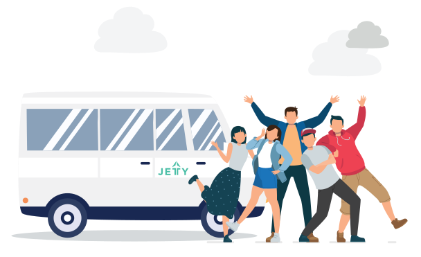
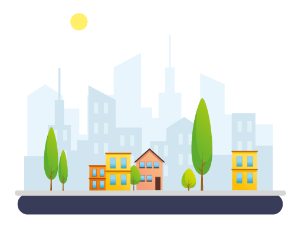
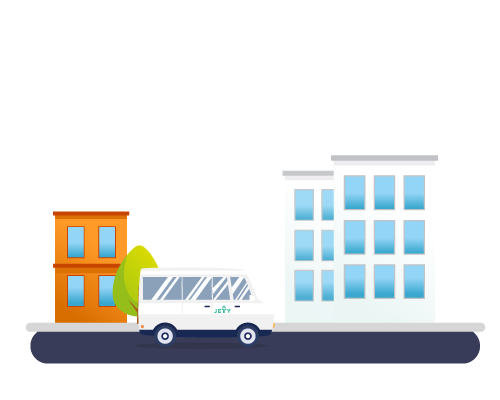
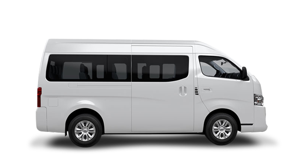
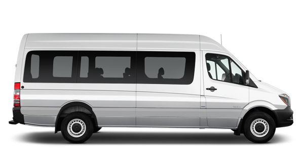
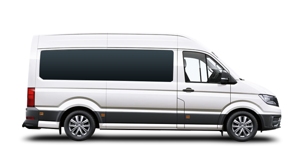
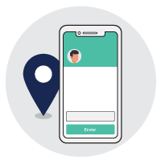
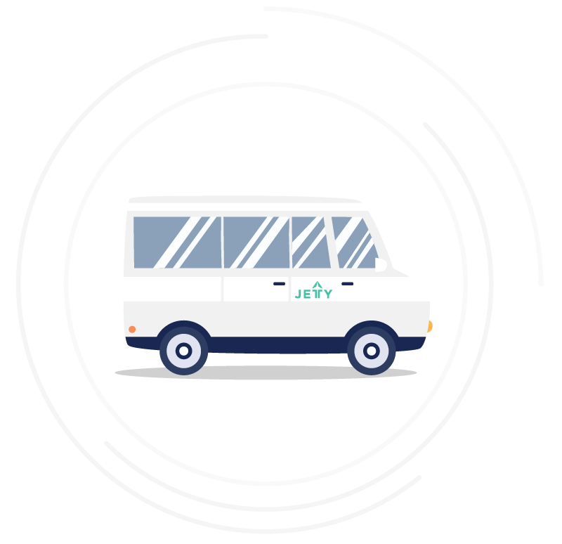

  

    

      

        
      

      

        <h1>¡Vámonos de fin de semana!</h1>
        
¿Estás buscando transporte para viajar el fin de semana?

        
¿Quieres moverte con comodidad y sin estrés?

        
En Jetty nos adaptamos a tus necesidades para brindarte la mejor experiencia de viaje.

        <!-- <a href="https://form.jotform.com/202037283972860" class="btn btn-default btn-gray">Agendar viaje</a> -->

        <!-- Button trigger modal -->
        <button type="button" class="btn btn-default btn-gray" data-toggle="modal" data-target="#myModal">
          Agendar viaje
        </button>

      

    

    

      

        <h2>Cuéntanos el tipo de servicio que deseas</h2>
      

      

        
        <h3 class="textGray">Fuera de la ciudad</h3>
      

      

        
        <h3 class="textGray">Dentro de la ciudad</h3>
      

      

        
        <h3 class="textGray">Transporte empresarial</h3>
      

    

    

      

        <h2>Elige tu transporte ideal</h2>
      

      

        
        <h3 class="textGray">Urvan</h3>
      

      

        
        <h3 class="textGray">Transit</h3>
      

      

        
        <h3 class="textGray">Crafter</h3>
      

      

        <!-- <a href="https://form.jotform.com/202037283972860" class="btn btn-default btn-gray">Agendar viaje</a> -->
        <button type="button" class="btn btn-default btn-gray" data-toggle="modal" data-target="#myModal">
          Agendar viaje
        </button>
      

    

    

      

        <b>*Medidas de prevención COVID-19</b> 
        -Unidades  100% sanitizadas antes y después de cada trayecto. 
        -Pedimos el uso de cubrebocas a todas y todos los pasajeros. 
        -Toma de temperatura y gel antibacterial antes de ingresar. 
        -Maximización de espacios dentro de la unidad. 
         
        <b>Nuestro compromiso es ofrecerte viajes cómodos y seguros, cumpliendo con los protocolos necesarios para minimizar el riesgo de contagio, tanto de nuestros usuarios como colaboradores.</b>
      

    

    

    

      

        <h2>Al viajar con nosotros, tu experiencia incluye:</h2>
      

      

        
        
<b>Conductores profesionales</b>

        
Nuestros conductores son amables y respetuosos. Todos pasan por un proceso estricto de selección.

      

      

        
        
<b>Tecnología</b>

        
Todas nuestras unidades son monitoreadas y cuentan con asistencia durante el viaje.

      

      

      

        
      

      

      

        
        
<b>Seguro</b>

        
Viaja con confianza y tranquilidad en unidades aseguradas.

      

      

        
        
<b>Equipamiento</b>

        
Vehículos con aire acondicionado, botiquín de primeros auxilios, asientos cómodos, cámara de seguridad y gps.

      

      

        <!-- <a href="https://form.jotform.com/202037283972860" class="btn btn-default btn-gray">Agendar viaje</a> -->
        <button type="button" class="btn btn-default btn-gray" data-toggle="modal" data-target="#myModal">
          Agendar viaje
        </button>
      

      

        

          <a href="http://ayuda.jetty.mx/es/articles/4320027-politica-de-cambios-y-cancelacion" class="linkPoliticas">Revisa nuestras políticas de cambios y cancelación.</a>
        

      

    

  

<!-- Modal -->

  

    

      

        <button type="button" class="close" data-dismiss="modal" aria-label="Close">&times;</button>
        <!-- <h4 class="modal-title" id="myModalLabel">Déjanos tus datos y te mandaremos la cotización.</h4> -->
      

      

        

      

      <!-- 

        <button type="button" class="btn btn-default" data-dismiss="modal">Close</button>
        <button type="button" class="btn btn-primary">Save changes</button>
      
 -->
    

  

