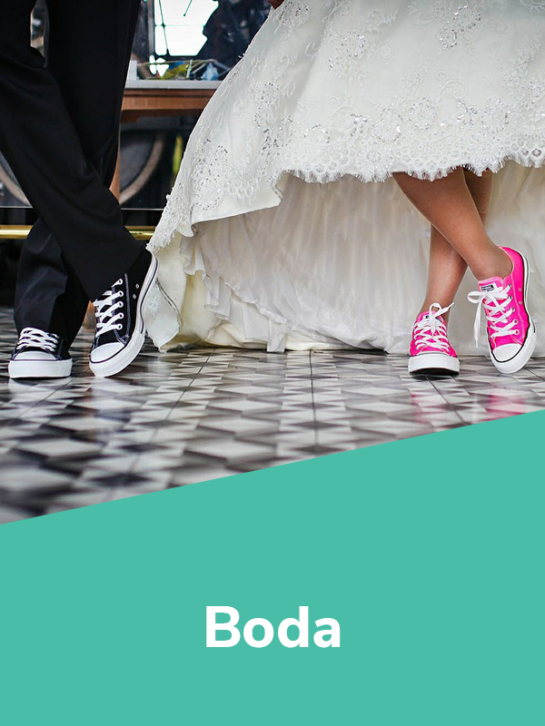
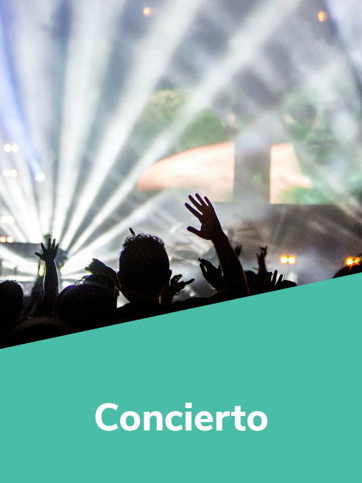
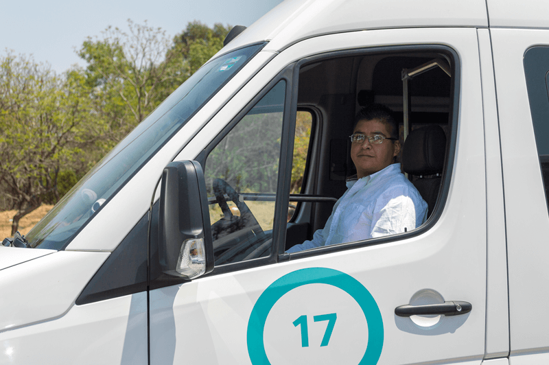
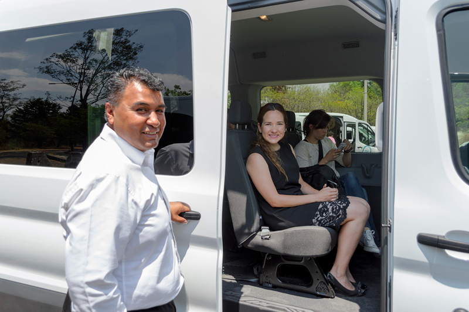
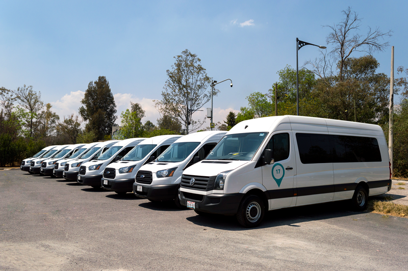

  

    

      

        <h1>¿Estás buscando transporte para un evento?</h1>
        <h1>¿Consideras rentar una camioneta con chofer?</h1>
      

      

        <h3>Nos adaptamos a tu necesidad al mejor precio para resolver tu transporte.</h3>
        <button type="button" class="btn btn-default btn-gray" data-toggle="modal" data-target="#ModalEventos">
          Cotiza
        </button>
      

    

    

      

        <h2>Ya sea que organices o vayas a un evento masivo, tenemos la solución para ti.</h2>
      

      

        <ul>
          <li>
            <figure>
              
              <figcaption>
                <h3>Evento Deportivo</h3>
              </figcaption>
            </figure>
          </li>
          <li>
            <figure>
              
              <figcaption>
                <h3>Boda</h3>
              </figcaption>
            </figure>
          </li>
          <li>
            <figure>
              
              <figcaption>
                <h3>Concierto</h3>
              </figcaption>
            </figure>
          </li>
          <li>
            <figure>
              
              <figcaption>
                <h3>Evento Empresarial</h3>
              </figcaption>
            </figure>
          </li>
          <li>
            <figure>
              
              <figcaption>
                <h3>Turismo</h3>
              </figcaption>
            </figure>
          </li>
        </ul>
      

    

    

      

        <h2 class="text-center">Nuestro servicio incluye:</h2>
      

      

        
        <h3>Conductores profesionales</h3>
        
El conductor pasó un estricto proceso de selección que incluye entrevistas, exámenes toxicológicos y evaluaciones psicométricas, entre otras.

      

      

        
        <h3>Equipamiento</h3>
        
Todos nuestros viajes son monitoreados por nuestro equipo de soporte.

      

      

        
        <h3>Vehículos nuevos</h3>
        

          Caddy - 6 pax   Urvan - 13 pax   Transit - 14 y 17 pax   Crafter - 19 pax   Linner G - 41-45
        

      

      

        <button type="button" class="btn btn-default btn-gray" data-toggle="modal" data-target="#ModalEventos">
          Cotiza
        </button>
      

    

  

<!-- Modal Eventos -->

  

    

      

        <button type="button" class="close" data-dismiss="modal" aria-label="Close">&times;</button>
      

      

    

  

 <!-- Modal Conductor -->
 

  

    

      

        <button type="button" class="close" data-dismiss="modal" aria-label="Close">&times;</button>
        <h4 class="modal-title" id="myModalLabel">Recibimos tu solicitud</h4>
      

      

        

          

              <h5>Nos pondremos en contacto contigo dentro de poco.</h5>
          

        

      

    

  

<!-- MODAL TOURS MURALISMO-->

  

    

      

        <h2 class="modal-title title-tours-modal" id="myModalLabel">Nuevo Muralismo Mexicano</h2>
      

      <form class="js--form-events">
        

          

            

              

                <label for="nuevo-muralismo-name">Nombre</label>
                <input name="name" id="nuevo-muralismo-name" type="text" class="form-control" maxlength="30" placeholder="Nombre">
                <input name="eventname" type="hidden" value="Nuevo Muralismo Mexicano">
              

              

                <label for="nuevo-muralismo-lastname">Apellido</label>
                <input name="lastname" id="nuevo-muralismo-lastname" type="text" class="form-control" maxlength="60" placeholder="Apellido">
              

              

                <label for="nuevo-muralismo-email">Correo electrónico</label>
                <input name="email" id="nuevo-muralismo-email" type="email" class="form-control" placeholder="Correo electrónico">
              

              

                <label for="nuevo-muralismo-phone">Celular</label>
                <input name="phone" id="nuevo-muralismo-phone" type="text" class="form-control" placeholder="Número telefónico">
              

            

          

          

            

              

                <label for="nuevo-muralismo-people">Número de personas</label>
                <input name="people" id="nuevo-muralismo-people" type="text" class="form-control" placeholder="Número">
              

              

                <label for="nuevo-muralismo-date">Fecha de salida</label>
                <select class="form-control" id="nuevo-muralismo-date" name="origin_date">
                  <option value="11/Mayo/2019">11 de Mayo del 2019</option>
                </select>
              

            

          

        

        

          <button type="button" class="btn btn-gray-small" data-dismiss="modal">Cerrar</button>
          <button type="submit" class="btn btn-green-small">Enviar</button>
        

      </form>

    

  

<!-- MODAL TOURS MERCADO-->

  

    

      

        <h2 class="modal-title title-tours-modal" id="myModalLabel">Mercado de San Juan</h2>
      

      <form class="js--form-events">
        

          

            

              

                <label for="nuevo-mercado-name">Nombre</label>
                <input name="name" id="nuevo-mercado-name" type="text" class="form-control" maxlength="30" placeholder="Nombre">
                <input name="eventname" type="hidden" value="Mercado de San Juan">
              

              

                <label for="nuevo-mercado-lastname">Apellido</label>
                <input name="lastname" id="nuevo-mercado-lastname" type="text" class="form-control" maxlength="60" placeholder="Apellido">
              

              

                <label for="nuevo-mercado-email">Correo electrónico</label>
                <input name="email" id="nuevo-mercado-email" type="email" class="form-control" placeholder="Correo electrónico">
              

              

                <label for="nuevo-mercado-phone">Celular</label>
                <input name="phone" id="nuevo-mercado-phone" type="text" class="form-control" placeholder="Número telefónico">
              

            

          

          

            

              

                <label for="nuevo-mercado-people">Número de personas</label>
                <input name="people" id="nuevo-mercado-people" type="text" class="form-control" placeholder="Número">
              

              

                <label for="nuevo-mercado-date">Fecha de salida</label>
                <select class="form-control" id="nuevo-mercado-date" name="origin_date">
                  <option value="18/Mayo/2019">18 de Mayo del 2019</option>
                </select>
              

            

          

        

        

          <button type="button" class="btn btn-gray-small" data-dismiss="modal">Cerrar</button>
          <button type="submit" class="btn btn-green-small">Enviar</button>
        

      </form>

    

  

<!-- MODAL TOURS SANTA MARIA-->

  

    

      

        <h2 class="modal-title title-tours-modal" id="myModalLabel">Santa María la Ribera</h2>
      

      <form class="js--form-events">
        

          

            

              

                <label for="nuevo-santamaria-name">Nombre</label>
                <input name="name" id="nuevo-santamaria-name" type="text" class="form-control" maxlength="30" placeholder="Nombre">
                <input name="eventname" type="hidden" value="Santa María la Ribera">
              

              

                <label for="nuevo-santamaria-lastname">Apellido</label>
                <input name="lastname" id="nuevo-santamaria-lastname" type="text" class="form-control" maxlength="60" placeholder="Apellido">
              

              

                <label for="nuevo-santamaria-email">Correo electrónico</label>
                <input name="email" id="nuevo-santamaria-email" type="email" class="form-control" placeholder="Correo electrónico">
              

              

                <label for="nuevo-santamaria-phone">Celular</label>
                <input name="phone" id="nuevo-santamaria-phone" type="text" class="form-control" placeholder="Número telefónico">
              

            

          

          

            

              

                <label for="nuevo-santamaria-people">Número de personas</label>
                <input name="people" id="nuevo-santamaria-people" type="text" class="form-control" placeholder="Número">
              

              

                <label for="nuevo-santamaria-date">Fecha de salida</label>
                <select class="form-control" id="nuevo-santamaria-date" name="origin_date">
                  <option value="25/Mayo/2019">25 de Mayo del 2019</option>
                </select>
              

            

          

        

        

          <button type="button" class="btn btn-gray-small" data-dismiss="modal">Cerrar</button>
          <button type="submit" class="btn btn-green-small">Enviar</button>
        

      </form>

    

  

