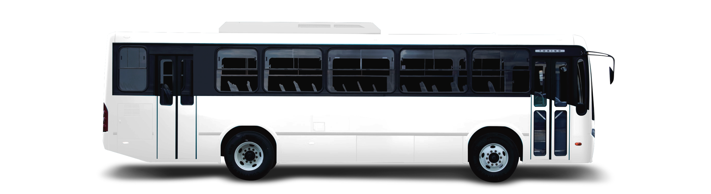
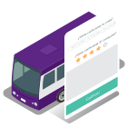

  

    

      

        <h1>Transporte Público</h1>
        <h2>¿Tienes una concesión de transporte público?</h2>
        

          
        

      

    

    

    

      

        <h2>Beneficios para concesionarios o permisionarios.</h2>
      

      

        
        
Mayor control sobre la operación y la caja al reducir el manejo de efectivo.

      

      

        
        
Supervisión de conductores gracias a retroalimentación de los usuarios.

      

      

        
        
Optimización de frecuencias y horarios.

      

      

      

        
        
Mejora del servicio.

      

      

        
        
Demostrar al usuario que el transporte concesionado también puede innovar.

      

      

        
        
Capacitación a los conductores en servicio al cliente y perspectiva de género.

      

       

      

        <button type="button" class="btn btn-gray" data-toggle="modal" data-target="#ModalConcesionado">
         Conoce más
        </button>
      

    

    

    

      

        <h3>Empresas con las que trabajamos:</h3>
        <ul class="list-transportistas">
          <li>
            
          </li>
          <li>
            
          </li>
          <li>
            
          </li>
          <li>
            
          </li>
          <li>
            
          </li>
        </ul>
      

    

  

<!-- Modal Concesionado -->

  

    

      

        <button type="button" class="close" data-dismiss="modal" aria-label="Close">&times;</button>
        <h4 class="modal-title" id="myModalLabel">Déjanos tus datos y nos pondremos en contacto</h4>
      

      <form id="form-concesionado">
        

            

              <label  for="from-concesionado--name">Nombre</label>
              <input  type="text"
                      class="form-control"
                      placeholder="Nombre"
                      maxlength="30"
                      name="name"
                      id="form-concesionado--name"
                      required />
            

            

              <label  for="form-concesionado--lastname">Apellidos</label>
              <input  type="text"
                      class="form-control"
                      placeholder="Apellidos"
                      maxlength="60"
                      name="lastname"
                      id="form-concesionado--lastname"
                      required />
            

            

              <label  for="form-concesionado--mail">Correo electrónico</label>
              <input  type="text"
                      class="form-control"
                      maxlength="60"
                      placeholder="Correo electrónico"
                      name="email"
                      id="form-concesionado--email"
                      />
            

            

              <label  for="form-concesionado--phone">Número telefónico</label>
              <input  type="text"
                      class="form-control"
                      maxlength="20"
                      placeholder="Número telefonico"
                      name="phone"
                      id="form-concesionado--phone"
                      required>
            

            

              <label for="form-concesionado--city">¿En qué ciudad estás?</label>
              <input  type="text"
                      class="form-control"
                      maxlength="120"
                      name="city"
                      id="form-concesionado--city"
                      required />
            

            

              <label for="form-concesionado--route">¿Qué ruta operas?</label>
              <input  type="text"
                      class="form-control"
                      maxlength="120"
                      name="route"
                      id="form-concesionado--route"
                      required />
            

            

              
<b>Cuéntanos tu experiencia como operador de transporte:</b>

              <label for="form-concesionado--years">Años de experiencia</label>
              <textarea class="form-control" rows="3" name="years" id="form-concesionado--years"></textarea>
            

            

              <label for="form-concesionado--vehiculos">¿Cuántos Vehículos tienes?</label>
              <textarea class="form-control" rows="3" name="vehiculos" id="form-concesionado--vehiculos"></textarea>
            

            

              <label for="form-concesionado--tipo">¿Qué tipos de vehículos tienes?</label>
              <textarea class="form-control" rows="3" name="tipo" id="form-concesionado--tipo"></textarea>
            

            

              <label for="form-concesionado--why">Porqué quieres trabajar con Jetty</label>
              <textarea class="form-control" rows="3" name="why" id="form-concesionado--why"></textarea>
            

            

              <label for="">¿Cómo te enteraste de Jetty?</label>
              

                <label>
                  <input  type="radio"
                          name="how"
                          value="amigo-trabaja-en-jetty" />
                  Amigo que trabaja en Jetty
                </label>
              

              

                <label>
                  <input  type="radio"
                          name="how"
                          value="vi-vehiculo-en-calle" />
                  Vi un vehículo en la calle
                </label>
              

              

                <label>
                  <input  type="radio"
                          name="how"
                          value="recomendacion" />
                  Recomendación
                </label>
              

              

                <label>
                  <input  type="radio"
                          name="how"
                          value="otro" />
                  Otro
                </label>
              

            

        

        

        

          <button type="button" class="btn btn-default" data-dismiss="modal">Cancelar</button>
          <button type="submit" class="btn btn-green-small" data-loading-text="Espera...">Enviar</button>
        

      </form>

    

  

 <!-- Modal Transportistas Success -->
 

  

    

      

        <button type="button" class="close" data-dismiss="modal" aria-label="Close">&times;</button>
        <h4 class="modal-title" id="myModalLabel">Recibimos tu solicitud</h4>
      

      

        

          

              <h5>Nos pondremos en contacto contigo dentro de poco.</h5>
          

        

      

    

  

